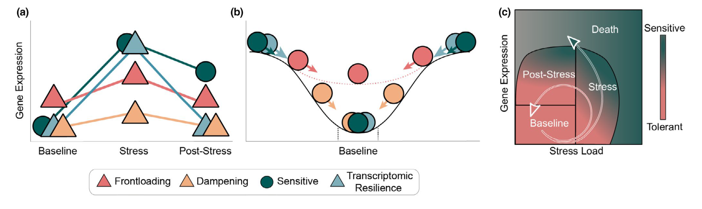

```{r #setup, echo = FALSE, message = FALSE}
library(knitr)
knitr::opts_chunk$set(
	fig.height = 5,
	fig.width = 10,
	cache = TRUE
)
library(knitcitations)
library(kableExtra)
opts_chunk$set(fig.width = 10,
               fig.height = 5,
               cache = TRUE)
cite_options(citation_format = "pandoc", max.names = 3, style = "html", 
             hyperlink = "to.doc")
```

## Overview

If you are interested in submitting new content to the
MarineOmics.github.io website, this is the guide for you! While the
website managers will work with you to help prepare and publish your new
page, this guide can be a useful resource as you develop your content.
Below we provide general instructions as well as examples of how to
build specific features (eg., tables, code chunks). Prior to developing
new pages, please contact the current Website Manager Jason Johns
(jasonjohns[at]ucsb.edu). Do not hesitate to reach out with any other
questions, comments, or features you'd like added to this guide.

The MarineOmics website is published through Github Pages directly from
the [MarineOmics github
repository](https://github.com/MarineOmics/marineomics.github.io). In
short, each page of the website is rendered as an .html from an
RMarkdown (.Rmd) document. The two most important files for publishing
the general website are the \_site.yml and the index.Rmd/index.html.

\*\*\_site.yml\*\*: the 'under the hood' backbone of the website, where
things like the visual appearance of the website and the navigation bar
are specified

**index.html**: rendered from index.Rmd - the home page from which all
other pages branch

\* The website manager will modify the index.html and .site_yml files
for your page when you are ready to publish it, so you don't need to
know exactly how they work, but it's good to know what they are at a
basic level.

<hr />

# R Markdown basics

The rendered .Rmd and .html files for each page on this site can be seen
in the [MarineOmics github
repository](https://github.com/MarineOmics/marineomics.github.io). It is
possible to use .Rmd files in base R, but we recommend using RStudio. If
you don't have much experience with RStudio, it's quite intuitive with a
shallow learning curve and many existing online resources for using it.
It is possible to use .Rmd files in base R, but we recommend using
RStudio.

*Note: it's a good idea to look at existing .Rmd scripts (including [the
one that codes for this
page](https://github.com/MarineOmics/marineomics.github.io/blob/main/submissions_instructions.Rmd))
to see examples of how a particular feature can be accomplished, such as
citing references, linking a website, building a table, incorporating
figures, etc. We will explicitly go over some of those features below,
but there are many other bells and whistles that can be explored through
online resources.*

Here are some general RMarkdown tutorials that we like to reference:
<br> - [Chapter 10 from RMarkdown the Definitive Guide: Xi, Allaire, &
Grolemund
2022](https://bookdown.org/yihui/rmarkdown/rmarkdown-site.html) <br> -
[R Markdown Websites: Garrett
Grolemund](https://garrettgman.github.io/rmarkdown/rmarkdown_websites.html)

<br>

## Formatting basics

One of the strengths of .Rmd documents is their versatility. They can
hold everything from code (not only in R but in other languages),
formatted text, figure outputs, and more. Basically, code must be
enclosed within 'code chunks' and anything outside of code chunks will
be read as text, similar to a basic text file.

### **code chunks**

Below is a basic R code chunk which can be inserted by clicking the
green +C button on the RStudio toolbar or typing the keyboard shortcut:
<br>

-   macOS: command + option + I <br>
-   Windows/Linux: control + alt + I

<!-- -->

    ```{r, echo = TRUE, include = TRUE} `r ''`

    #Here's a simple linear model in R as an example
    my_lm <- lm(y ~ x, data = df)

    ```

Whether code chunks and/or their output are included in the knitted
.html can be modified with the logical commands "echo" and "include".
<br>

-   echo: include the code chunk itself or not <br>
-   include: include the output of the code chunk or not

\* Other options exist for code chunk output which can be explored
online and in other .Rmd scripts in this repository.

<br>

#### *global code chunk options*

This is the chunk where we establish global settings for the entire
document. This is done with the command from the knitr package
"opts_chunk\$set" as shown in the example below. This command is
typically included in the first code chunk, where we also load our page
formatting packages and adjust the settings for citations. When a new
.Rmd is made, this command is automatically included in the first chunk,
which is named "setup" by default. The name of a code chunk can be
specified after the r in \`\`\`{r \_\_\_\_}.

<a id="cite_options"></a>

    ```{r setup} `r ''`
    knitr::opts_chunk$set(echo = FALSE, message = FALSE, warning = FALSE, cache = TRUE) 
    # load page formatting packages
    library(knitr)
    library(knitcitations)
    library(kableExtra)
    knitr::opts_chunk$set(fig.width = 10, fig.height = 5) #setting the dimensions for figure outputs in a different line of code for cleanliness
    cite_options(citation_format = "pandoc", max.names = 3, style = "html", 
                 hyperlink = "to.doc") #setting format for in-text citations for the references section at the bottom of the page
    ```

\* Note the "cache =" option. When set to "true" R will cache all of the
output created from knitting the RMarkdown document. This is especially
useful for pages with heavy computation that take a long time to knit.

<br>

#### *including code from another language*

In addition to R code, we can also run code such as bash shell script in
the R markdown file by modifying the code chunk header as below: <br>

    ```{bash, eval = T} `r ''`

    # Here's a simple line of bash as an example
    echo "Hi world"

    ```

<br>

### **formatting text**

Options abound for formatting text in .Rmd documents using [Pandoc
Markdown](https://pandoc.org/MANUAL.html), and many of these can be
found with a quick search, but we will go over a few basics here.<br>

-   As with writing code, any text symbol that codes for something, such
    as a \# or a \* must be escaped with a backslash (\\) if you just
    want to use the symbol itself. <br>
-   **\#**: *Outside of a code chunk*, pound signs dictate the size and
    organizational level of the text. A single \# will make large text
    and a main section in the navigation window. Two \## will make
    slightly smaller text and a sub-section in the navigation window.
    <br>
    -   For example, the "RMarkdown formatting" text and category was
        created with "\# RMarkdown formatting" while the "code chunks"
        subcategory was created with "\## code chunks."<br>
-   **\***: Asterisks are used to bold and italicize when surrounding
    texts. Use \*\***two asterisks to bold**\*\* and \**one asterisk*\*
    to italicize.<br>
-   **\<br\>**: adds a line break <br>
-   **\<hr /\>**: adds a horizontal line across the page

<br>

### **in-text citations from your .bib**

In-text citations can be made throughout the document that will
automatically add a reference to your reference section via the
following steps: <br>

-   add your citations to the common-bib_01.bib document by exporting
    BibTeX-formatted citations from your reference manager
-   add the line 'bibliography: common-bib_01.bib' to your header at
    the top of the .Rmd document, which looks like this:

<!-- -->

    ---
    title: "Instructions for developing new pages for the MarineOmics webpage"
    bibliography: common-bib_01.bib
    ---

-   include the 'cite-options' chunk in your 'setup' code chunk. See the
    initial ['r setup' chunk](#cite_options) above for the syntax of the
    'cite_options' command.

After following these step, you can cite them in the RMarkdown document.
Let's say you have a paper you want to cite by LastName et al. 2023 and
the paper's ID in your .bib file is 'LastName2023-xy'. We can reference
this paper in-text by adding [\@LastName2023-xy] to the end of a
sentence. This will produce a reference such as the one below for Tripp
et al. 2017.

*syntax in .Rmd text **(not in a code chunk)***:

    RADseq can produce insightful analyses even in the absence of data, if missing values are handled properly [@Tripp2017-cp].

*knitted output*: <br> RADseq can produce insightful analyses even in
the absence of data, if missing values are handled properly
[@Tripp2017-cp].

<br>

### **installing & loading packages**

If you will be using any R packages or external software for your
content, it's a good idea to highlight them toward the beginning of your
page, including code for installing them. Here's an example from the
RADseq tutorial: <br> <br> *If you would like to run the R code examples
that are scattered throughout the guide (recommended but not required!),
you will need to install some R packages. Only need to run this code
once:*

```{r, eval=F}
install.packages("tidyverse")
if (!requireNamespace("BiocManager", quietly = TRUE))
    install.packages("BiocManager")
#the BiocManager package facilitates the installation of packages from the Bioconductor project
BiocManager::install("SeqArray")
BiocManager::install("SNPRelate")
```

<br> *These external software are referenced in the tutorial:* <br>

-   [vcftools](https://vcftools.github.io/man_latest.html)
-   [gnuplot](https://riptutorial.com/gnuplot/example/11275/installation-or-setup)

### **caching**

If your page includes any code that takes a long time to run, please set
"cache = TRUE" in the knitr::opts_chunk\$set command in your global code
chunk.

<hr />

## Examples of how to include visual feautures such as tables, images, equations, etc.

### **insert a table**

*text in .Rmd **(not in a code chunk)***:

    | Term A | Term B | Term C | Term D | Term E | Term F | Term G |
    | :--- | :--- | :--- | :--- | :--- | :--- | :--- |
    | xxx | xxx | xxx | xxx | xxx | xxx | xxx |  
    | yyy | yyy | yyy | yyy | yyy | yyy | yyy | 
    | zzz | zzz | zzz | zzz | zzz | zzz | zzz | 

<br>

*knitted output*:

| Term A | Term B | Term C | Term D | Term E | Term F | Term G |
|:-------|:-------|:-------|:-------|:-------|:-------|:-------|
| xxx    | xxx    | xxx    | xxx    | xxx    | xxx    | xxx    |
| yyy    | yyy    | yyy    | yyy    | yyy    | yyy    | yyy    |
| zzz    | zzz    | zzz    | zzz    | zzz    | zzz    | zzz    |

<br>

You can generate a Markdown-formatted table using a free online editor,
such as [this
one](https://tabletomarkdown.com/generate-markdown-table/). The
[**kableExtra**](https://bookdown.org/yihui/rmarkdown-cookbook/kableextra.html)
package has a lot of functionality for fancier tables.

<br>

### **insert an image**

To insert an image, you need the image file to also be uploaded to the
Github repositority. We store the images hosted on the website in the
`images/` folder. For any image, please make sure you have permission to
share the image and that it is appropriately cited.

*code chunk in .Rmd*:

    ```{r, echo = TRUE, include = TRUE, out.height = "40%", fig.align = "center", fig.cap="Figure from Rivera et al. 2021"} `r ''`

    

    ```

<br>

*knitted output*:

```{r, echo = TRUE, include = TRUE, out.height = "40%", fig.align = "center",fig.cap="Figure from Rivera et al. 2021" }


```

<br>

### **write and print an equation**

Equations follow LaTeX style formatting.

For illustrative purposes, here is a simple and famous equation. <br>
*syntax in .Rmd*:

    $$
    E = mc^2
    $$

<br>

*knitted output*: $$
E = mc^2
$$ <br>

As an example of a more complex equation, here is an equation for the
t-statistic: <br> *syntax in .Rmd*:

    $$
    t = \frac{\overline{x_{1}}-\overline{x_{2}}}
    {\sqrt{(s^2(
    \frac{1}{n_{1}} + \frac{1}{n_{2}}
    ))}}
    $$ 

*knitted output*: $$
t = \frac{\overline{x_{1}}-\overline{x_{2}}}
{\sqrt{(s^2(
\frac{1}{n_{1}} + \frac{1}{n_{2}}
))}}
$$

<br>

After you have finished editing your R markdown file, you can "knit" it
to an HTML file by selecting the Knit button at the top of RStudio. You
can review this HTML file to get an idea of what the page will look like
on the website (minus the navigation bar and other site-specific
formatting). You will need to upload both the R markdown file and the
HTML file to Github prior to you page being added to the website.

<hr />

## References
