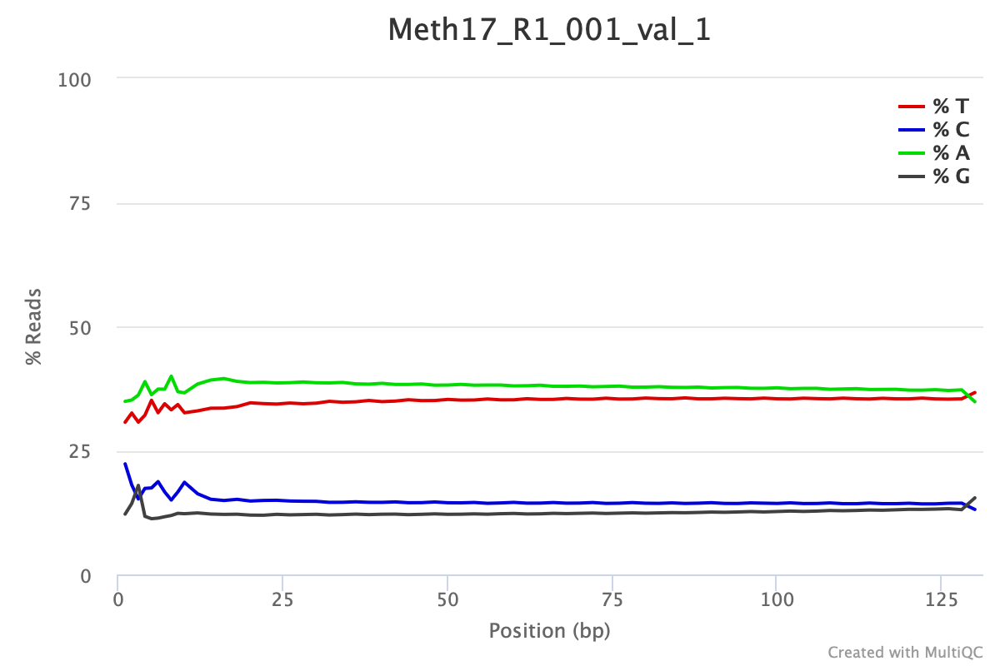

```{r,message = FALSE,echo = FALSE}
library(knitr)
knitr::opts_chunk$set(echo = TRUE)
library(knitcitations)
library(kableExtra)
opts_chunk$set(fig.width = 10,
               fig.height = 5,
               cache = FALSE)
cite_options(citation_format = "pandoc", max.names = 3, style = "html", 
             hyperlink = "to.doc")
```

---
title: 'DNA Methylation Analyses'
subtitle: '*Steven Roberts*, *Sam White*, and ............ '
bibliography: DNA-Methylation.bib
---

# Introduction

The purpose of this tutorial is to provide an example of taking Bisulfite treated DNA sequence data through identification of methylation at the loci and gene level. The principle behind creating bisulfite treated DNA libraries is that when cytosines are not methylated they will be converted to uracil, which ultimately result in thymine. When aligning to a reference genome the percent methylation at a given CpG loci is determined by examine the ratio to thymines and cytosines. For example if there is a given CpG loci with 30% of the alignment with the cytosine on the reference being and thymine, one would consider this cytosine loci (CpG) to be 70% methylated.

For a good review of epigenetic mechanisms including DNA methylation in marine organisms see @doi:10.1146/annurev-marine-010318-095114. @https://doi.org/10.1111/1755-0998.13542 offers a comparison of three methods for quantifying DNA methylation at single base-pair resolution using whole genome bisulfite sequencing (WGBS), reduced representation bisulfite sequencing (RRBS), and methyl-CpG binding domain bisulfite sequencing (MBDBS). The tutorial below is based on WGBS, though the general workflow would be consistent.

# Sequence Quality

An example of what raw data might look like from a marine invertebrate is shown. *Note that DNA methylation patters are diverse across taxa with most marine invertebrates demonstrating a mosiac pattern and global methylation at CpG loci is approximately 15%.*

Following trimming one would expect to see something similar to this. This particular data set was trimmed with the following parameters:

    /gscratch/srlab/programs/TrimGalore-0.4.5/trim_galore \
    --output_dir /gscratch/scrubbed/strigg/analyses/20200311/WGBS_MBD \
    --paired \
    --fastqc_args \
    --outdir /gscratch/scrubbed/strigg/analyses/20200311/WGBS_MBD/FASTQC \
    --threads 28 \
    --illumina \
    --clip_R1 10 \
    --clip_R2 10 \
    --three_prime_clip_R1 10 \
    --three_prime_clip_R2 10 \
    --path_to_cutadapt /gscratch/srlab/programs/miniconda3/bin/cutadapt \
    /gscratch/scrubbed/sr320/froger-raw/00_fastq/Meth17_R1_001.fastq.gz \

```{r meth-bp, echo = FALSE, out.width = "70%", fig.align = "center"}

```


# Read Alignment

The software used as part of this tutorial is **Bismark Bisulfite Mapper**. As with any software it is best to be famililar with the [User Manual](https://rawgit.com/FelixKrueger/Bismark/master/Docs/Bismark_User_Guide.html). Thus content below will provided with the assumption that the reader has read the manual and is meant to serve as guidance based on experience working with marine invertebrates.

The first step in the process in preparing the genome. Example code:

    # Directories and programs
    bismark_dir="/programs/Bismark-0.21.0"
    bowtie2_dir="/programs/bowtie2-2.3.4.1-linux-x86_64/"
    genome_folder="/where/the/fastafile/lives/"

    ${bismark_dir}/bismark_genome_preparation \
    --verbose \
    --parallel 28 \
    --path_to_aligner ${bowtie2_dir} \
    ${genome_folder}

You should expect to prepared genome with new directories indluding

    ./Bisulfite_Genome
    ./Bisulfite_Genome/GA_conversion
    ./Bisulfite_Genome/CT_conversion

For doing the alignment of the trim reads to the genome the following code structured is used

    find ${reads_dir}*_R1_001_val_1.fq.gz \
    | xargs basename -s _R1_001_val_1.fq.gz | xargs -I{} ${bismark_dir}/bismark \
    --path_to_bowtie ${bowtie2_dir} \
    -genome ${genome_folder} \
    -p 4 \
    -score_min L,0,-0.6 \
    --non_directional \
    -1 ${reads_dir}{}_R1_001_val_1.fq.gz \
    -2 ${reads_dir}{}_R2_001_val_2.fq.gz \
    -o Mcap_tg

This will create bam files (sequence alignment files)

Files are then deduplicated if they are whole genome bisulfite treated samples. This command will deduplicate the Bismark alignment BAM file and remove all reads but one which align to the the very same position and in the same orientation. This step is recommended for whole-genome bisulfite samples, but should not be used for reduced representation libraries such as RRBS, amplicon or target enrichment libraries.

    find *.bam | \
    xargs basename -s .bam | \
    xargs -I{} ${bismark_dir}/deduplicate_bismark \
    --bam \
    --paired \
    {}.bam

# Methylation Quantification

Methylation levels are then extracted using the `bismark_methylation_extractor`. For example:

    ${bismark_dir}/bismark_methylation_extractor \
    --bedGraph \
    --counts \
    --comprehensive \
    --merge_non_CpG \
    --multicore 28 \
    --buffer_size 75% \
    *deduplicated.bam

This will create a file with the suffix `deduplicated.bismark.cov.gz` (example shown below in uncompressed format). And while a bedGraph file is generated, in this workflow a bedGraph will be generated later that uses information from merged strands (as opposed to this output).

    NC_035784.1 141 141 37.5    3   5
    NC_035784.1 142 142 100 2   0
    NC_035784.1 155 155 70  7   3
    NC_035784.1 156 156 100 2   0
    NC_035784.1 291 291 0   0   2
    NC_035784.1 292 292 0   0   3
    NC_035784.1 313 313 0   0   1
    NC_035784.1 314 314 66.6666666666667    2   1
    NC_035784.1 470 470 66.6666666666667    4   2
    NC_035784.1 611 611 0   0   4

column organization of the file

    <chromosome> <start position> <end position> <methylation percentage> <count methylated> <count unmethylated>

A genome-wide cytosine report is generated, with this code as an example:

    find *deduplicated.bismark.cov.gz \
    | xargs basename -s _trimmed_bismark_bt2.deduplicated.bismark.cov.gz \
    | xargs -I{} ${bismark_dir}/coverage2cytosine \
    --genome_folder ${genome_folder} \
    -o {} \
    --merge_CpG \
    --zero_based \
    {}_trimmed_bismark_bt2.deduplicated.bismark.cov.gz

Generating a file `.CpG_report.merged_CpG_evidence.cov`

    NC_035785.1 217 219 100.000000  17  0
    NC_035785.1 523 525 87.500000   7   1
    NC_035785.1 556 558 50.000000   5   5
    NC_035785.1 727 729 100.000000  16  0
    NC_035785.1 1330    1332    0.000000    0   2
    NC_035785.1 1403    1405    0.000000    0   2
    NC_035785.1 1494    1496    66.666667   2   1
    NC_035785.1 1747    1749    100.000000  8   0
    NC_035785.1 2024    2026    100.000000  24  0
    NC_035785.1 2054    2056    93.333333   14  1

# File Conversions

From here it could be useful to do some simple file reorganizaion to obtain bedgraph or tab files for downstream analysis (eg bedtools, GLMs).

    #creating bedgraphs post merge
    for f in *merged_CpG_evidence.cov
    do
      STEM=$(basename "${f}" .CpG_report.merged_CpG_evidence.cov)
      cat "${f}" | awk -F $'\t' 'BEGIN {OFS = FS} {if ($5+$6 >= 10) {print $1, $2, $3, $4}}' \
      > "${STEM}"_10x.bedgraph
    done

    for f in *merged_CpG_evidence.cov
    do
      STEM=$(basename "${f}" .CpG_report.merged_CpG_evidence.cov)
      cat "${f}" | awk -F $'\t' 'BEGIN {OFS = FS} {if ($5+$6 >= 5) {print $1, $2, $3, $4}}' \
      > "${STEM}"_5x.bedgraph
    done

    #creating tab files with raw count for glms
    for f in *merged_CpG_evidence.cov
    do
      STEM=$(basename "${f}" .CpG_report.merged_CpG_evidence.cov)
      cat "${f}" | awk -F $'\t' 'BEGIN {OFS = FS} {if ($5+$6 >= 10) {print $1, $2, $3, $4, $5, $6}}' \
      > "${STEM}"_10x.tab
    done

    for f in *merged_CpG_evidence.cov
    do
      STEM=$(basename "${f}" .CpG_report.merged_CpG_evidence.cov)
      cat "${f}" | awk -F $'\t' 'BEGIN {OFS = FS} {if ($5+$6 >= 5) {print $1, $2, $3, $4, $5, $6}}' \
      > "${STEM}"_5x.tab
    done

It is sometimes useful to sort BAM files for downstream analysis (eg methylkit, IGV)

    # Sort files for methylkit and IGV
    find *.bam | \
    xargs basename -s .bam | \
    xargs -I{} ${samtools} \
    sort --threads 28 {}.bam \
    -o {}.sorted.bam

    # Index sorted files for IGV
    find *.sorted.bam | \
    xargs basename -s .sorted.bam | \
    xargs -I{} ${samtools} \
    index -@ 28 {}.sorted.bam

# References
