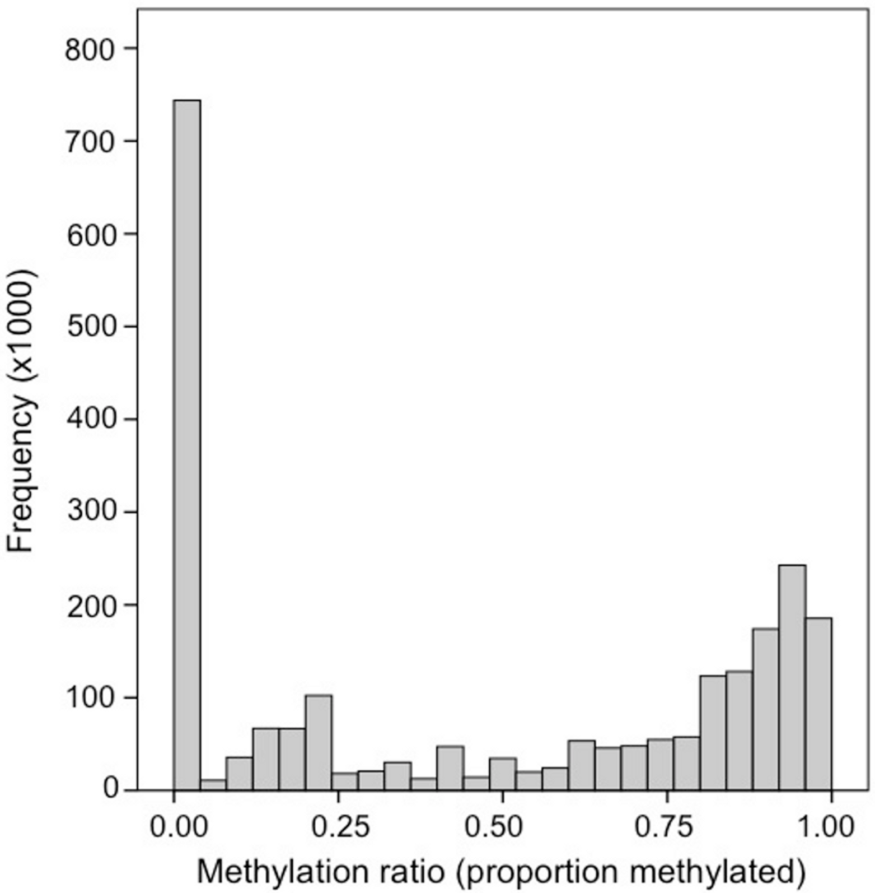

```{r,message = FALSE,echo = FALSE}
library(knitr)
knitr::opts_chunk$set(echo = TRUE)
library(knitcitations)
library(kableExtra)
opts_chunk$set(fig.width = 10,
               fig.height = 5,
               cache = FALSE)
cite_options(citation_format = "pandoc", max.names = 3, style = "html", hyperlink = "to.html")
```

---
title: 'DNA Methylation Assessment'
subtitle: '*Yaamini Venkataraman*, *Kathryn Greiner-Ferris*, *Sam White*, and *Steven Roberts*'
bibliography: DRAFT_DNA_methylation/DNA-Methylation.bib
---

Initial publication year: TBD <br> [How to cite](https://marineomics.github.io/#How_to_Cite)

# Introduction

## Background

Thanks to advances in sample preparation and sequencing methods, there is an influx of research examining epigenomics in non-model systems. Broadly, epigenetics can be defined as changes to gene expression that do not arise from changes in the DNA sequence. DNA methylation, or addition of a methyl (CH<sub>3</sub>) group to a cytosine base adjacent to a guanine (CpG) is one of the more commonly studies epigenetic mechanisms, partly because of its environmental sensitivity and potential role in phenotypic plasticity. For a good review of epigenetic mechanisms including DNA methylation in marine organisms see @doi:10.1146/annurev-marine-010318-095114.

The purpose of this tutorial is to provide an example of aligning bisulfite-treated and enzymatically converted DNA sequence data to an existing genome, and discuss needs for potential downstream applications. The principle behind creating bisulfite-treated DNA libraries is that when cytosines are not methylated, then they will be converted to uracil, which ultimately result in thymine nucleotides in the sequence data. @https://doi.org/10.1111/1755-0998.13542 offers a comparison of three methods for quantifying DNA methylation at single base-pair resolution using whole genome bisulfite sequencing (WGBS), reduced representation bisulfite sequencing (RRBS), and methyl-CpG binding domain bisulfite sequencing (MBDBS). When aligning bisulfite-converted data to a reference genome the percent methylation at a given CpG loci is determined by examining the ratio of thymines to cytosines. For example if there is a given cytosine adjacent to a guanine (ie CpG locus) with 30% of the reads containing thymine, one would consider this cytosine loci (CpG) to be 70% methylated. Since bisulfite treatment can damage DNA, newer library preparation and sequencing methods (ex. [NEBNext® Enzymatic Methyl-seq Kit; EM-seq](https://www.neb.com/en-us/products/e7120-nebnext-enzymatic-methyl-seq-kit#Protocols,%20Manuals%20&%20Usage) are starting to gain popularity. As EM-Seq produces loci-level data, alignment of EM-Seq data is similar to WGBS. Also, technologies like Nanopore and PacBio sequencing can directly detect DNA methylation without bisulfite conversion. As DNA passes through a nanopore or is sequenced by single-molecule real-time (SMRT) technology, changes in electrical current or fluorescence patterns can indicate the presence of methylated bases.

## Experimental Considerations

### Sample Size

Sample size is a critical factor when conducting DNA methylation analysis, particularly because of the significant variation in methylation patterns both between individuals and across different tissues. This variation, which is not yet fully understood, can significantly impact the outcomes and interpretations of methylation studies.

When selecting samples for DNA methylation analysis, the key principle is that larger sample sizes generally provide more reliable and generalizable results. A larger number of samples allows for a more accurate representation of the population, accounting for individual and tissue-level differences. This is essential for identifying true biological patterns rather than artifacts of small, non-representative samples.

However, the practicality of obtaining a large number of samples must be balanced with resource constraints. In this context, a sample size of around eight can be considered a decent starting point. This number is often sufficient to begin observing trends and patterns in methylation across individuals and tissues, providing a foundational understanding which can be built upon with further research.

It's crucial to remember that while more samples can enhance the reliability of the results, the quality of the samples and the robustness of the methylation analysis techniques are equally important. Therefore, researchers must strive for a balance between quantity and quality in their sample selection to ensure meaningful and accurate insights into DNA methylation.

### Sequencing Depth

### Bisulfite Conversion Efficiency

Bisulfite Conversion Efficiency is important to assess. One common step during library preparation us spiking library with Lambda phage DNA. Lambda phage DNA lacks cytosine methylation, making it an ideal control for bisulfite treatment. Here's how it works and why it's useful:

1.  **Background on Lambda Phage DNA**: Lambda phage DNA is a widely used control in bisulfite sequencing because it is naturally unmethylated. By including this DNA in your sample, you create a known unmethylated reference.

2.  **Preparation and Spiking**: You prepare the lambda phage DNA and spike it into your DNA samples before bisulfite treatment. The proportion of lambda DNA added should be enough to be detected post-sequencing, but not so much that it overwhelms the sample. A typical proportion might be around 0.1% to 1% of the total DNA.

3.  **Bisulfite Treatment and Sequencing**: After spiking, you proceed with bisulfite treatment and sequencing of the entire sample, which now includes your genomic DNA of interest and the spiked lambda DNA.

4.  **Assessing Conversion Efficiency**: Once sequencing is complete, you analyze the lambda phage DNA sequences. Since this DNA is unmethylated, all cytosines should be converted to thymines after bisulfite treatment and subsequent PCR. By calculating the percentage of cytosines that were successfully converted to thymines in the lambda DNA, you can determine the bisulfite conversion efficiency. An efficient conversion typically results in over 99% of cytosines being converted.

## Tutorial Details

For a good review of epigenetic mechanisms including DNA methylation in marine organisms see @doi:10.1146/annurev-marine-010318-095114. @https://doi.org/10.1111/1755-0998.13542 offers a comparison of three methods for quantifying DNA methylation at single base-pair resolution using whole genome bisulfite sequencing (WGBS), reduced representation bisulfite sequencing (RRBS), and methyl-CpG binding domain bisulfite sequencing (MBDBS). The tutorial below is based on WGBS, though the general workflow would be consistent.

The tutorial will cover the following:\
- Sequence quality assessment\
- Read alignment\
- Methylation quantification\
- File conversions\
- Potential downstream applications. Although this tutorial will not provide code for downstream applications such as differential methylation analysis, it will link to other open-access resources and examples.

The tutorial below is based on WGBS from a species of marine intertebrate (*Montipora capitata* coral) examined in @https://doi.org/10.1111/1755-0998.13542, and all raw data can be accessed under NCBI Bioproject PRJNA691891 if you would like to follow the tutorial with this dataset. The general workflow would be consistent for other library preparation and sequencing methods that produce loci-level data. The tutorial indicates places where special analytical consideration should be given to other data types.

# Sequence Quality

Following trimming one would expect to see FastQC per base sequencing content similar to the plot shown below. This particular data set was trimmed with the following parameters:

```         
/gscratch/srlab/programs/TrimGalore-0.4.5/trim_galore \
--output_dir /gscratch/scrubbed/strigg/analyses/20200311/WGBS_MBD \
--paired \
--fastqc_args \
--outdir /gscratch/scrubbed/strigg/analyses/20200311/WGBS_MBD/FASTQC \
--threads 28 \
--illumina \
--clip_R1 10 \
--clip_R2 10 \
--three_prime_clip_R1 10 \
--three_prime_clip_R2 10 \
--path_to_cutadapt /gscratch/srlab/programs/miniconda3/bin/cutadapt \
/gscratch/scrubbed/sr320/froger-raw/00_fastq/Meth17_R1_001.fastq.gz \
```

```{r meth-bp, echo = FALSE, out.width = "70%", fig.align = "center"}
knitr::include_graphics("DRAFT_DNA_methylation/meth-bp-chart.png")
```

For WGBS and MBDBS data, it is general practice to hard-trim 10 bp from the beginning and end of each read. [RRBS data often needs different trimming specifications](https://rawgit.com/FelixKrueger/Bismark/master/Docs/Bismark_User_Guide.html#ix-notes-about-different-library-types-and-commercial-kits).

# Read Alignment

## Software Considerations

The software used as part of this tutorial is **Bismark Bisulfite Mapper** [@10.1093/bioinformatics/btr167], which is one of the more widely-used softwares to align methylation data to a reference genome. Another commonly-used options include bwa-meth [@pedersen2014fast] and BSMAP [@10.1186/1471-2105-10-232] (see [@10.1093/bib/bbab021] and [@10.1016/j.csbj.2022.08.051] for comparisons of these software for plant and mammal species, respectively). As with any software it is best to be famililar with the [User Manual](https://felixkrueger.github.io/Bismark/).

Within Bismark, the tutorial uses Bowtie 2 [@10.1038/nmeth.1923] as the alignment software. Although the Bismark user manual covers the necessary Bowtie 2 parameters, it may be useful to refer to the [Bowtie 2 manual](https://bowtie-bio.sourceforge.net/bowtie2/manual.shtml).

The content below will provided with the assumption that the reader has read the manual and is meant to serve as guidance based on experience working with marine invertebrates.

## Genome Preparation

The first step in the process in preparing the reference genome by performing an in silico bisulfite conversion to allow Bowtie alignments. Example code:

```         
# Directories and programs
bismark_dir="/programs/Bismark-0.21.0"
bowtie2_dir="/programs/bowtie2-2.3.4.1-linux-x86_64/"
genome_folder="/where/the/fastafile/lives/"

${bismark_dir}/bismark_genome_preparation \
--verbose \
--parallel 28 \
--path_to_aligner ${bowtie2_dir} \
${genome_folder}
```

1.  **Bismark Genome Preparation Command**:

    -   **`${bismark_dir}/bismark_genome_preparation`**: This is the command to run the genome preparation part of Bismark. The **`${bismark_dir}`** variable is expanded to the path where Bismark is installed, so the script knows where to find the **`bismark_genome_preparation`** program.

    -   **`--verbose`**: This flag makes the program output more detailed information about what it is doing, which is helpful for debugging or understanding the process.

    -   **`--parallel 28`**: This option tells Bismark to use 28 threads in parallel to speed up the process. You can adjust this based on your computing power.

    -   **`--path_to_aligner ${bowtie2_dir}`**: This specifies the path to the aligner (Bowtie2) that Bismark will use. The **`${bowtie2_dir}`** variable is expanded to the path where Bowtie2 is installed.

    -   **`${genome_folder}`**: Finally, this specifies the location of the genome files. The script uses the **`${genome_folder}`** variable, which holds the path to these files.

Bismark will create two individual folders within this directory, one for a C-\>T converted genome and the other one for the G-\>A converted genome. After creating C-\>T and G-\>A versions of the genome they will be indexed in parallel usingthe indexer. Bismark will create the following subdirectories as outputs.

```         
./Bisulfite_Genome
./Bisulfite_Genome/GA_conversion
./Bisulfite_Genome/CT_conversion
```

This preparation step only needs to happen once for a given genome.

## Aligning reads

Once the genome is prepared, reads can be aligned. For aligning the trimmed reads to the genome the following code structure is used:

```         
find ${reads_dir}*_R1_001_val_1.fq.gz \
| xargs basename -s _R1_001_val_1.fq.gz | xargs -I{} ${bismark_dir}/bismark \
--path_to_bowtie ${bowtie2_dir} \
-genome ${genome_folder} \
-p 4 \
-score_min L,0,-0.6 \
--non_directional \
-1 ${reads_dir}{}_R1_001_val_1.fq.gz \
-2 ${reads_dir}{}_R2_001_val_2.fq.gz \
-o Mcap_tg
```

This will create BAM files (sequence alignment files) and txt files (mapping reports). The reports contain information such as mapping efficiency.

Specifically this is what the code chunk does:

1.  **Finding Files and Preparing Filenames**:

    -   **`find ${reads_dir}*_R1_001_val_1.fq.gz`**: This command uses the **`find`** utility to search for files in the directory specified by the variable **`reads_dir`**. The files it looks for have a naming pattern ending with **`_R1_001_val_1.fq.gz`**, which typically denotes the first file of a pair in paired-end sequencing data.

    -   **`| xargs basename -s _R1_001_val_1.fq.gz`**: The **`xargs`** command takes the list of files found and passes them to **`basename`**, which strips the suffix **`_R1_001_val_1.fq.gz`** from each filename. This step extracts the base name of each file, which is used to pair the R1 and R2 files correctly in the following steps.

2.  **Running Bismark for Sequence Alignment**:

    -   **`| xargs -I{} ${bismark_dir}/bismark`**: The **`xargs`** command here is used to pass the base filenames to Bismark for alignment. **`{}`** is a placeholder for each base filename.

    -   **`--path_to_bowtie ${bowtie2_dir}`**: This option specifies the path to the Bowtie 2 aligner, which Bismark uses for the alignment process.

    -   **`-genome ${genome_folder}`**: Specifies the directory where the genome files, prepared in advance, are located.

    -   **`-p 4`**: Sets the number of processing threads to 4, allowing Bismark to perform the alignment in parallel, which can speed up the process. This parameter can be changed based on your computing power.

    -   **`-score_min L,0,-0.6`**: This sets the scoring threshold for alignments, impacting the sensitivity and specificity of the alignment. The default scoring threshold used by Bismark is L,0,-0.2.

    -   **`--non_directional`**: This flag indicates the sequencing data is non-directional, which is important for correctly interpreting the methylation status in bisulfite sequencing.

    -   **`-1 ${reads_dir}{}_R1_001_val_1.fq.gz -2 ${reads_dir}{}_R2_001_val_2.fq.gz`**: Specifies the files for paired-end reads. R1 and R2 files are paired based on their base filename.

    -   **`-o Mcap_tg`**: Sets the output directory for the alignment results to **`Mcap_tg`**.

### Optimizing alignment sensitivity

The code above uses `score_min L,0,-0.6` as the scoring threshold for alignment sensitivity and specificity. This is different than the Bismark default, `score_min L,0,-0.2`. Reducing the sensitivity of the alignment can increase the percentage of reads aligned to the reference genome, but of course the quality of the alignment may decrease. A good practice is to align a subset of your data to the reference genome using different `score_min` parameters, then comparing mapping efficiency from the mapping reports. Generally, you want to choose a parameter that maximizes percent alignment and specificity. Example code

```         
find ${reads_dir}*_R1_001_val_1.fq.gz \
| xargs basename -s _R1_001_val_1.fq.gz | xargs -I{} ${bismark_dir}/bismark \
--path_to_bowtie ${bowtie2_dir} \
-genome ${genome_folder} \
-p 4 \
- u 10000 \
-score_min L,0,-0.6 \
--non_directional \
-1 ${reads_dir}{}_R1_001_val_1.fq.gz \
-2 ${reads_dir}{}_R2_001_val_2.fq.gz \
-o Mcap_tg
```

This is the same code as above, except `-u 10000` is used to run the alignment on a 10,000 bp subset of the data in each input file.

## Deduplication

Files are then deduplicated if they are whole genome bisulfite treated samples. This command will deduplicate the Bismark alignment BAM file and remove all reads that align to the the very same position and in the same orientation except for one. This step is recommended for whole-genome bisulfite samples, but **should not** be used for reduced representation libraries such as RRBS, amplicon, or target enrichment libraries. The [`bismark` manual](https://rawgit.com/FelixKrueger/Bismark/master/Docs/Bismark_User_Guide.html#ix-notes-about-different-library-types-and-commercial-kits) provides additional information.

```         
find *.bam | \
xargs basename -s .bam | \
xargs -I{} ${bismark_dir}/deduplicate_bismark \
--bam \
--paired \
{}.bam
```

# Methylation Quantification

## What to expect

DNA methylation at CpG locus can vary to 0-100%. How methylated CpGs are across a genome can vary WIDELY depending on your focal taxa. Generally, invertebrate genomes are predominantly unmethylated, with smaller regions of higher methylation in a mosaic pattern. In some marine invertebrates we see \~15% methylation of CpGs (defined as \> 75% methylated) across the genome with most CpGs unmethylated. In these taxa methylation usually occurs in gene bodies.

The figure below shows the methylation ratio of CpGs across the Pacific oyster (*Crassostrea gigas*) genome, as well as the location of methylation across the genome:

```{r meth-ratio, echo = FALSE, out.width = "70%", fig.align = "center", fig.cap = "Frequency distribution of methylation ratios for CpG dinucleotides in oyster gill tissue. @10.7717/peerj.215"}

```


```{r meth-igv, echo = FALSE, out.width = "100%", fig.align = "center", fig.cap = "Screenshot from IGV. Bedgraph files are displayed. See below for code to create these file (File Conversion)"}
knitr::include_graphics("DRAFT_DNA_methylation/igv.png")
```

---

Vertebrate genomes, on the other hand, have higher overall levels of methylation, with methylation occuring in CpG islands.

[ placeholder for Kathryn to add some stuff! ]

## Methylation extraction

Methylation levels are then extracted using the `bismark_methylation_extractor`. For example:

```         
${bismark_dir}/bismark_methylation_extractor \
--bedGraph \
--counts \
--comprehensive \
--merge_non_CpG \
--multicore 28 \
--buffer_size 75% \
*deduplicated.bam
```

This particular command is used to extract and process methylation data from BAM files (generated after sequencing data alignment). Let's break down the options:

1.  **Options**:

    -   **`--bedGraph`**: Generates a BedGraph file output, which is a format that allows visualization of the methylation levels across the genome in genome browsers.

    -   **`--counts`**: Outputs the count of methylated and unmethylated calls for each cytosine in the genome.

    -   **`--comprehensive`**: This option makes the methylation extractor process all cytosines in the genome, not just those in a CpG context. It combines all three contexts (CpG, CHG, and CHH) into one output file.

    -   **`--merge_non_CpG`**: Merges the methylation information for CHG and CHH contexts (non-CpG) into a single file.

    -   **`--multicore 28`**: Specifies that the program should use 28 cores to process the data in parallel, which can significantly speed up the analysis. This can be adjusted depending on your computing power.

    -   **`--buffer_size 75%`**: This option sets the buffer size for reading in BAM files to 75% of the available system memory. It helps optimize the performance of the tool by adjusting how much memory is used for processing. This can be adjusted depending on your computing power.

    -   **`*deduplicated.bam`**: This is the input file pattern for the command. It indicates that the methylation extractor should process all BAM files in the current directory that have names ending with "deduplicated.bam". These files are typically the output of a deduplication process applied to aligned bisulfite sequencing data.

This will create a file with the suffix `deduplicated.bismark.cov.gz` (example shown below in uncompressed format):

```         
NC_035784.1 141 141 37.5    3   5
NC_035784.1 142 142 100 2   0
NC_035784.1 155 155 70  7   3
NC_035784.1 156 156 100 2   0
NC_035784.1 291 291 0   0   2
NC_035784.1 292 292 0   0   3
NC_035784.1 313 313 0   0   1
NC_035784.1 314 314 66.6666666666667    2   1
NC_035784.1 470 470 66.6666666666667    4   2
NC_035784.1 611 611 0   0   4
```

column organization of the file

```         
<chromosome> <start position> <end position> <methylation percentage> <count methylated> <count unmethylated>
```

The resultant bedGraph file contains information from *unmerged* strands, meaning reads aligning to forward and reverse strands in the same position are not combined. It is important to merge the reads from the forward and reserve strands for more accurate methylation quantification. A genome-wide cytosine report and merged bedGraph file are generated (including merged bedGraph file) from the `deduplicated.bismark.cov.gz` generated above in this example code:

```         
find *deduplicated.bismark.cov.gz \
| xargs basename -s _trimmed_bismark_bt2.deduplicated.bismark.cov.gz \
| xargs -I{} ${bismark_dir}/coverage2cytosine \
--genome_folder ${genome_folder} \
-o {} \
--merge_CpG \
--zero_based \
{}_trimmed_bismark_bt2.deduplicated.bismark.cov.gz
```

The script converts coverage files into a format that details cytosine methylation levels across the genome. Here's a breakdown of each step:

1.  **Finding Files**:

    -   **`find *deduplicated.bismark.cov.gz`**: This command is used to search for all files in the current directory that end with **`deduplicated.bismark.cov.gz`**. These files are coverage files produced by Bismark, typically after aligning bisulfite-treated DNA sequences. They contain information about methylation at different sites in the genome.

2.  **Extracting Base File Names**:

    -   **`| xargs basename -s _trimmed_bismark_bt2.deduplicated.bismark.cov.gz`**: This pipeline uses **`xargs`** to pass each found file to **`basename`**, which strips the suffix **`_trimmed_bismark_bt2.deduplicated.bismark.cov.gz`** from each file name. This step extracts the base names of the files, which will be used to generate output filenames in the following steps.

3.  **Converting Coverage to Cytosine Methylation Levels**:

    -   **`| xargs -I{} ${bismark_dir}/coverage2cytosine`**: This pipeline uses **`xargs`** again to pass each base filename to the **`coverage2cytosine`** tool in the Bismark suite. The placeholder **`{}`** is replaced by the base filename.

    -   **`--genome_folder ${genome_folder}`**: This option specifies the location of the genome folder. The **`${genome_folder}`** variable holds the path to this folder, which contains reference genome data necessary for the analysis.

    -   **`-o {}`**: The **`-o`** option specifies the output file name, using the base filename **`{}`** obtained from the previous steps.

    -   **`--merge_CpG`**: This flag instructs the program to merge the methylation information of cytosines in CpG context, providing a single methylation value for each CpG site.

    -   **`--zero_based`**: This option indicates that the output file should use zero-based coordinates, which is a common format in bioinformatics where the first base of a sequence is numbered 0 instead of 1.

    -   **`{}_trimmed_bismark_bt2.deduplicated.bismark.cov.gz`**: Finally, this specifies the input file for each iteration, where **`{}`** is replaced by the base filename obtained earlier. These are the coverage files previously identified by the **`find`** command.

Output file format `.CpG_report.merged_CpG_evidence.cov` (merged bedGraph file)

```         
NC_035785.1 217 219 100.000000  17  0
NC_035785.1 523 525 87.500000   7   1
NC_035785.1 556 558 50.000000   5   5
NC_035785.1 727 729 100.000000  16  0
NC_035785.1 1330    1332    0.000000    0   2
NC_035785.1 1403    1405    0.000000    0   2
NC_035785.1 1494    1496    66.666667   2   1
NC_035785.1 1747    1749    100.000000  8   0
NC_035785.1 2024    2026    100.000000  24  0
NC_035785.1 2054    2056    93.333333   14  1
```

column organization of the file

```         
<chromosome> <start position> <end position> <methylation percentage> <count methylated> <count unmethylated>
```

# Summary Report

Many steps of the Bismark workflow produce reports (.txt files) with useful information (ex. mapping efficiency, percent cytosine methylation, etc.). These files can be collated into processing reports for each individual sample, which can then be further collated into an [HTML summary report](https://gannet.fish.washington.edu/seashell/bu-mox/scrubbed/032120-fds/bismark_summary_report.html):

```         
#HTML Processing Report

${bismark_dir}/bismark2report

#Summary Report

${bismark_dir}/bismark2summary
```

These commands should be run in the same directory where all output files are stored.

```{r meth-summary, echo = FALSE, out.width = "100%", fig.align = "center"}
knitr::include_graphics("DRAFT_DNA_methylation/bismark-summary-report.png")
```

# File Conversions

From here it could be useful to do some file reorganizaion to obtain bedGraph or tab files for downstream analysis (eg `bedtools`, GLMs). Specifically, it may be important to filter the CpG methylation data to a specific coverage threshold (ex. 5x or 10x). The more read coverage a CpG has, the higher the confidence in methylation quantification.

Creating bedGraphs post-merge at a specific coverage threshold (ex. 10x or 5x):

```         
for f in *merged_CpG_evidence.cov
do
  STEM=$(basename "${f}" .CpG_report.merged_CpG_evidence.cov)
  cat "${f}" | awk -F $'\t' 'BEGIN {OFS = FS} {if ($5+$6 >= 5) {print $1, $2, $3, $4}}' \
  > "${STEM}"_5x.bedgraph
done
```

Creating tab files with raw count data for GLMs at 10x and 5x coverage:

```         
for f in *merged_CpG_evidence.cov
do
  STEM=$(basename "${f}" .CpG_report.merged_CpG_evidence.cov)
  cat "${f}" | awk -F $'\t' 'BEGIN {OFS = FS} {if ($5+$6 >= 5) {print $1, $2, $3, $4, $5, $6}}' \
  > "${STEM}"_5x.tab
done
```

It is sometimes useful to sort BAM files for downstream analysis (eg methylkit, IGV)

```         
# Sort files for methylkit and IGV
find *.bam | \
xargs basename -s .bam | \
xargs -I{} ${samtools} \
sort --threads 28 {}.bam \
-o {}.sorted.bam

# Index sorted files for IGV
find *.sorted.bam | \
xargs basename -s .sorted.bam | \
xargs -I{} ${samtools} \
index -@ 28 {}.sorted.bam
```

# Next Steps

So you've aligned your trimmed reads to your reference genome and have methylation data for CpGs. Now what?

## Removing C to T (C-\>T) SNPs

Removing cytosine (C) to thymine (T) single nucleotide polymorphisms (SNPs) in bisulfite sequencing analysis could be something to consider for a few reasons:

1.  **Bisulfite Conversion Process**: In bisulfite sequencing, unmethylated cytosines are converted to uracil, which is then read as thymine in sequencing. This conversion is key to identifying methylated cytosines. However, if a genomic DNA sequence naturally has a C to T (C-\>T) SNP, it can be falsely interpreted as a converted cytosine, leading to incorrect conclusions about methylation.

2.  **Reduction of False Positives**: By removing C-\>T SNPs, one can reduce false positives in methylation analysis. Without removal, these SNPs might be misinterpreted as unmethylated cytosines that have undergone conversion, skewing the data towards an apparent increase in methylation.

3.  **Accurate Methylation Mapping**: For precise mapping of methylation patterns, it's crucial to distinguish between true methylation signals and genetic variation (SNPs). Removing C-\>T SNPs allows for a more accurate representation of the methylation status of the genome.

4.  **Analysis Consistency**: In comparative studies, where multiple samples or conditions are analyzed, removing C-\>T SNPs ensures consistency across samples. This is especially important in cases where SNP profiles may vary between samples, which could otherwise lead to inconsistent methylation data.

By eliminating these potential sources of error, researchers can have more confidence in their interpretation of the bisulfite sequencing data, leading to more reliable and valid conclusions about DNA methylation patterns.

One way to do this is using BS-Snper (@10.1093/bioinformatics/btv507). <https://github.com/hellbelly/BS-Snper>. This program finds SNPs in Bisulfite treated alignment files. The bash code below represents steps to identify SNPS and create a list of all C-\>T SNPS.

```         
samtools merge \
Pg_merged.bam \
*.sorted.bam

perl /gscratch/srlab/programs/BS-Snper-master/BS-Snper.pl \
Pg_merged.bam \
--fa Panopea-generosa-v1.0.fa \
--output snp.candidate.out \
--methcg meth.cg \
--methchg meth.chg \
--methchh meth.chh \
--minhetfreq 0.1 \
--minhomfreq 0.85 \
--minquali 15 \
--mincover 10 \
--maxcover 1000 \
--minread2 2 \
--errorate 0.02 \
--mapvalue 20 \
>SNP.vcf 2>SNP.log


grep $'C\tG' output/SNP.vcf > output/CT-SNP.vcf
wc -l output/CT-SNP.vcf
```

Let's break down the command and its arguments:

1.  **`perl /gscratch/srlab/programs/BS-Snper-master/BS-Snper.pl`**: This part of the command calls the Perl interpreter to execute the **`BS-Snper.pl`** script. The script is located in the **`/gscratch/srlab/programs/BS-Snper-master/`** directory.

2.  **`Pg_merged.bam`**: This is the input file for the script, likely a BAM file (Binary Alignment/Map format) which contains alignment information of bisulfite-treated sequencing reads.

3.  **`--fa Panopea-generosa-v1.0.fa`**: This option specifies the reference genome file in FASTA format against which the BAM file will be compared.

4.  **`--output snp.candidate.out`**: This argument sets the name of the output file where the SNP candidates will be written.

5.  **`--methcg meth.cg`, `--methchg meth.chg`, `--methchh meth.chh`**: These options specify the output files for methylation analysis for CG, CHG, and CHH contexts, respectively (where H can be A, C, or T).

6.  **`--minhetfreq 0.1`**: Sets the minimum frequency for heterozygous bases to be considered in SNP calling (here, 10%).

7.  **`--minhomfreq 0.85`**: Sets the minimum frequency for homozygous bases to be considered in SNP calling (here, 85%).

8.  **`--minquali 15`**: Sets the minimum base quality score.

9.  **`--mincover 10`, `--maxcover 1000`**: These set the minimum and maximum coverage (number of reads) for a position to be considered in the analysis.

10. **`--minread2 2`**: The minimum number of reads required to support a SNP candidate. It could be useful to use the same values for the minimum read threshold for SNP identification and for minimum coverage in the methylation data.

11. **`--errorate 0.02`**: Sets the error rate of sequencing (here, 2%).

12. **`--mapvalue 20`**: Specifies the mapping quality value, a threshold for considering reads in the analysis.

13. **`>SNP.vcf`**: Redirects the standard output to a file named **`SNP.vcf`**. This file will contain the SNP calls in VCF (Variant Call Format) format.

14. **`2>SNP.log`**: Redirects the standard error output to a file named **`SNP.log`**. This file will contain error messages and possibly additional log information.

The resulting could be used to mask the genome and the entire process described above could be repeated (ie Genome Preparation, Alignment, Quantification). An alternative and common practice is to remove cytosines from downstream analysis by removing loci in intermediate files (ie tab-delimited data files). Below is an example using `antijoin` to remove loci that correspond to CT SNPs from 5x coverage methyation quantification files.

```{r, eval=FALSE}
# Read in CT SNP file
ct <- read.csv("../output/CT-SNP.vcf", header = FALSE, sep = "\t") %>%
  mutate(loci = paste0(V1, "_", V2))


# 1. List all files with _5x.tab suffix
files <- list.files(path = "../data/", pattern = "_5x.tab$", full.names = TRUE)

# 2. Iterate over each file
for(file in files) {
  
  # Extract base filename without the directory for naming purposes
  base_name <- basename(file)
  
  # Read the file
  data <- read.csv(file, header = FALSE, sep = "\t")
  
  # Modify the data
  modified_data <- data %>%
    mutate(loci = paste0(V1, "_", V2)) %>%
    anti_join(ct, by = "loci") %>%
    select(-loci)
    
  
  # Write the modified data to an output file
  output_file <- paste0("../output/f", base_name)
  write.table(modified_data, file = output_file, sep = "\t", row.names = FALSE, quote = FALSE, col.names = FALSE)
}
```

Let's break down what each part of the script does:

1.  **Reading in a CT SNP file**:

    -   **`ct <- read.csv("../output/CT-SNP.vcf", header = FALSE, sep = "\t")`**: This line reads a file named **`CT-SNP.vcf`** from the specified directory. The file is expected to be in a tab-separated format (**`sep = "\t"`**), and it doesn't have a header row (**`header = FALSE`**).

    -   **`mutate(loci = paste0(V1, "_", V2))`**: The **`mutate`** function from the **`dplyr`** package is used to add a new column (**`loci`**) to the **`ct`** data frame. This column is created by concatenating the values in the first (**`V1`**) and second columns (**`V2`**) of each row, separated by an underscore.

2.  **Listing files with a specific suffix**:

    -   **`files <- list.files(path = "../data/", pattern = "_5x.tab$", full.names = TRUE)`**: This line generates a list of file paths in the **`../data/`** directory. It only includes files that end with **`_5x.tab`** (as indicated by the **`pattern`** argument).

3.  **Processing each file**:

    -   The **`for(file in files)`** loop iterates over each file found in the previous step.

        -   **`base_name <- basename(file)`**: Extracts the file name without the directory path.

        -   **`data <- read.csv(file, header = FALSE, sep = "\t")`**: Reads the current file in the loop. Similar to the first **`read.csv`** call, it expects a tab-separated file with no header row.

        -   The **`mutate`** and **`anti_join`** functions are used to modify **`data`**:

            -   **`mutate(loci = paste0(V1, "_", V2))`**: Adds a **`loci`** column similar to the **`ct`** data frame.

            -   **`anti_join(ct, by = "loci")`**: Removes rows from **`data`** that have matching **`loci`** values in the **`ct`** data frame.

            -   **`select(-loci)`**: Removes the **`loci`** column from the data.

        -   The modified data is then written to an output file:

            -   **`output_file <- paste0("../output/f", base_name)`**: Constructs the output file path.

            -   **`write.table(modified_data, file = output_file, sep = "\t", row.names = FALSE, quote = FALSE, col.names = FALSE)`**: Writes the **`modified_data`** to the specified file. The output is tab-separated, and it doesn't include row names, quotes, or column names.

## Downstream application

-   Gene-level methylation analysis. It is worth considering the utility of converting loci-level resolution data to gene-level resolution data

-   Differential loci or region analyses. methylKit is a popular package to conduct this analysis

-   Feature overlap. Bedtools for quantitative assessment and IGV for visual assessment are valuable for this.

# References
