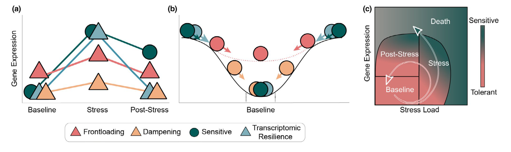

# Getting to Enrichment Analysis

Finding your subset of genes of interest 

* Differential expression
* Clustering
* WGCNA 

<br>

# Introduction and Considerations 

* The Gene Ontology (Thea)
* Annotation and filtration decisions (Sam) - include key terms
* Overrepresentation vs Enrichment (Thea)
* Explanation of statistics (Sam) - include key terms

<br>

# Tools and Approaches

* Ontologizer (command line) (Thea)
* Panther (online GUI) - endorsed by The Gene Ontology (Thea)
* R...Mann-Whitney U Test and Fisher’s Exact Test (Sam) 

<br>

# What to Do with the Output

* Visualizing results
* Interpreting results - gather consensus advice 
* R...Mann-Whitney U Test and Fisher’s Exact Test (Sam) 

<br>

# Formatting Examples

<br>

## Example of table syntax

| Term A | Term B | Term C | Term D | Term E | Term F | Term G |
| :--- | :--- | :--- | :--- | :--- | :--- | :--- |
| xxx | xxx | xxx | xxx | xxx | xxx | xxx |  
| yyy | yyy | yyy | yyy | yyy | yyy | yyy | 
| zzz | zzz | zzz | zzz | zzz | zzz | zzz | 

<br>

## Example of how to insert an image

```{r, echo = FALSE, out.height = "40%", fig.align = "center", }



```

## Example of how to write and print an equation

For illustrative purposes, here is a simple and famous equation

$$
E = mc^2
$$

<br>

As an example of a more complex equation, here is an equation for the t-statistic

$$
t = \frac{\overline{x_{1}}-\overline{x_{2}}}
{\sqrt{(s^2(
\frac{1}{n_{1}} + \frac{1}{n_{2}}
))}}
$$ 

## Example of how to cite a reference from your .bib in-text

Functional enrichment tests applied to mRNA analyses often impose significant biases [@Bleazard2015-vn].


    ```{r setup, include = FALSE} `r ''`

    # Set root directory... in this draft, ensure that you have the same path
    knitr::opts_knit$set(root.dir = '~/Documents/GitHub/marineomics.github.io/')

    ```

<br>

# Let's get started

Below is an example of what should be the first, visible code chunk

```{r, results = FALSE, message = FALSE, warning = FALSE}

## Unhash and run the code below if you believe you may need to install the packages loaded below
# Edit code below to list packages that are used in this draft... at present these are just examples

if (!require("BiocManager", quietly = TRUE))
    install.packages("BiocManager")

BiocManager::install(c("DESeq2","edgeR","arrayQualityMetrics"))

# Load packages
library(tidyverse)

```

# References

Below are the markdown-formatted references for our document derived from the 
