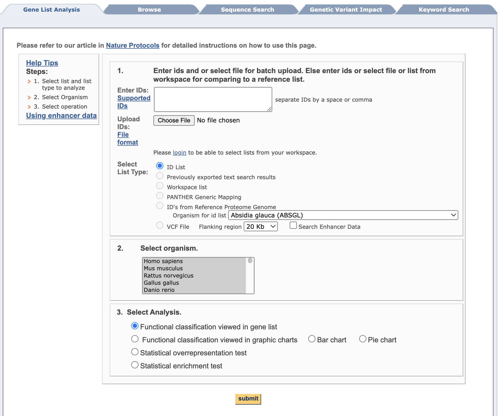
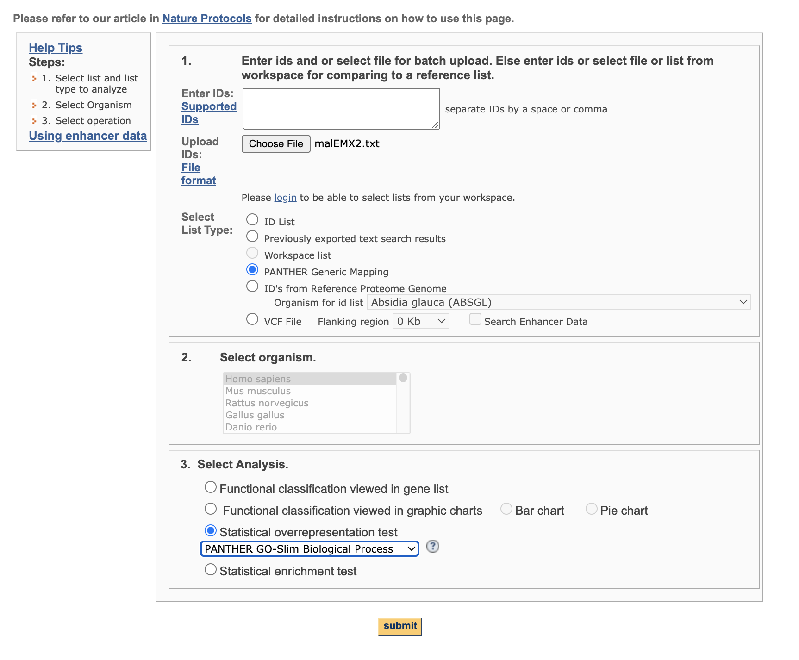
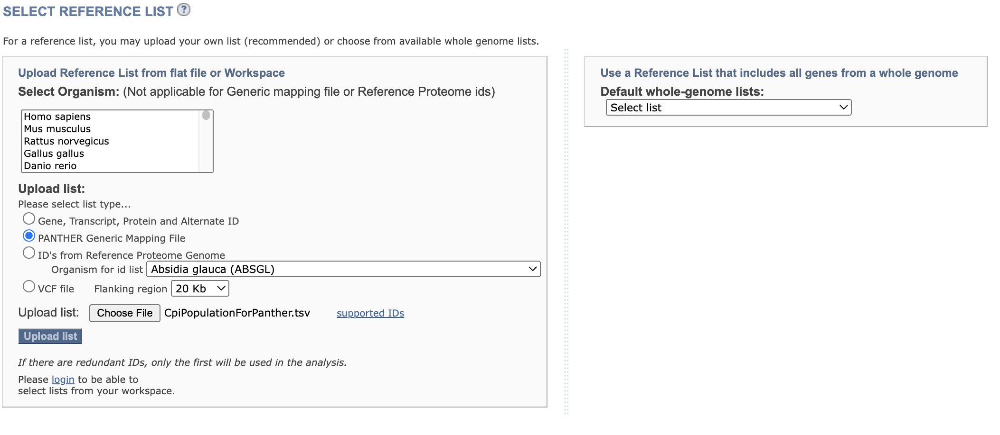
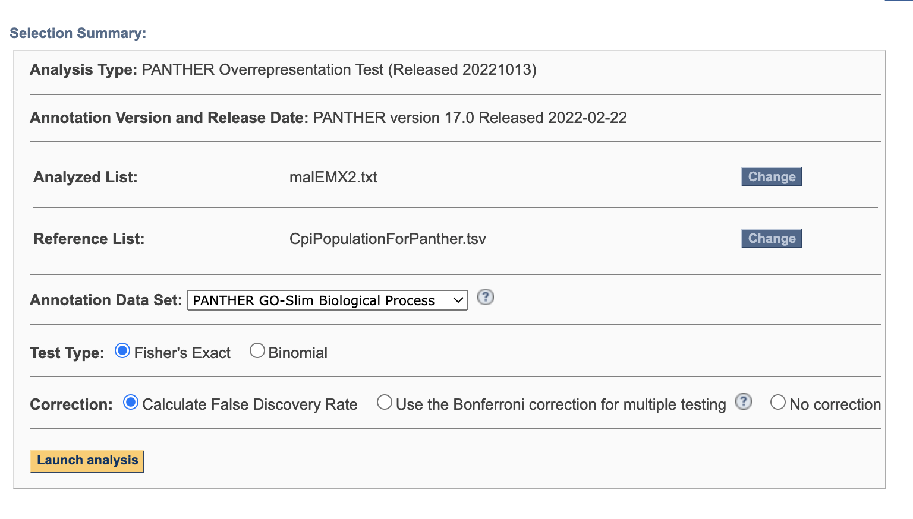
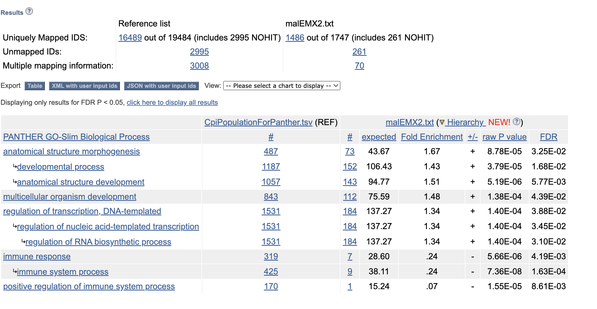
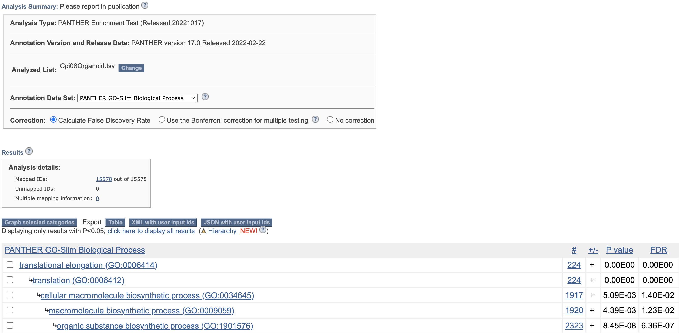

```{r setup, include=FALSE}
library(tidyverse)
library(reticulate)
```

Functional gene enrichment analysis is a powerful tool that can aid in the interpretation of biological data by identifying biological processes and pathways that are significantly overrepresented in a gene list of interest. However, to effectively use this tool, it is essential to have a proper annotation of genes.

Proper annotation of genes is crucial because it ensures the genes are correctly identified and annotated with their appropriate biological functions. Incorrect annotation of genes can lead to inaccurate interpretations of experimental results and hinder progress in understanding the biological systems of non-model species.

Therefore, the quality of gene annotation is critical for accurate functional gene enrichment analysis. This involves careful curation of gene annotations based on experimental evidence from various sources, including transcriptomic and proteomic data, literature mining, and functional assays. This curation process can be particularly challenging for non-model species with limited genomic and transcriptomic resources.

**In some instances high quality annotation might not be possible but it is critical that before you undergo enrichment analysis you have a full understanding of how your data set was annotated, and any associated limitations**

<br>

# Navigating Annotation

The following is a stepwise example or annotation of a gene set using UniProt::Swiss-Prot (reviewed) such that Gene Ontology terms can be associated with each gene.

In this following chunk where the fasta file is downloaded the [release](https://www.uniprot.org/help/release-statistics) is noted and the file name is modified accordingly.

```{r engine='bash', eval=FALSE}
cd DRAFT_Funct_Enrich/annot

curl -O https://ftp.uniprot.org/pub/databases/uniprot/current_release/knowledgebase/complete/uniprot_sprot.fasta.gz

mv uniprot_sprot.fasta.gz uniprot_sprot_r2023_02.fasta.gz
gunzip -k uniprot_sprot_r2023_02.fasta.gz
```

A protein blast database is then made.

```{r engine='bash', eval=FALSE}
/home/shared/ncbi-blast-2.11.0+/bin/makeblastdb \
-in DRAFT_Funct_Enrich/annot/uniprot_sprot_r2023_02.fasta \
-dbtype prot \
-out DRAFT_Funct_Enrich/annot/uniprot_sprot_r2023_02
```

In a majority of cases you will want to annotate a gene set to get gene ontology information. If you are creating your own genome or transcriptome it should be rather straightforward to know what file to annotate. If using a widely studied system where there are publically available resources, it is advisable to use those as this is the best way to facilitate integration of data sets. In this case study we will be considering the Eastern oyster, (*Crassostrea virginica*) for which there is data at [NCBI](https://www.ncbi.nlm.nih.gov/datasets/genome/GCF_002022765.2/) and [Ensembl Metazoa](http://metazoa.ensembl.org/Crassostrea_virginica_gca002022765v4/Info/Index). At NCBI there is both a GenBank and RefSeq assembly available.

In order to know which of the numerous fasta files should annotated with gene ontology information one should think downstream (or look to files already generated) to the identifiers in genesets that would be subject to functional enrichment tests.

The resulting fpkm count matrix for our case study is from an experiment where male and female oysters where exposed to low pH (and control) conditions. The count matrix is accessible [here (csv)](https://github.com/epigeneticstoocean/2018_L18-adult-methylation/blob/main/analyses/gene_fpkm.csv). Hisat2/Stringtie was used to generate the count matrix with `GCF_002022765.2_C_virginica-3.0_genomic.gff` formatting thus responsible for gene naming. Specifically the naming format is as follows `gene-LOC111099033,gene-LOC111099034,gene-LOC111099035`.

The following fasta was selected for annotation: `GCF_002022765.2_C_virginica-3.0_translated_cds.faa.gz`

```{r engine='bash', eval=FALSE}
cd DRAFT_Funct_Enrich/annot

curl -O https://ftp.ncbi.nlm.nih.gov/genomes/all/GCF/002/022/765/GCF_002022765.2_C_virginica-3.0/GCF_002022765.2_C_virginica-3.0_translated_cds.faa.gz

gunzip -k GCF_002022765.2_C_virginica-3.0_translated_cds.faa.gz
```

```{r engine='bash', eval=FALSE}
head -2 DRAFT_Funct_Enrich/annot/GCF_002022765.2_C_virginica-3.0_translated_cds.faa

echo "number of sequences"
grep -c  ">" DRAFT_Funct_Enrich/annot/GCF_002022765.2_C_virginica-3.0_translated_cds.faa

```

```         
>lcl|NC_035780.1_prot_XP_022327646.1_1 [gene=LOC111126949] [db_xref=GeneID:111126949] [protein=UNC5C-like protein] [protein_id=XP_022327646.1] [location=join(30535..31557,31736..31887,31977..32565,32959..33204)] [gbkey=CDS]
MTEVCYIWASSSTTVVICGIFFIVWRCFISIKKRASPLHGSSQQVCQTCQIEGHDFGEFQLSCRRQNTNVGYDLQGRRSD
```

This protein fasta is used as query for blast of uniprot_sprot database.

```{r engine='bash', eval=FALSE}
/home/shared/ncbi-blast-2.11.0+/bin/blastp \
-query DRAFT_Funct_Enrich/annot/GCF_002022765.2_C_virginica-3.0_translated_cds.faa \
-db DRAFT_Funct_Enrich/annot/uniprot_sprot_r2023_02 \
-out DRAFT_Funct_Enrich/annot/Cvir_transcds-uniprot_blastp.tab \
-evalue 1E-20 \
-num_threads 40 \
-max_target_seqs 1 \
-outfmt 6
```

Here is what the output file looks like, and at this point we want to get the UniProt Accession number for each gene

```{r engine='bash', eval=TRUE}
head -2 DRAFT_Funct_Enrich/annot/Cvir_transcds-uniprot_blastp.tab
```

```{r eval=TRUE}
blast <- read.csv("DRAFT_Funct_Enrich/annot/Cvir_transcds-uniprot_blastp.tab", sep = '\t', header = FALSE)
```

Convert fasta to tab

```{r engine='bash', eval=TRUE}
perl -e '$count=0; $len=0; while(<>) {s/\r?\n//; s/\t/ /g; if (s/^>//) { if ($. != 1) {print "\n"} s/ |$/\t/; $count++; $_ .= "\t";} else {s/ //g; $len += length($_)} print $_;} print "\n"; warn "\nConverted $count FASTA records in $. lines to tabular format\nTotal sequence length: $len\n\n";' \
DRAFT_Funct_Enrich/annot/GCF_002022765.2_C_virginica-3.0_translated_cds.faa > DRAFT_Funct_Enrich/annot/GCF_002022765.2_C_virginica-3.0_translated_cds.tab
```

```{r engine='bash', eval=TRUE}
head -1 DRAFT_Funct_Enrich/annot/GCF_002022765.2_C_virginica-3.0_translated_cds.tab
```

```{r}
cdsftab <- read.csv("DRAFT_Funct_Enrich/annot/GCF_002022765.2_C_virginica-3.0_translated_cds.tab", sep = '\t', header = FALSE, row.names=NULL)
```

Now we can take the two data frames: A) blast output of taking protein fasta and comparing to uniprot_swiss-prot and B) a tabular version of same fasta file that has ID numbers of importance. Note this importance was determined based on what we want to use down stream.

```{r, eval=TRUE}
g.spid <- left_join(blast, cdsftab, by = "V1") %>%
  mutate(gene = str_extract(V2.y, "(?<=\\[gene=)\\w+")) %>%
  select(gene, V11, V2.x) %>%
  mutate(SPID = str_extract(V2.x, "(?<=\\|)[^\\|]*(?=\\|)")) %>%
  distinct(gene, SPID, .keep_all = TRUE)
```

Let's break it down step by step:

1.  **`g.spid <- left_join(blast, cdsftab, by = "V1")`** - This line is using the **`left_join()`** function from **`dplyr`** to merge the **`blast`** and **`cdsftab`** datasets by the column "V1". A left join retains all the rows in the **`blast`** data frame and appends the matching rows in the **`cdsftab`** data frame. If there is no match, the result is **`NA`**. The result of this operation is assigned to the **`g.spid`** object.

2.  **`mutate(gene = str_extract(V2.y, "(?<=\\[gene=)\\w+"))`** - This line is using the **`mutate()`** function from **`dplyr`** to add a new column called "gene" to the data frame. The new column is created by extracting substrings from the "V2.y" column based on the given regular expression pattern **`"(?<=\\[gene=)\\w+"`**. This regular expression matches and extracts any word (sequence of word characters, i.e., alphanumeric and underscore) that comes after "[gene=".

3.  **`select(gene, V11, V2.x)`** - This line is using the **`select()`** function from **`dplyr`** to keep only the specified columns ("gene", "V11", and "V2.x") in the data frame.

4.  **`mutate(SPID = str_extract(V2.x, "(?<=\\|)[^\\|]*(?=\\|)"))`** - Again, the **`mutate()`** function is used to add another new column named "SPID". This column is created by extracting substrings from the "V2.x" column. The regular expression **`"(?<=\\|)[^\\|]*(?=\\|)"`** is designed to extract any character(s) that is/are surrounded by "\|" (pipe symbol). This is a common format for delimited strings.

5.  **`distinct(gene, SPID, .keep_all = TRUE)`** - This line is using the **`distinct()`** function from **`dplyr`** to remove duplicate rows based on the "gene" and "SPID" columns. The **`.keep_all = TRUE`** argument means that all other columns are also kept in the result, not just the "gene" and "SPID" columns.

The resulting **`g.spid`** data frame should have unique rows with respect to the "gene" and "SPID" columns, and it should contain these two new columns, "gene" and "SPID", extracted from the original data based on specific string patterns.

Now lets just write out SPIDs.

```{r, eval=TRUE}
left_join(blast, cdsftab, by = "V1") %>%
  mutate(gene = str_extract(V2.y, "(?<=\\[gene=)\\w+")) %>%
  select(gene, V11, V2.x) %>%
  mutate(SPID = str_extract(V2.x, "(?<=\\|)[^\\|]*(?=\\|)")) %>%
  distinct(gene, SPID, .keep_all = TRUE) %>%
  select(SPID) %>%
  write.table(file = "DRAFT_Funct_Enrich/annot/SPID.txt", sep = "\t", row.names = FALSE, quote = FALSE
 ) 
```


With a list of matching Swiss-Prot IDs, (technically UniProt Accession number) we can go back to https://www.uniprot.org and grab corresponding GO terms. This can be done via a web or using Python API.

**Using Web**

Using ID Mapping 


Now will customize columns to get GO IDs.


```{r engine='bash', eval=TRUE}
head -2 DRAFT_Funct_Enrich/annot/uniprotGO.tab
```

Finally we can join table to get "LOCIDs" the notation for our DEGs, with GO terms.

```{r, eval=TRUE}
go <- read.csv("DRAFT_Funct_Enrich/annot/uniprotGO.tab", sep = '\t', header = TRUE, row.names=NULL)
```


```{r, eval=TRUE}
left_join(g.spid, go, by = c("SPID" = "Entry")) %>%
  select(gene,Gene.Ontology.IDs) %>%
  write.table(file = "DRAFT_Funct_Enrich/annot/geneGO.txt", sep = "\t", row.names = FALSE, quote = FALSE
  )
```


```{r engine='bash', eval=TRUE}
head DRAFT_Funct_Enrich/annot/geneGO.txt
```


**Using API** (DOES NOTE WORK)

```{python}
#DRAFT_Funct_Enrich/annot/uniprot-retrieval.py DRAFT_Funct_Enrich/annot/SPID.txt
```

<br>

# Introduction and Considerations

## Considerations for a Rigourous Analysis

While functional gene enrichment analysis poses many challenges to non-model systems, it is critical the analyses conducted be as rigorous and replicable as possible. A recent survey of published enrichment results indicated that issues in the performance and reporting of enrichment analyses is not uncommon [@RN335]. Basic standards advised by the authors include:

-   Selection of appropriate gene background set. This set should not necessarily be the full set of genes in the genome. Rather it should be the set of genes expressed in the experiment. This is especially an issue with overrepresentation analysis and showed a consider impact on results when done incorrectly.
-   Multiple hypothesis correction. A common metric used with enrichment results is a false discovery rate (FDR) correction.
-   Adequate methodological reporting including software and parameters used, versions of software and annotation files, all gene lists analyzed including subset and background sets, types of statistical tests and corrections performed, and any code used to conduct the analyses.

<br>

## Getting to Enrichment Analysis: Annotation and Filtration Decisions

Once the challenge of annotating data has been met, the next step is determining the focus of your functional analysis. In some cases, you will use the complete dataset, but in other cases you may be interested in a subset of interest. There are numerous approaches that can be used to achieve this, many with excellent tutorials available online. Some commonly used approaches include: 

-   Differential Expression Analysis
-   Clustering
-   WGCNA

<br>

## The Gene Ontology

<br>

## Overrepresentation vs Enrichment Approaches

Often, everything gets referred to as enrichment analysis, but this is not the case. The two primary analyses to be run that examine functional patterns are statistical over-representation analysis and statistial enrichment analysis. There are differences in how data are input, what kind of data are used, and what statistical tests are employed by each analysis.

Over-representation analysis is used when you do not have expression values associated with your data. In this case you will provide a list of a subset of genes of interest as well as a reference list. This reference list will contain all the genes in your study. For example, in a transcriptomic analysis the reference list would include all expressed genes in the experiment while the gene of interest list might include genes that are over expressed under a specific condition (e.g., genes over expressed in females compared to all genes expressed in males and females). These two lists are compared to one another and a Fisher's Exact Test is used to calculate whether any functional categories (based on how genes are annotated to particular GO terms) are over-represented in your list of genes of interest, relative to the representation of all functional categories present in your full data set.

Enrichment analysis is used when you do have expression values associated with your data. In this case, you will provide the full list of genes in your experiment and their associated expression values (e.g., this might be a library from an RNA-seq experiment). Any expression metric can be used. This flexiblity is because enrichment analysis uses a Mann-Whitney U Test to calculate enrichment, which is based on rankings - thus values need to be interpretable for rank-based relationships, and an appropriate normalization metric should be applied to your data.

See later sections for further discussion of Fisher's Exact Test and Mann-Whitney U Test.

<br>

## A Primer on the Statistics of Functional Enrichment

Two popular methods of testing for GO term enrichment are the Fishers exact test and Mann Whitney U tests. Each test can produce results that are sensitive to the kinds of data they are input with such as differential expression or WGCNA coefficients [cite]. Neither test necessarily needs to be used alongside known networks of genes and use GO terms, enabling their use in non-model systems. These two methods are summarized and derived below:

<br>

### Fisher's Exact Test

The Fisher's exact test evaluates the relationship between two categorical variables: whether the ontology of a gene is represented in a test set or a background set. In the case of differential expression (DE), the test set is al DE genes and the background set is all genes included in DE analysis after filtering, not the entire transcriptome. The test asks whether the number of genes for a given GO term represented in a test set relative to the background is greater than what is expected due to chance alone (p).

$$
p = \frac{{\binom{{a+b}}{{a}} \cdot \binom{{c+d}}{{c}}}}{{\binom{{n}}{{a+c}}}}
$$

Where

-   $a =$ $n$ genes of GO term $i$ in both the test and background set
-   $b =$ $n$ genes of GO $i$ in the background but not test
-   $c =$ $n$ genes of GO $i$ absent from the test but present in the background
-   $d =$ $n$ genes of GO $i$ absent in both the category and the background
-   $n =$ $n$ genes in the background set

A Fisher's exact test can be executed in base R using the fishers.text() function

<br>

### Mann Whitney U Test

The critical difference between Mann Whitney U and Fisher's exact tests and are that Mann Whitney U's permit the analysis of continuous rather than categorical variables. These continuous values can be log fold changes of differential expression or -log p-values associated with DE or inclusion in a WGCNA. Because it doesn't rely on binary values denoting the existence of an effect, but rather the strength of an effect, the Mann Whitney U test is a more quantitative approach toward functional enrichment. The test asks whether the distribution of ranks for this continuous value in a GO term is significantly skewed from the distribution of ranks across all other GO terms. Like the background set employed in a Fisher's exact test, "all other GO terms" refers to those terms included in genes used for analysis following filtering.

The skewedness of a GO term's rank distribution relative to the background is represented by the statistic $U$. The p-value output by the Mann Whitney U test is calculated with the following equation:

$$
p = \frac{{U}}{{a \cdot b}}
$$

Where

-   $a =$ $n$ genes in GO term $i$
-   $b =$ $n$ genes in the background set

A Mann Whitney U test can be executed for GO enrichment analysis using code from [@Wright2015-dc]

<br>

A number of different parameters can be used to filter results or modify the execution of both tests, which we detail below.

<br>

# Tools and Approaches

-   Ontologizer (command line) (Thea)
-   Panther (online GUI) - endorsed by The Gene Ontology (Thea)
-   R...Mann-Whitney U Test and Fisher's Exact Test (Sam)

## Ontologizer

[Ontologizer](http://ontologizer.de/) offers a command-line option for functional analysis using the Gene Ontology and is one of several tools endorsed by the GO. Functionally, it represents a tool for overrepresentation analysis as it makes use of the Fisher's Exact Test. The most challenging part of running ontologizer is preparing your input files and ensuring they are annotated properly.

To run Ontologizer on the command line the Ontologizer.jar file will need to be downloaded from [here](http://ontologizer.de/commandline/). Additionally, Ontologizer requires java to run, so ensure you have this installed or call the relevant module in your hpc system. It needs to be supplied with the following:

-   The association file (-a) relating genes to GO terms (ends in .gaf for gene association file). A number of options are available through the annotations link on [this page](http://geneontology.org/docs/download-go-annotations/).
-   The file (-g) containing the GO terminology and structure [go-basic.obo](http://geneontology.org/docs/download-ontology/).
-   A population reference file (-p), which you will generate.
-   Files representing your gene subsets of interest (-s). Multiple subsets can be provided at one time to Ontologizer and run in parallel by specifying a path to the directory containing only these files.

There are a number of other options that can be specified. Some worth consider are your calculation method (-c), whether to ignore genes with no associations in your calculations (-i), and the name of the directory that you want your output written to (-o).

A sample script run on an hpc cluster may look like the following:

```         
java -jar Ontologizer.jar -a goa_uniprot_all.gaf -g go-basic.obo -p pop.CPISwissProtIDs.txt -s Subset/CPIDEA/StudySet -c "MGSA" -d 0.05 -i -o CPIOntologizerSubsetOutput
```

## PANTHER

PANTHER is a GUI option that is endorsed by The Gene Ontology and integrated into their website. PANTHER stands for Protein ANalysis THrough Evolutionary Relationships.

### Preparing data for input into Panther.

Here we will go over how to map your transcripts to PANTHER IDs for input into the PANTHER analysis pipeline. PANTHER can accept a number of ID types, but this is method may be useful if you are working in a nonmodel system with limited annotation data available.

Download the PANTHER HMM scoring tool from [here](http://pantherdb.org/downloads/index.jsp)

```         
wget http://data.pantherdb.org/ftp/hmm_scoring/current_release
```

Unpack the tar file.

```         
tar -xvzf PANTHER17.0_hmmscoring.tgz
```

Using the provided script located at pantherScore2.2/pantherScore2.2.pl, submit amino acid sequences to be searched against the PANTHER HMM library and assign appropriate IDs. Thus you may need to translate your transcript sequences using a tool such as [TransDecoder](https://github.com/TransDecoder/TransDecoder/wiki). Searching your sequences against the PANTHER HMM library can be done on the command line. You will need to load perl and hmmer software packages. Test data are provided to check that everything installed properly. Once you are ready to go, you can run some version of the following. See command options for alternative variables to consider.

```         
pantherScore2.2.pl -l ../target/famlib/rel/PANTHER17.0_altVersion/hmmscoring/PANTHER17.0/ -D B -V -i translated_coding_sequences.faa -o hits.txt -n
```

```         
-l PANTER (l)ibrary with HMMs when using hmmsearch, binary PANTHER HMM model when using hmmscan
-D display type for results
    options: I (interproscan), B (best hit), A (all hits)
-o (o)utput file (redirect STDOUT)
-i (i)nput fasta file to score
-V (V)ery verbose (debug info to STDERR)
```

The results will look something like this:

```         
CpiID   PantherID       GeneName        HmmEvalue       HmmBitscore     AlignRange
lcl|NC_024225.1_prot_XP_023959495.1_6146        PTHR46343:SF3   SUSHI REPEAT-CONTAINING PROTEIN SRPX2   1.2e-266        887.6   9-462
lcl|NW_007359912.1_prot_XP_008164062.1_46642    PTHR10048:SF33  PHOSPHATIDYLINOSITOL 4,5-BISPHOSPHATE 3-KINASE CATALYTIC SUBUNIT BETA ISOFORM   0       2111.3  1-1040
lcl|NW_007281451.1_prot_XP_008170789.1_21777    PTHR23119:SF48  LEUCINE-RICH REPEAT-CONTAINING PROTEIN 7        0       2508.4  7-1351
lcl|NW_007281531.1_prot_XP_005308912.1_25857    PTHR12157:SF18  REGULATING SYNAPTIC MEMBRANE EXOCYTOSIS PROTEIN 1       0       2637.1  1-1502
lcl|NW_007359900.1_prot_XP_005287749.1_44438    PTHR13040:SF2   AUTOPHAGY PROTEIN 5     3.2e-105        355.0   3-272
lcl|NW_007359900.1_prot_XP_005287749.1_44438    PTHR13040       AUTOPHAGY PROTEIN 5     3.2e-105        355.0   3-272
lcl|NW_007282136.1_prot_XP_005313942.1_33204    PTHR26450:SF179 OLFACTORY RECEPTOR      2.6e-146        489.7   1-311
...
```

Now that you have the PANTHER annotations, the next step is to do any final parsing of your data for input into PANTHER. For overrepresentation analysis you will need a reference file representing your population of genes and a subset file representing your set of target genes of interest. They can both take the format for Generic Mapping which follows the form shown above. If performing enrichment analysis, some extra data formatting will be needed. In this case, input should contain three columns: a gene ID (in a form useful to you), the PANTHER ID (resulting from the search against the HMM library described above), and an expression metric for each gene.

### Running PANTHER Overrepresentation

Go to <http://pantherdb.org>. This will bring up the start page which will look something like this:

image: 

Step 1 is to upload your file of interest. If you are doing an overrepresentation analysis, this would be a your subset list of genes. Your list type will need to be specified. If you are working with a non-model system with limited genomic resources, chances are you will want to use the PANTHER Generic Mapping option (see elsewhere for instructions on preparing this data). See both the Supported IDs and File format links on this page for descriptions of acceptable IDs.

Step 2 depends on your selection in step one. Here is where you would specify your organism (and consequent reference file) if it is avialable within the PANTHER database. If your organism is not avialable, you will have selected PANTHER Generic Mapping and will provide your own reference set (for overrepresenation analysis only) at a later stage and this step will be skipped.

Step 3 selects the type of analysis you would like to run. Here we will discuss the statistical overrperesentation test.

Here is what things will look like once your data are uploaded:

image: 

Click Submit.

You will now be brought to the second data entry page. Here is where you will provide your reference list. If you are working with a species present in the PANTHER DATABASE you can specify that here. Alternatively you can provide your own. In this example we will provide a PANTHER Generic Mapping File, since we also provided this type of file for our subset list.

First, select the list type - in this case we select PANTHER Generic Mapping File. Then choose file; you will be able to upload a file from your computer. Select upload list and you will be brought the the analysis page.

Prior to selecting upload list, the page should look something like this:

image: 

Once you have uploaded your reference file you will be brought to a new page. You should see your subset of interest file after Analyzed List and your population reference file after Reference List. You can select which annotation data set you want to query:

-   PANTHER Pathways
-   PANTHER GO-Slim Molecular Function
-   PANTHER GO-Slim Biological Process
-   PANTHER GO-Slim Cellular Component
-   PANTHER Protein Class

Select your test type (either Fisher's Exact Test or Binomial) and test correction type (False Discovery Rate, Bonferroni, or None).

Here is an example of what the page will look like once it is ready to go:

image: 

Launch Analysis.

Results will load below. The default is to only show significant results. There are several options for downloading results. Simply select the type you wish to download and save it to your computer.

Here is an example of the results page when there are significant hits:

image: 

### Running PANTHER Enrichment

Go to <http://pantherdb.org>. This will bring up the start page which will look something like this:

image: 

Step 1 is to upload your file of interest. If you are running enrichment analysis, then you would upload your full set of genes with expression values. Your list type will need to be specified. If you are working with a non-model system with limited genomic resources, chances are you will want to use the PANTHER Generic Mapping option (see elsewhere for instructions on preparing this data). See both the Supported IDs and File format links on this page for descriptions of acceptable IDs.

Step 2 depends on your selection in step one. Here is where you would specify your organism if it is avialable within the PANTHER database. If your organism is not avialable, you will have selected PANTHER Generic Mapping and this step will be skipped.

Step 3 selects the type of analysis you would like to run. Here we will discuss the statistical enrichment test.

Here is what things will look like once your data are uploaded:

image: 

Click Submit.

This will bring up the results page for the analysis. You can select a different type of annotation data set to analyze if you wish as well as change the multiple hypothesis correction type. The data sets available are the same as for running the overrepresentation test. A false discovery rate correction is applied automatically and any significant results are displayed below, but Bonferroni and none are options as well. There are several options for downloading results. Simply select the type you wish to download and save it to your computer.

Here is an example of the results page when there are significant hits:

image: 

## Using R

<br>

# What to Do with the Output

-   Visualizing results
-   Interpreting results - gather consensus advice
-   R...Mann-Whitney U Test and Fisher's Exact Test (Sam)

<br>

# Formatting Examples

<br>

## Example of table syntax

| Term A | Term B | Term C | Term D | Term E | Term F | Term G |
|:-------|:-------|:-------|:-------|:-------|:-------|:-------|
| xxx    | xxx    | xxx    | xxx    | xxx    | xxx    | xxx    |
| yyy    | yyy    | yyy    | yyy    | yyy    | yyy    | yyy    |
| zzz    | zzz    | zzz    | zzz    | zzz    | zzz    | zzz    |

<br>

## Example of how to insert an image

```{r, echo = FALSE, out.height = "40%", fig.align = "center", }

knitr::include_graphics("DRAFT_Funct_Enrich/Rivera_etal_fig.png")

```

## Example of how to write and print an equation

For illustrative purposes, here is a simple and famous equation

$$
E = mc^2
$$

<br>

As an example of a more complex equation, here is an equation for the t-statistic

$$
t = \frac{\overline{x_{1}}-\overline{x_{2}}}
{\sqrt{(s^2(
\frac{1}{n_{1}} + \frac{1}{n_{2}}
))}}
$$

## Example of how to cite a reference from your .bib in-text

Functional enrichment tests applied to mRNA analyses often impose significant biases [@Bleazard2015-vn].

````         
```{r setup, include = FALSE} `r ''`

# Set root directory... in this draft, ensure that you have the same path
knitr::opts_knit$set(root.dir = '~/Documents/GitHub/marineomics.github.io/')

```
````

<br>

# Let's get started

Below is an example of what should be the first, visible code chunk

```{r, results = FALSE, message = FALSE, warning = FALSE}

## Unhash and run the code below if you believe you may need to install the packages loaded below
# Edit code below to list packages that are used in this draft... at present these are just examples

if (!require("BiocManager", quietly = TRUE))
    install.packages("BiocManager")

BiocManager::install(c("DESeq2","edgeR","arrayQualityMetrics"))

# Load packages
library(tidyverse)

```

# Run GOMWU and Fisher's exact tests on data of interest (see <https://github.com/z0on/GO_MWU>)

```{r, include = TRUE, eval=F}

# GO enrichments using Mann Whitney U tests
setwd("GO_MWU-master/")

#Now we multiply them together into a new column

## Ok we also want to bring in our annotations
#I would suggest putting a GO_MWU folder into your working directory for these steps. There is some stuff to download such as the obo files 
#See https://github.com/z0on/GO_MWU

# GO_MWU uses continuous measure of significance (such as fold-change or -log(p-value) ) to identify GO categories that are significantly enriches with either up- or down-regulated genes. The advantage - no need to impose arbitrary significance cutoff.
# If the measure is binary (0 or 1) the script will perform a typical "GO enrichment" analysis based Fisher's exact test: it will show GO categories over-represented among the genes that have 1 as their measure. 
# On the plot, different fonts are used to indicate significance and color indicates enrichment with either up (red) or down (blue) regulated genes. No colors are shown for binary measure analysis.
# The tree on the plot is hierarchical clustering of GO categories based on shared genes. Categories with no branch length between them are subsets of each other.
# The fraction next to GO category name indicates the fracton of "good" genes in it; "good" genes being the ones exceeding the arbitrary absValue cutoff (option in gomwuPlot). For Fisher's based test, specify absValue=0.5. This value does not affect statistics and is used for plotting only.
# Stretch the plot manually to match tree to text

# Mikhail V. Matz, UT Austin, February 2015; matz@utexas.edu

################################################################
# First, press command-D on mac or ctrl-shift-H in Rstudio and navigate to the directory containing scripts and input files. Then edit, mark and execute the following bits of code, one after another.

# Edit these to match your data file names: 
input = "GOMWU_input.csv" # two columns of comma-separated values: gene id, continuous measure of significance. To perform standard GO enrichment analysis based on Fisher's exact test, use binary measure (0 or 1, i.e., either sgnificant or not).
goAnnotations = "goAnnot_spu.tab" # two-column, tab-delimited, one line per gene, multiple GO terms separated by semicolon. If you have multiple lines per gene, use nrify_GOtable.pl prior to running this script.
goDatabase = "go.obo" # download from http://www.geneontology.org/GO.downloads.ontology.shtml
goDivision = "MF" # either MF, or BP, or CC
source("gomwu.functions.R")

# Calculating stats. It might take ~3 min for MF and BP. Do not rerun it if you just want to replot the data with different cutoffs, go straight to gomwuPlot. If you change any of the numeric values below, delete the files that were generated in previos runs first.
gomwuStats(input, goDatabase, goAnnotations, goDivision,
	perlPath = "perl", # replace with full path to perl executable if it is not in your system's PATH already
	largest = 0.1, # a GO category will not be considered if it contains more than this fraction of the total number of genes
	smallest = 25,   # a GO category should contain at least this many genes to be considered
	clusterCutHeight = 0.25, # threshold for merging similar (gene-sharing) terms. See README for details.
	Alternative = "g") # # threshold for merging similar (gene-sharing) terms. See README for details.
           #	Alternative="g" # by default the MWU test is two-tailed; specify "g" or "l" of you want to test for "greater" or "less" instead. 
           #	Module=TRUE,Alternative="g" # un-remark this if you are analyzing a SIGNED WGCNA module (values: 0 for not in module genes, kME for in-module genes). In the call to gomwuPlot below, specify absValue=0.001 (count number of "good genes" that fall into the module)
           #	Module=TRUE # un-remark this if you are analyzing an UNSIGNED WGCNA module
# do not continue if the printout shows that no GO terms pass 10% FDR.

quartz.save(file = "quartz.png", type = "png")
results=gomwuPlot(input, goAnnotations, goDivision,
#	absValue=-log(0.05,10),  # genes with the measure value exceeding this will be counted as "good genes". Specify absValue=0.001 if you are doing Fisher's exact test for standard GO enrichment or analyzing a WGCNA module (all non-zero genes = "good genes").
	absValue= .2,
	level1=0.01, # FDR threshold for plotting. Specify level1=1 to plot all GO categories containing genes exceeding the absValue.
	level2=0.005, # FDR cutoff to print in regular (not italic) font.
	level3=0.001, # FDR cutoff to print in large bold font.
	txtsize=1.2,    # decrease to fit more on one page, or increase (after rescaling the plot so the tree fits the text) for better "word cloud" effect
	treeHeight=0.5 # height of the hierarchical clustering tree
#	colors=c("dodgerblue2","firebrick1","skyblue","lightcoral") # these are default colors, un-remar and change if needed
)
# manually rescale the plot so the tree matches the text 
# if there are too many categories displayed, try make it more stringent with level1=0.05,level2=0.01,level3=0.001.  

# text representation of results, with actual adjusted p-values
results

# Export list of GO terms enriched among genes in lowest quartiles of TSS acess and expression
write.csv(results[1], 
          "~/Documents/GitHub/marineomics.github.io/DRAFT_Funct_Enrich/MF_output.csv", 
          row.names = TRUE)

# Next, manually repeat this code chunk using BP and CC terms and change exported name of file

```

# References

Below are the markdown-formatted references for our document derived from the
