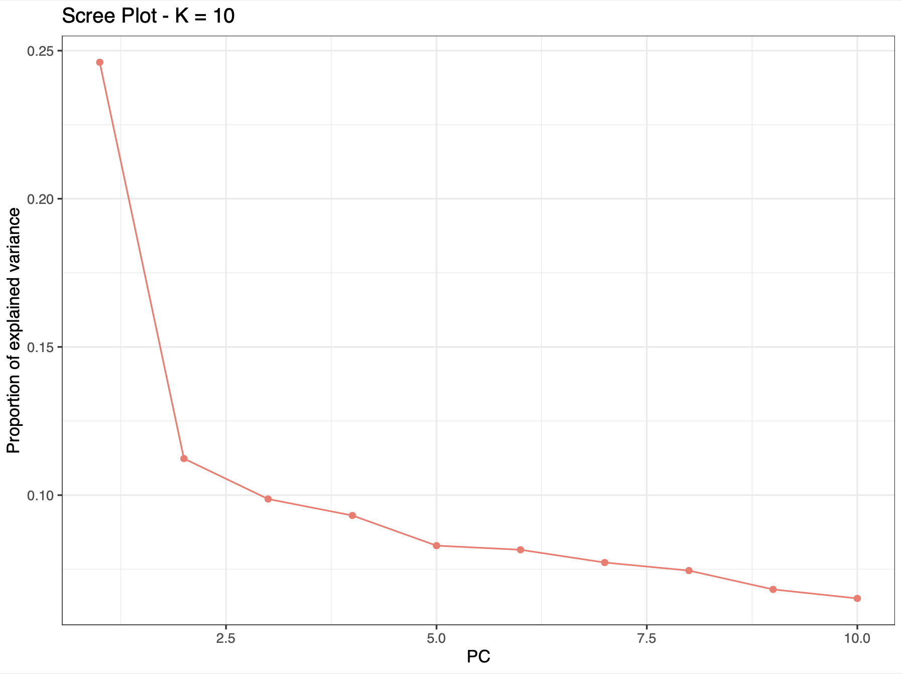
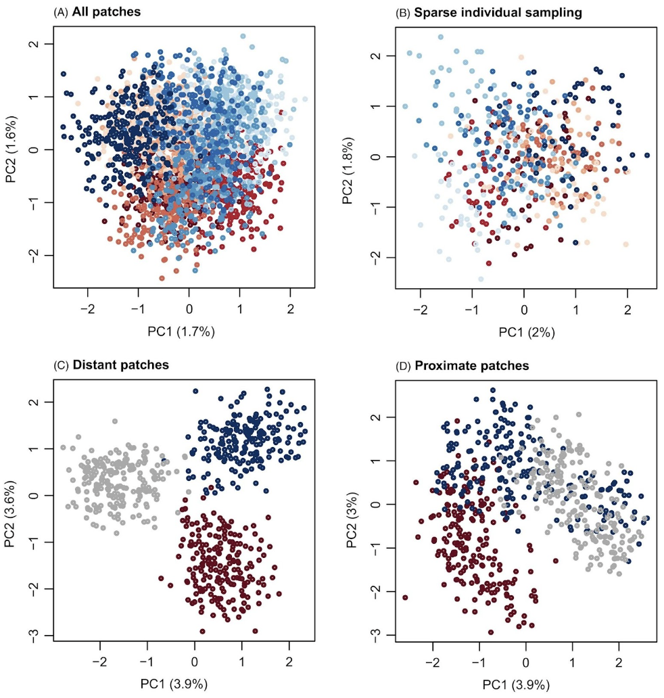
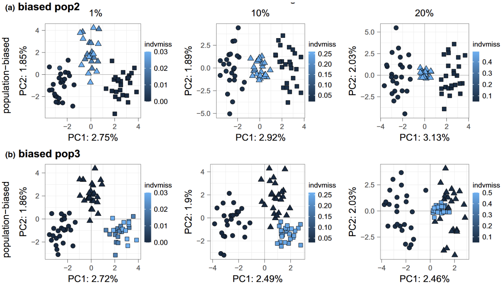

```{r setup, eval=TRUE, echo=TRUE, message = FALSE, include = FALSE}
knitr::opts_chunk$set(message = FALSE, warning = FALSE, cache = TRUE) 
```

[How to cite](https://marineomics.github.io/#How_to_Cite)

Principal component analysis (PCA) is a multivariate method often used for summarising and visualising genetic data. In MarineOmics, PCA is commonly used to explore [population structure](/lnk to population structure section) and to highlight data issues such as batch effects, outliers, or variation to be explored (i.e. structural variation). 

This page aims to provide a helpful resource for applying PCA in the field of population genomics. We provide a brief outline of the PCA method and then detail some ‘ins-and-outs’ as it relates to population genomics. Importantly, there are many existing resources for navigating PCA from both the primary literature and online tutorials, several of which we reference throughout this page. These useful resources can be found in the [References](#refs) section at the bottom of this page!

On this page we outline and describe many aspects of PCA:

* What is PCA and what are its common uses in population genetics?
* Considerations before sampling:
    + How one chooses to sample from a landscape
    + Sample sizes
* Considerations while processing data (aka 'weird stuff that happens in PCA'): 
    + Batch effects
    + LD and inversion effects
    + Missing data and imputation
    + Hybridization and inbreeding effects
    + Horseshoe and wave patterns
* Comparison to other common approaches to investigating population genetic structure
    + PCA  vs ADMIXTURE/STRUCTURE

<hr />

## What is PCA and what are its common uses in population genetics?

Primarily, PCA is about dimension-reduction. PCA captures the linear relationships (constrained, orthogonal axes) that best explain the correlated structure across the data.

In a population genomic context, the variables used for PCA are a matrix (n x m) of n samples (i.e. individuals, populations) and m genetic loci (usually microsatellite or SNP markers; genotypes, likelihoods or allele frequencies). In the case of an n x m (individual x SNP) PCA, each SNP is a variable, so that in a dataset with 500,000 SNPs there will be 500,000 variables (or dimensions) in the data. 

Because we cannot visualise 500,000 dimensions, PCA helps us distill these down to increase the interpretability of data while preserving the maximum amount of information (aka variance) . It does this by creating new, uncorrelated variables that maximise variance called “principal components” (PCs, see  for the OG description). Like other multivariate methods, PCA involves a series of geometric operations and associated computations, usually achieved by matrix factorization methods (for details see REF).  In PCA, the first few PCs will account for a substantial proportion of the variation in the original variables, and can consequently be used to provide a convenient lower-dimensional summary of these variables. 

The output of PCA are the eigenvalues and eigenvectors (eigenvalues = principal components (PCs), eigenvectors = principal axes) (see [here](https://www.youtube.com/watch?v=PFDu9oVAE-g) for video explanation) which can be represented as graphical outputs that summarise the information of a large number of variables by a smaller number of dimensions (PCs). When applied to very large genetic datasets, the eigenvectors and eigenvalues are usually determined by a method called singular value decomposition (SVD) or some variation of it, a matrix factorisation method recommended when the number of variables is very large  (i.e. often more variables than observed entities, n << m, see this [YouTube playlist](https://www.youtube.com/playlist?list=PLMrJAkhIeNNSVjnsviglFoY2nXildDCcv) for details). Other methods use the covariance (or correlation) matrix. The data are usually centered (so it becomes zero mean gaussian, center = TRUE ), and scaled ( scale = TRUE ), where scaling is recommended when the variance is not homogeneous across variables (@Jolliffe2005-hw).

The eigenvalues represent the amount of variance explained per component and are typically represented as a barplot, in descending order (Figure 1) (also called variable loadings). The percentage of explained variance by each eigenvector will vary between datasets since it is highly dependent on the size of the data and the correlation structure between variables. The eigenvalues are typically used as an empirical way of choosing the number of PCs to represent the data. Usually, the “elbow” of this barplot shows the number of the least amount of variables (PCs) explaining the most amount of variation. 

```{r, echo = FALSE, include = TRUE, out.width = "60%", fig.align = "center", fig.cap="Figure 1. 'Screeplot' of PCA eigenvalues, where there is one eigenvalue for every eigenvector. From Spies et al. 2022 (Supp. Fig. 2)."}



```

The eigenvectors are represented as a standard scatter plot, where points are samples/individuals represented on the new system of axes (PCs). Dimension reduction to eigenvectrors (PCs) means that the 1st PC is the linear combination of the original variables that explains the most/greatest amount of variation, while the 2nd PC accounts for the greatest amount of the remaining variation being orthogonal (uncorrelated) to the 1st PC, the 3rd PC accounts for the greatest amount of the remaining variation being orthogonal (uncorrelated) to the 1st and 2nd PC so on and so on. In population genomics, typically the 1st PC will capture broad scale population structure (because broadly distributed populations are usually the most differentiated) while subsequent axes capture more regional population structure (usually less differentiated at smaller geographic scales, see Figure 2A). However, other cool examples using PCA find the greatest amount of variation is between individuals, particularly in the case of inversions, structural variation or regions associated with a specific phenotype or adaption (see Figure 2B). 


```{r, echo = FALSE, include = TRUE, out.width = "60%", fig.align = "center", fig.cap="Figure 2. PCA plots from two studies (A) from Figure 2 in x, showing population structure results for 19 Ostrea lurida populations Plots of individual admixture determined using the program STRUCTURE (top) and PCA plots for PCs 1–5. PC1 is plotted against the latitude of the sampling site, then PC2 versus PC3 and PC4 versus PC5 and (B) from Figure 2 in x, showing PCA scores of 734 individuals of Atlantic Halibut (Hippoglossus hippoglossus) from samling sites on the North West Atlantic on PC1 and PC3 axes from PCA on 86 043 SNPs, highlighting population structure (PC3) and a putative inversion (PC1). In both plots, colors refer to the phylogeographic regions of each sample."}


```

To get a better understanding of PCA, we recommend reading these useful reviews and studies of PCA:

* Jolliffe, I. (2005). Principal component analysis. Wiley Online Library.
https://doi.org/10.1098/rsta.2015.0202
* Pearson K (1901) On lines and planes of closest fit to systems of points in space. Philos Mag
2:559–572
* Hotelling H (1936) Relations between two sets of variates. Biometrika 28:321–377
* // add good reviews here: task Katherine Silliman and others
* Fentaw Abegaz et al.,2019. Principals about principal components in statistical genetics, Briefings in Bioinformatics. DOI: https://doi.org/10.1093/bib/bby08
* Josse J., Husson F. (2012) Handling missing values in exploratory multivariate data analysis methods. J. Soc. Française Stat., 153, 79–99.

<hr />

## Considerations before sampling
### How one chooses to sample from a landscape
How samples are selected from a metapopulation also affects the visual pattern in a PCA. 

This study by [Gompert & Buerkle, 2021](https://onlinelibrary.wiley.com/doi/full/10.1111/eva.12380) simulated a metapopulation along a 1-D stepping stone model with 50 patches (patch - a location in space), where dispersal was allowed only between adjacent patches, leading to isolation by distance (https://onlinelibrary.wiley.com/doi/full/10.1111/eva.12380). 

The authors sampled the patches from the landscape in different ways and then performed a PCA.

Figure 4 from their paper shows how different patterns in a PCA can arise from the same metapopulation, depending on how that population was sampled:

A) 50 individuals were sampled from each patch. Dark red and blue indicate patches on opposite ends, with lighter colors used for more central patches. This graph reflects the weak population structure in the simulation.

B) 5 individuals were sampled from each patch. Dark red and blue indicate patches on opposite ends, with lighter colors used for more central patches.

C) 50 individuals were included from patches 1–4, 24–27 and 47–50. Dark red and dark blue are used to denote peripheral patches and gray is used to denote central patches. This could be incorrectly interpreted as evidence of an isolated hybrid lineage or even hybrid species.

D) 50 individuals were sampled from patches 20–31. Dark red and dark blue are used to denote peripheral patches in the sample and gray is used to denote central patches. In this case, sampling only the central patches also exaggerated the level of population structure. This horseshoe pattern in a PCA is a consequence of distance metrics that saturate (https://journals.asm.org/doi/10.1128/mSystems.00166-16). This saturation property arises in the case of  isolation by distance. With increasing distance between sampled patches, there is a loss of information about dissimilarity among patches (i.e. dissimilarity saturates with distance), and PCA cannot discriminate between samples that do not share any common features. 

```{r, echo = FALSE, include = TRUE, out.width = "70%", fig.align = "center", fig.cap="Figure 3. Figure 4 from https://onlinelibrary.wiley.com/doi/full/10.1111/eva.12380"}



```

### Sample sizes
Uneven sampling between groups, the number of samples and/or the number of markers/SNPs used in PCA can change the PCA projection space, and thus interpretation of results, relative to the true demographic history of the sampled groups.

In the paper “A Genealogical Interpretation of Principal Components Analysis,” McVean demonstrates the relationship between fundamental demographic parameters and the projection of samples onto the primary axes. This paper highlights how different demographic processes can lead to the same projections, and that projections can be influenced by uneven sampling. The study reviews nuances in how PCA is conducted. For example, if one chooses to normalize the rows to have equal variance, it will tend to up-weight the influence of rare variants.


**Number of SNPs**
The number of SNPs sampled has a large impact on the resolution of populations in PC space. In PCA, there is a critical signal-to-noise ratio below which the true structure of the signal cannot be recovered - in other words for genotype data, as genetic distance (i.e. FST) among populations decreases, the number of SNPs needed to separate the signal from the noise increases. The paper makes useful recommendations on how many SNPs would be needed to resolve population structure in PCA space for a given FST for a two population model (see  McVean //add ref):

FST > 1/sqrt(number_of_SNPs * number_of_samples_per_group) 		Eq1
Rearranging, if we know FST and the number of samples per group, we can calculate how many SNPs we would need to sequence for our PCA to be above the signal-to-noise ratio; or if we know FST and the number of SNPs, we can calculate how many samples per group we would need to sequence for our PCA to be above the signal-to-noise ratio:


Number_of_samples_per_group <- 1/(number_of_SNPs * FST^2)		Eq2

Number_of_SNPs <- 1/(Number_of_samples_per_group * FST^2)		Eq3


For instance, if FST = 0.01 and there is 100 samples per group, then you would need 1/(100 * 0.01^2) = 100 SNPs . If FST = 0.001 and there is 20 samples per group (not out of the question for a marine species), then you would need 1/(20 * 0.001^2) = 50,000 SNPs. Anecdotally, we have observed with SNP data for a high gene flow marine species (low FST) that >50,000 SNPs was needed to resolve structure in PC space between adjacent populations.

```{r, echo = FALSE, include = TRUE, out.width = "60%", fig.align = "center", fig.cap="Figure 4. Figure 2 from MacVean - Simulated a population (Fig 2A), where the expected locations for the two populations on the first PC are defined by the time-since-divergence (the lines in Fig 2C). The signal-to-noise threshold for a sample size of 100 and FST=0.01 is 100 SNPs (see Eq3 above). Fig 2C shows that around or below this threshold of 100 SNPs, the PCA is affected by random clustering. The author notes that the separation of samples (Fig 2C) with 10 SNPs does not correlate with population divergence, but reflects random clustering arising from the small numbers of SNPs."}


```

**Unequal sample size per population**

MacVean (2009) used simulations of two populations of equal size to show how the number of individuals sampled per group influenced PC projections (Figure 2a, MacVean, 2009). Figure 2B (MacVean, 2009) shows how groups with larger sample sizes will lie closer to the origin of the first PC axis, while Figure 2c shows the effect of using fewer SNPs on the inferring the true population configuration, where lines indicate the expectation of population scores on the PC-axis. 

The author extended this analysis to a 9-population stepping stone lattice. Figure 3 from the paper shows how differences in the number of samples per population can warp the projection space of PCA, even when migration rates and effective population size in each deme are the same. Note that FST among demes would be similar in all panels because it is based on an allele frequency in each deme (although small differences would occur due to sampling error when fewer individuals within a deme are sampled).

```{r, echo = FALSE, include = TRUE, out.width = "50%", fig.align = "center", fig.cap="Figure 5. Figure 3 from MacVean (2009). PCA projection of samples taken from a set of nine populations arranged in a lattice, each of which exchanges migrants at rate M per Ne generations with each adjoining neighbor, leads to a recovery of the migration-space if samples are of equal size (A), or a distortion of migration-space if populations are not equally represented (B,C). The left-hand panel for each pair shows analytical results, where the area of each point represents the relative sample size and lines show migration routes, while the right-hand panel shows how the projection space no longer reflects the migration matrix when sample size is uneven between projected groups."}


```

<hr />

## Considerations while processing data (aka 'weird stuff that happens in PCA')
Author: KE Lotterhos

We often use PCA because we are interested in understanding population structure using a dataset of genetic markers. However, because PCA is a linear transformation of variables, it can be strongly influenced by varying degrees of non-independence among the samples and variables (i.e. SNPs) that go into the analysis, which in some cases may obscure the structure that we wish to detect. Simply put, samples in a population genetic dataset are never independent of each other due to shared evolutionary history among populations (e.g., population structure), variation in associations among nucleotides within a genome due to linkage disequilibrium, or even variation in data quality due to sequencing (i.e. batch effects)... which means weird things can happen! 

In this respect, PCA is a useful tool to apply to your data, both prior to broader analysis, and as an analysis tool. Below we show how PCA can be applied including how it can be used to check for issues in your data during the filtering/cleaning stage ([batch effects](#batcheffects), [missing data](#missingdata), [linkage disequilibrium](#ld), [hybridization](#hybrid)), how it can be used to highlight informative loci/samples for further exploration (i.e. structural variation, linkage-disequilibrium, sex-linked markers, hybrids), and how it it is commonly used to visualise population structure in a set of unlinked genetic markers. 

### Batch effects {#batcheffects}
Batch effects are caused by technical differences among batches (i.e. groups) of samples in a dataset and may reflect differences in DNA quality, library preparation method, depth of sequencing, sequencing platform, read type (single vs paired-end), and/or read length (https://onlinelibrary.wiley.com/doi/full/10.1111/1755-0998.13559). These technical differences can result in differences in missing data, genotype error rates, allele frequency estimates, or SNP coverage among batches, causing different batches to appear as unique clusters in PC space. Batch effects can systematically bias genetic diversity estimates, population structure inference and selection scans (https://onlinelibrary.wiley.com/doi/full/10.1111/1755-0998.13559). Batch effects can be removed with careful read trimming and filtering (see https://onlinelibrary.wiley.com/doi/full/10.1111/1755-0998.13559 and references therein).

As an example, let us consider simulated results from Lou & Therkildsen (2022; https://onlinelibrary.wiley.com/doi/full/10.1111/1755-0998.13559) depicting batch effects related to differences in sequencing depth in a low-coverage whole genome dataset.  
Simulations consisted of nine populations on a 3x3 grid connected to neighbors in a low migration scenario (see Supporting Information at https://onlinelibrary.wiley.com/doi/full/10.1111/1755-0998.13559 for details). In this case, the PCA based on “true genotypes” should look similar to the figure below in which each of the populations are able to be distinguished as separate clusters in PC space. 

```{r, echo = FALSE, include = TRUE, out.width = "30%", fig.align = "center", fig.cap="Figure 6. Example figure above modified from Figure 4 in https://onlinelibrary.wiley.com/doi/abs/10.1111/mec.16077. This figure depicts patterns of spatial population structure inferred through principal component analysis (PCA) with lcWGS data. At top is a schematic for a scenario with nine populations (each coloured node corresponds to a simulated population) on a 3x3 grid connected to neighbors via gene flow, and below is the PCA based on the true genotypes under low migration conditions."}


```

Under these conditions, two batches of sequencing data generation - one reflecting a sequencing depth of 0.125x and the other of 4x - were then simulated for different numbers of individuals sampled from each population. The performance of three different PCA/PCoA approaches to inferring patterns of spatial population structure under these conditions is compared in the figure below. 

```{r, echo = FALSE, include = TRUE, out.width = "100%", fig.align = "center", fig.cap="Figure 7. Differences in the sensitivity of three PCA programs to batch effects caused by different sequencing depths and number of samples. The number at the top of each panel is the number of individuals sampled from each simulated population. Color represents sequencing depth: yellow points mark individuals that were simulated sequenced at 0.125×; grey points for 4×. Figure 6 from https://onlinelibrary.wiley.com/doi/full/10.1111/1755-0998.13559."}

knitr::include_graphics("DRAFT_PCA/Fig.7_Lou_Thilk_fig6.png")

```

Within each panel of the above plot, the only thing that differs between the two batches of simulated data is their sequencing depth. In this example, we see false patterns of clustering at lower sample sizes (n=5,10) when using the first two PCA approaches (PCAngsd and ANGSD with the -doCov 1 option) in which samples tended to group together according to sequencing depth along one of the PC axes (i.e. a batch effect associated with differences in sequencing depth). As the sample size per population increased from left to right, false patterns of clustering by read depth become less apparent and suggest that larger sample sizes can help to mitigate batch effects caused by differences in coverage. 

### LD and Inversion effects {#ld}
Linkage disequilibrium (LD) is the non-random association between alleles and can arise from physical proximity on a chromosome, demography, or selection. LD is often measured as a correlation in allele frequencies across a set of individuals and varies across a genomic map depending on recombination rates, demographic history, and selection. For example, if two SNPs are physically proximate, the allele at one SNP can predict the allele at the other SNP in the same individual because recombination is rare among sites. But LD can also evolve among SNPs that are not physically proximate, for example if an allele at each SNP is under selection. LD is a source of non-independence in genomic data. Variation in linkage disequilibrium across the map of the genome can warp principal components, as initial PC axes are biased to explain genetic variation in LD as opposed to genetic variation among populations (see Figure 2B above).

The following Figure 3 from Lotterhos 2019 (https://academic.oup.com/g3journal/article/9/6/1851/6028019) illustrates what happens in a PCA on landscape genomic data when there is recombination variation. She simulated a 2-D continuous landscape with local adaptation to an environmental cline, with a genome that consisted of linkage groups with quantitative trait loci that contributed to adaptation, a large neutral inversion (not involved in adaptation), and a region of low recombination (also not involved in adaptation). Even though the SNPs in the inversion made up less than 5% of the total number of SNPs in the PCA, and the inversion was not related to population structure, the first PC axis separated samples by inversion genotype (Figure A below - the second PC axes separated samples based on their haplotype in the region of low recombination).

When SNPs were thinned for LD and then a PCA was run on the data, the PCA showed a pattern of isolation-by-environment, which more accurately captured the population structure in the simulation (Figure B below - https://academic.oup.com/g3journal/article/9/6/1851/6028019).

```{r, echo = FALSE, include = TRUE, out.width = "50%", fig.align = "center", fig.cap="Figure 8. Figure 3 from https://academic.oup.com/g3journal/article/9/6/1851/6028019."}

knitr::include_graphics("DRAFT_PCA/Fig.8_Lotterhos2019_fig3.png")

```

Similar patterns have been observed for sex linked-markers. For example, https://onlinelibrary.wiley.com/doi/10.1111/mec.14217  found genetic clustering in a PCA by sex instead of by population structure, which was driven by as few as 12 sex-linked markers in the data.  Removing the sex-linked markers led to nonsignificant genetic structure in one species and a more accurate estimation of FST in the second species.

### Missing Data in PCA and Imputation {#missingdata}

Missing data in population genomic analysis is common.  Sometimes it is random, or it may be a feature of the data type (i.e. low coverage NGS, microsatellite null alleles, mutation at RAD cut sites). In general, if missing data reflects a true population signal (e.g. null alleles in one population but not others) then it requires careful consideration during analysis. 
 
However, PCA and other multivariate analyses typically do not allow missing data in the input, and many commonly used PCA methods cannot handle missing data which can bias results. It is therefore relevant to know how the implementations of PCA used often in MarineOmics and other conservation genomic studies account, or not,  for missing data. 

Implementations of PCA in genomics typically (a) avoid missing values (i.e pcadapt, plink) usually by first determining the covariance-matrix or genomic relationship matrix (GRM)) between each pair of individuals using the variables (loci) that are available for both samples or by (b) impute missing values. Imputation is the process of replacing a missing value with a numerical value via inference. Imputation of missing data can be done by sophisticated methods such as in genomic association studies, linked haplotypes, and strong genotype-phenotype correlations (see Yi & Latch, 2021). However, in population genomic studies for species of conservation concern which may have few genomic resources, simple imputations such as mean imputation (replace missing with column mean) are commonly encountered. 

Imputation via the mean genotype in the metapopulation.
In this case, missing values for all individuals at a locus are replaced with the mean for that locus (also called a mean-imputed matrix). Importantly, when the mean-imputed matrix is centered and scaled, the original missing become non-informative in PCA (missing values are placed at the origin). This can be problematic if you have a lot of missing data in your dataset, especially if that missing data is biased (not random). Yi and Latch (2022) demonstrated this effect using different simulated populations (no migration. 5% migration, isolation-by-distance-cline) with 1%, 10% and 20% missing data, either randomly distributed among individuals, or biased among some individuals and some populations. They conducted PCA using the adegenet::glPca() implementation of PCA with default mean imputation and standardization, retaining all PCA axes. They found that individuals biased with missing data would be dragged away from their real population clusters to the origin of PCA plots, making them indistinguishable from known admixed individuals, potentially leading to misinterpreted population structure (Figure 11). 

```{r, echo = FALSE, include = TRUE, out.width = "80%", fig.align = "center", fig.cap="Figure 9. Figure 2(b) from Yi and Latch (2022) shows PCA on the individual-biased missing data (1%, 10% or 20%) introduced to a simulated population experiencing an isolation-by-distance cline, where one population (represented as triangles) is an admixture of the remaining two (circle and squares). Individual colors represent their amounts of missing data with relatively higher missingness shown in lighter blue in each plot (legend, notice changing scale from left to right). As the % of missing data increases, the samples with the most missing data become centered at the PCA origin."}


```

Imputation via the mean genotype within a site, sampling location, or population. 
In this case, missing values for each individual sample at each locus is replaced with the mean genotype of other individuals from the same sampling location or population. The effect of this imputation in a PCA is that the mapping for that imputed sample will move closer to the center of the population cluster, and will make the PCA appear to be more clustered (Figure 12). This is because this method of imputation would make samples with missing data look more similar to the samples used to generate imputation values. This method is not recommended (see Yi & Latch 2021), since within-group mean imputation depends largely on the a priori population designation and can easily bring artificial biases. 

```{r, echo = FALSE, include = TRUE, out.width = "80%", fig.align = "center", fig.cap="Figure 10. Figure 4 from Yi and Latch (2022) shows PCA on the cline model with missing data condensed in either the (a) admixed population and (b) one end population. The admixed population (pop2) has high migration with both end populations (pop1 and pop3) while no migration occurs between the end populations."}



```

**Effects of different approaches to imputation on PCA.**

The choice of imputation can have drastic effects on inference if there is a lot of missing data. When there is population structure and missing genotypes are imputed with the mean genotype across all populations, the genetic differentiation among populations may be artificially reduced and the metapopulation would appear to be panmictic.  When there is no population structure and missing genotypes are imputed with the mean genotype within each sampling location, the genetic differentiation among populations may be artificially inflated and it could appear that their genetic structure when there is in fact none. As such, it is really important to understand the type of imputation a PCA method might be implementing  and its effect  on population clustering and final inferences. 

Since most genomic data has missingness, it may be preferable to implement a method of PCA which explicitly accepts it (i.e pcadapt, PCAngsd).  

### Hybridization and inbreeding effects {#hybrid}
Genetic differences between two different parental species typically constitute the dominant axis of genetic variation in a PCA, with hybrids mapping in PC space between the parental species (https://onlinelibrary.wiley.com/doi/full/10.1111/eva.12380 ). However, PC axes can also pick up on differences in homozygosity caused by many generations of inbreeding. These PCA patterns can be informative during early data exploration for identifying cryptic species or hybrids that you may want to remove prior to analyzing for population structure.  

Below is Figure 5 from https://onlinelibrary.wiley.com/doi/full/10.1111/eva.12380, with two parental species shown in dark red or dark blue, the F1 hybrids in yellow circles, and the F1-parental backcrosses in the lighter colors. Subsequent crosses between hybrids are shown in yellow with different symbols (F2 squares, F5 upward triangles, F20 downward triangles). F1...FN are genetically intermediate on PC1, and across all hybrids, PC1 mirrors the admixture proportion. In general, PC2 is associated with genetic variation among Fn generations.

```{r, echo = FALSE, include = TRUE, out.width = "50%", fig.align = "center", fig.cap="Figure 11. Figure 5 from https://onlinelibrary.wiley.com/doi/full/10.1111/eva.12380."}

knitr::include_graphics("DRAFT_PCA/Fig.11_Gompert_Buerkle_fig5.png")

```


### Horseshoe and Wave patterns
Horseshoe patterns arise in population genetic data that has isolation by distance structure, by which genetic differentiation among locations increases with the distance between them. The result when this type of data is put into a PCA is that the pattern looks like a horseshoe (Figure 1B from Morton et al below). In Figure 1B, Sample 0 is most distantly related from Sample 20, but they have the same loading on the PC1 axis. Horseshoe patterns also arise in microbial ecology, where they were originally misinterpreted as having an ecological explanation before they were proven to be a statistical artifact (https://journals.asm.org/doi/10.1128/mSystems.00166-16). The pattern arises in microbial data or genetic data as a consequence of distance metrics that saturate (Figure 1A and C below), typically when distance metrics as used in PCA cannot discriminate between samples that do not share any common features. Figure 1A below shows an isolation by distance or “band” pattern, in which neighboring samples have mostly similar alleles, but the similarity in allelic composition declines with the distance between samples. For example, “Sample 0” has the reference alleles at SNPs 1-10, but does not share the same alleles at any SNPs with samples 10-20. As a result, the euclidean distance (on which a PCA is based) saturates with increasing distance between samples (Figure 1C below). 

```{r, echo = FALSE, include = TRUE, out.width = "70%", fig.align = "center", fig.cap="Figure 12. Figure 1 from https://journals.asm.org/doi/10.1128/mSystems.00166-16.  (a) A band table for haploids where SNPs are in rows, samples are in columns, and the color is the allele (0 or 1). Blocks that are colored black have a value of 1 while blocks that are colored white have a value of 0. (b) The first 2 components from a PCA of the band table, yielding the typical horseshoe shape. (c) The Euclidean distance (e.g., genetic relatedness) from point 0 to all of the other points. (d) An illustration of the distance saturation property."}


```

The saturation property of PCA can also create “wave” patterns in a PCA of genetic data, which were initially misinterpreted to be signatures of specific migration events before they were shown to be statistical artifacts (Novembre & Stephens). Figure 2 from Novembre & Stephens below shows the pattern arising from simulating a 1-D stepping stone model, which is analogous to marine samples that are collected along a coastline. The horseshoe pattern arises in the first 2PC axes (Figure 2C), but this example also shows the wave patterns that arise on subsequent PC axes. 

```{r, echo = FALSE, include = TRUE, out.width = "70%", fig.align = "center", fig.cap="Figure 13. Figure 2 from Novembre & Stephens. (a) Schematic of the one-dimensional habitat, with circles marking sampling locations and shades of blue marking order along the line. (b) One-dimensional PC maps (that is, plots of each PC element against the geographic position of the corresponding sample location). (c) Biplots of PC1 versus PC2, PC2 versus PC3, and PC3 versus PC4. Colors correspond to those in a. In many datasets without spatially referenced samples, the colors and the lines connecting neighboring points would not be observed; here they are shown to aid interpretation."}


```

These highly structured patterns are mathematical artifacts that arise generally when PCA is applied to spatial data in which covariance (similarity) between locations tends to decay with geographic distance. These artifacts happen because the distance metrics on which PCA is based do not capture all of the information about genetic dissimilarity along a gradient - in other words, distance metrics cannot discriminate between samples that do not share any common features. Understanding the statistical reasons for the horseshoe and wave effects is useful for correct interpretation of these patterns.

<hr />

## Relationship between PCA and Admixture

In cases of simple two- or three-way admixture, where close relatives of the source populations can be identified and sampled, estimation of admixture proportions can be achieved from projecting samples onto the PCs identified from the source populations. Figure 5 from McVean 2009 below shows an example for human populations from the [HapMap3 project](https://www.sanger.ac.uk/science/tools/#). Samples having African ancestry in Southwest USA (ASW) and two groups of samples representing the “source” populations for ASW: (1) Yoruba in Ibadan, Nigeria (YRI) and (2) Utah USA with Northern and Western European ancestry (CEU). The ASW group is admixed between the YRI and CEU groups. The YRI and CEU groups are not necessarily the source populations for the admixed group, but they are closely related to the true source. It is important when using PCA to infer admixture that the PCA is conducted on each chromosome on the two source groups, and all samples are subsequently projected onto the PCA.

In MacVean (2009) Figure 5A below, PCA is carried out only on the haplotypes from CEU and YRI and all samples are subsequently projected onto the first PC identified from this analysis. Figure 5A shows how the loadings of individuals map onto PC1 each chromosome (in rows), and note the uniformity of the loadings for the source populations. However for the admixed group ASW, note how there is considerable variation at the level of individual chromosomes, with some chromosomes within an individual appearing essentially European (when a green point maps at the blue end) and others essentially African (when a green point maps at the orange end). 
Figure 5B below shows how the genome-wide admixture proportions can be inferred directly from the location of admixed samples on the first PC between the two source populations. 

```{r, echo = FALSE, include = TRUE, out.width = "50%", fig.align = "center", fig.cap="Figure 14. Figure 5 from https://journals.plos.org/plosgenetics/article?id=10.1371/journal.pgen.1000686. See text above for explanation."}

knitr::include_graphics("DRAFT_PCA/Fig.14_McVean_fig5.png")

```

Table 1. Common PCA methods implemented in population genomics studies, a description of how they work, and how they treat missing data.  Abbreviations include Singular Value Decomposition (SVD), Single Nucleotide Polymorphism (SNP), genomic relationship matrix (GRM), minor allele frequency (MAF) 

| Method or Function, command call | Treatment of Missingness | Ref |
|:----------|:------------------------------------------------|:----|
|pcadapt|Missing data are coded as ‘9’ in the input. Applies a covariance approach to missing data, outlined in (Dray & Josse, 2015); this approach deals with missing data by only computing the covariance matrix (also called the genomic relationship matrix (GRM)) between each pair of individuals using the variables (loci) that are available for both individuals (at least until version < 3.x). The updated pcadapt (v.4.x)  is very fast, using a truncated SVD algorithm and accounts for missing data using a function which computes the product and cross-product of the (scaled) genotype matrix with a given vector (see Privé et al., 2020 supplementary materials). If you have A LOT of missing data, this method can affect the finding of ‘outlier loci’ (significance of loadings).|@privePerformingHighlyEfficient2020; @luuPcadaptPackagePerform2017|
|NIPALS (Nonlinear Iterative Partial Least Squares)|Missing values are initially set to the row averages, and SVD of the SNP matrix is used to create orthogonal PCs. The PCs which correspond to the largest eigenvalues are then used to reconstruct the missing SNP genotypes in the SNP matrix (REF). |@wold1975path|
|adegenet::glPCA|Missing values are replaced by the dosage (a factor homozygous ref = 0, heterozygous = 1, homozygous alternate = 2) mean of the column representing the variant |@jombart2008adegenet|
|SNPRelate::SNPRelatePCA|Missing values are imputed by the dosage mean|@zhengHighperformanceComputingToolset2012a|
|PCAngsd/EMU|Missing data is imputed based on population structure inferred from the posterior genotype dosages from the top K inferred PCs. The method to choose the top PCs to represent population structure and  estimate the individual allele frequencies follows Velicier’s minimum average partial (MAP) (@shrinerInvestigatingPopulationStratification2011).|@meisnerLargescaleInferencePopulation2021; @meisnerInferringPopulationStructure2018|
|dudi.pca()|Does not work with missing genotypes. Missingness can manually be replaced or removed|@dray2007ade4|
|BaseR, prcomp()|Does not work with missing genotypes. Missingness can manually be replaced or removed|@rcoreteamLanguageEnvironmentStatistical2013|
|vegan::RDA()|This function performs a PCA when no conditions are added. Does not work with missing genotypes. Missingness can manually be replaced, usually by the dosage mean.|@oksanenVeganCommunityEcology2019|
|Plink PCA|Can implement different computations: The standard computation computes the covariance matrix between pairs of individuals, using only variables (loci) that are available for both individuals (but you can add the modifier “meanimpute” for mean imputation). The randomisation algorithm (aka. FASTPCA) (--pca approx) performs mean-imputation of missing genotypes (see @galinskyFastPrincipalComponentAnalysis2016a)|
 |@purcell2007plink|
|bigSNPR:, big_SVD() and big_randomSVD()|Does not work with missing data, but offers various  functions to impute missingness based on plink, beagle or methods outlined in @wang2012fast|@prive2018efficient; @Prive2020-fp|

## References {#refs}