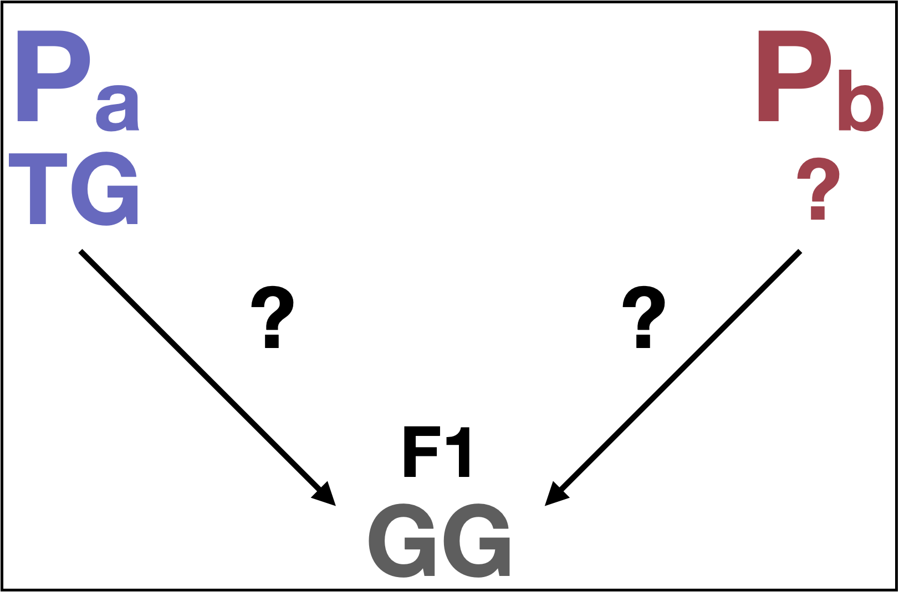
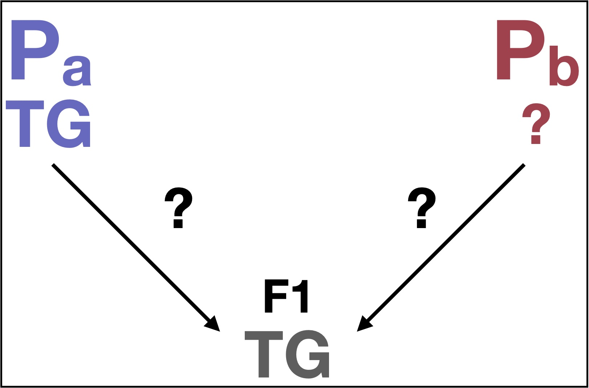
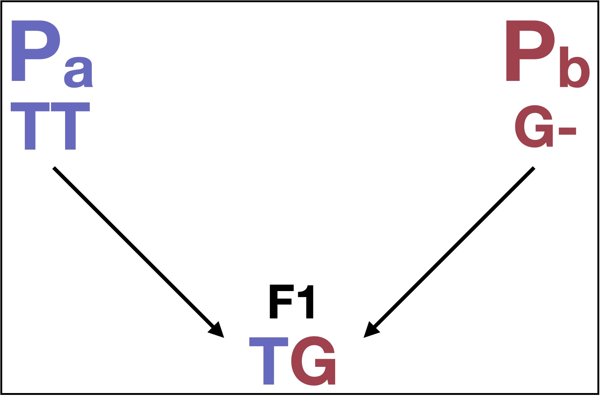

```{r setup, echo = FALSE, message = FALSE}
library(knitr)
knitr::opts_chunk$set(
	fig.height = 5,
	fig.width = 10,
	cache = TRUE
)
library(knitcitations)
library(kableExtra)
opts_chunk$set(fig.width = 10,
               fig.height = 5,
               cache = TRUE)
cite_options(citation_format = "pandoc", max.names = 3, style = "html", 
             hyperlink = "to.doc")
```

The purpose of this page is to give the reader a broad sense of how Quantitative Trait Locus (QTL) analysis can be used to connect phenotype to genotype. It is designed for those who have little to no experience with QTL analysis, although it should be a useful resource for anyone seeking the fundamentals of the method. I first give an overview of some different approaches to the method, then provide a basic tutorial style example using real data. This resource is meant to give more of a broad strokes overview of the methodology rather than rigorous details. As with any MarineOmics page, we welcome feedback and contributions that will strengthen and diversify its content. We invite any and all commentary on the [Discussion Forum](https://github.com/MarineOmics/marineomics.github.io/discussions)!

*All of this code and most of what I know about QTL analysis to [Prof. Evangeline Ballerini](https://www.ballerinilab.com/). Add something about Nathan. Any mistakes or lack of clarity are mine.

For more technical details, there are many valuable resources, referenced throughout this document. In particular, Karl Broman and Śaunak Sen developed a widely used R package called R/qtl, and have written thorough tutorials freely available on their website. While these tutorials are truly helpful for understanding the basic mechanics of QTL analysis, reading their book entitled QTL mapping with R/qtl is crucial for a thorough understanding.

Other resources for explaining basics of QTL: <br>
-  [Nature Education](https://www.nature.com/scitable/topicpage/quantitative-trait-locus-qtl-analysis-53904/): Miles & Wayne, 2008 <br>
-  JEB Kearsey 1998: The principles of QTL analysis (a minimal mathematics approach) - make sure to read this and vet it <br>
-  Darvasi 1998: Experimental strategies for the genetic dissection of complex traits in animals
discusses intercross vs. backcross strategies

## Principles of QTL analysis
QTL analysis uses linkage to identify genomic regions that harbor gene(s) involved with a trait of interest. It identifies region(s) of the genome where individuals with a particular phenotype consistently have the same genotype, and vice versa. The idea is to eventually narrow the region to a specific gene or genes responsible for a trait. Even if candidate genes are not identified, it can be useful for describing the genetic architecture of a trait or for ruling out a priori candidate genes.

## Experimental design
### considerations for experimental setup
1. Is/are the trait(s) likely to be highly complex & polygenic? <br>
    * large effect QTL can be identified with a relatively small sample size
    * an increase in sample size will narrow the QTL region, decreasing the number of candidate genes to consider
    * the greater the sample size, the more power you will have to identify small effect QTL

2. Is there likely to be a significant influence of environment, life stage, etc.?
    * the more environmental influence there is on a trait, the more it will have to be controlled and/or accounted for
    * environmental variables, life stage, etc. can all be accounted for as covariates in a QTL model

3. Evolutionary implications of the cross
    * QTL analysis identifies the genomic region(s) responsible for the phenotypic difference between the parents
    * if you are interested in the evolution of the trait in the context of selection and speciation, it is better to use populations or species that are more closely related to each other
      * for example: 
        * if we cross two species that are distantly related and have different phenotypes, there are more likely to be regions of the genome associated with the trait that were not responsible for or a result of speciation
        * more closely related taxa will identify regions of the genome associated with the trait that were involved in differentiation

4. single vs. multiple joint family design
    * In some cases (like mine), you may be able to grow your organisms in the lab or greenhouse and make controlled crosses. In these cases, using a single family design is feasible and preferred. 
    * More commonly, (especially in the marine world), controlled crosses are not possible, necessitating the use of multiple joint-family QTL analysis.
<br>
<br>

    The two approaches are briefly outline and compared below: <br>
    *single-family cross*
      * cross one individual with the trait, one without -> F(filial)1 hybrid
      * ideally parents are as inbred as possible, but not crucial that they are
      * cross the F1 to:
        * itself (intercross) - *here’s to hermaphroditism and monoecy
        * to parent with trait of interest (backcross)
        * to sibling with same phenotype <br>
        
        * for Jason: look at advantages vs disadvantages in Broman
      * most basic approach: use 2nd generation hybrids (F2) for analysis
        * same as what Mendel did to determine modes of inheritance, but now we sequence and annotate genomes to find the actual genes responsible

      * advantages of single-family
        * higher power to detect rare QTL (QTL segregating in small % of families)
        * easier to genotype offspring with only two parents: more likely that parents will have different alleles

    *multiple joint-family*
      * can use: 
        * multiple offspring from the same outcrossed parents
        * multiple offspring from multiple parents
        * uses already existing families

      * advantages of joint-family
        * can use already existing families rather than waiting on crosses
        * do not need to be able to do controlled crosses in captivity
        * more power to detect QTL consistent across multiple families
        * can investigate QTL across multiple genetic backgrounds
        * better estimation of QTL effects
        * more alleles mean more information about function of different alleles in real populations
        * more recombination means better resolution

      * Resources for linkage maps & QTL with joint multiple family based setup:
        * Nousias et al. 2022 Nature SR: Linkage mapping, comparative genome analysis, etc.
        * Manousaki et al. 2016 - Linkage mapping with RADseq & Pandora (Sparidae fish)
        * Wu & Ma 2002 - Math behind creating linkage map with outcrossed parents & siblings
        * Ogut et al. 2015 - Joint-multiple family linkage analysis predicts within-family variation better than single-family analysis of the maize nested association mapping population

make a table comparing single and joint-family QTL

*for nice comparison paper between single and multiple see Ogut et al. 2015*

### limitations of QTL analysis
  * often huge genomic regions fall under the peak with thousands genes under them
  * limited diversity in genetic background to pull out gene interactions
  * time consuming

### data
#### *genotype: most common types of data used today*
  * reduced representation: genotype by sequencing (GBS), RADseq]
  * WGS (link ‘Choosing a Popgen Approach’)<br>
  * As far as linkage map construction goes, relatively little sequence is actually needed. Because recombination only happens so often, F2s will have a consistent genotype (PaPa, PaPb, PbPb) across a large window. Thus, we only need enough sequence data to call genotypes within recombination windows. This can be done with:
    * low coverage (a.k.a. skim) sequencing
    * aggregate data within recombination windows to call genotype over a large block

#### *phenotype*
  * can use: 
    * truly quantitative and continuous
    * categorical data, even binary
  * keep covariates in mind
    * collect as much phenotypic data as is reasonable, keep track of environmental variables

<hr />

# Tutorial

This tutorial will walk you through the essentials of the particular analysis that I did, but my hope is that it will be useful even for those who take different approaches. It is not written with reproducible data, but I have included all of the necessary code and outputs. 

## Genetic map construction
The first step in QTL mapping is making a genetic map, where we have the determined the genotype of each F2 within recombination windows.

There are many different approaches for doing this, but below I describe our lab's method of using whole genome skim sequencing and custom scripts. I used a multiplexed library prep kit (formerly iGenomx, now Twist 96-plex kit), making costs and wet lab time comparable to reduced representation methods.

### general info on calling variants
If you have a reference genome available, you can of course just call variants against it. If not, you’ll do a de novo assembly from your sequence data (link tutorials, packages for this within and outside MarineOmics). You may also use another program for calling SNPs without a reference or enough sequence for de novo assembly. I have included all script files for this analysis here. For the sake of the tutorial, code is split into chunks with its output. For a brush up on command line code, Nicolas Lu has a great tutorial in his WGS page (if this is true, link it).

### calling variants for this tutorial
We have a reference genome for *Aquilegia*, so we’re going to align our sequence to it and call variants from it

This tutorial will start with .bam files, a result of aligning the raw sequence data (.fastq) to the *Aquilegia* reference genome. Many tutorials exist for aligning low coverage raw sequence data, including [one on the MarineOmics page](https://github.com/nt246/lcwgs-guide-tutorial) from Nicolas Lu.

The whole idea of steps 1-3 below is to determine the genotypes of the F2 population at enough useful sites to properly represent their genotypes across recombination bins. By useful, I mean only sites that were polymorphic between the parents, and within these, only sites where the F1 inherited different alleles from each parent (heterozygous). 

### defining all of our filepaths, variable names, and tools
```{bash, eval = F}
# make variables for commonly used directories. as always, set your working directory wherever works for you
workingdir="/Users/jason/qtl.tutorial"
mkdir $workingdir

bamdir="$workingdir/f2.alignments"
mkdir $bamdir

infodir="$workingdir/info"
mkdir $infodir

genodir="$workingdir/genotype"
idallelesdir="$genodir/id.alleles"
mkdir $genodir
mkdir $idallelesdir

# file with the Aquilegia reference genome, and bams for the f1 and the parent I have sequence for ('Pa')
reference="/Volumes/HD/genomes.reference/Aquilegia/V3/sequences/Aquilegia_coerulea.main_genome.scaffolds.fasta"
f1bam="$genodir/f2.merged.bam"
pabam="/Volumes/HD/projects/genomes.species/V3/alignments/jonesii.sorted.bam"

# on our lab computer we call samtools from it's location
samtools="/Volumes/HD/tools/samtools-1.3/samtools"

```

### determining the useful sites for genotyping the F2s
####  Generate a genotype depth sequence file for the F1
  * Of course, this can be done by sequencing the F1 to enough coverage to confidently genotype it at many SNPs, however there is a much easier and less costly way:
    * In this case, the F2 population only inherited alleles from the F1, so if we merge all of the F2 sequence data, we're left with a genotype level sequence file of the F1!
    
```{bash, eval = F}
# we'll start in our working directory
cd $workingdir

# make a list file with all of the file paths of our .bams for samtools to merge
ls -d -1 $bamdir/*.* | grep -v bai > $infodir/f2.paths.list

# merge bam files
samtools merge $genodir/f2.merged.bam -b $genodir/f2.paths.list

# index bam files
samtools index $genodir/f2.merged.bam
```

We can view the merged, indexed .bam file of the F2s in IGV (link). Because I got ~1x coverage on ~350 individuals, this merged .bam file is (on average) a 350x coverage sequence file of the F1...plenty to call a genotype at every base pair. As you can see from the below screenshot of this 53kb region, the coverage was quite variable. This is typical of the library prep method I used (formerly iGenomx, now Twist 96-plex kit), and is just fine for this application.

```{r, echo = FALSE, include = TRUE, out.height = "100%", fig.align = "center", fig.cap="screen shot of the merged .bam file in IGV"}

knitr::include_graphics("DRAFT_GxP_01_qtl_tutorial_files/images/merged.f2.igv.png")

```

#### Call and filter SNPs
  * We can only use sites that are heterozygous in the F1, as those are sites where it inherited different alleles from either parent, and these are the sites that may be useful for genotyping our F2s across recombination bins. If this doesn't make sense yet it hopefully will after reading more.
  
  ```{r, echo = FALSE, include = TRUE, out.width = "250px", fig.align = "center", fig.cap="no way to tell which allle came from which parent"}

  

  ```
    
  * call SNPs with whatever program you like: we use samtools here, there are many others
    ```{bash, eval = F}
    # move into the id.alleles directory
    cd $idallelesdir

    # run samtool mpileup to identify variant sites in the F1 and create a .vcf file with those sites
    samtools mpileup -q 30 -B -u -v -f $reference $f1bam | bcftools call -vm -f GQ > var.f1.vcf
    
    # we can look at the first 10 lines (SNPs) after the 'contig', 'INFO', and 'FORMAT' lines
    
    ```
  
  * filter vcfs, I used bcftools, then output a text file with our useful SNP positions
    * here's all of the code, which I'll break down piece by piece below:
    ```{bash, eval = F}
        cd $idallelesdir
        bcftools filter -g3 var.F1.vcf | awk ' ($8 !~ /INDEL/) {print $0} ' | bcftools query -i 'QUAL>30 && DP>20 && DP<700 && GT="0/1" && GQ>100' -f '%CHROM\t%POS\n' > f1.het.pos
    ```
      * use bcftools to filter my .vcf, and remove SNPs within 3 base pairs of an INDEL
      ```{bash, eval = F}
        bcftools filter -g3 var.F1.vcf
      ```
      * remove INDELs: INDELs can be hard to genotype, and we'll have plenty of SNPs, so we keep it to just those.
      ```{bash, eval = F}
        awk ' ($8 !~ /INDEL/) {print $0} '
      ```
      * filter for depth & quality and define output format: 
        * QUAL>30 (Phred score): 1/1000 chance that a base was called incorrectly
        * DP>20 && DP<700: site must have between 20 and 700x coverage
        * GT="0/1": heterozygous at that SNP
        * GQ>100: we're really, really sure that the genotype call is correct
        * -f '%CHROM\t%POS\n': defines the format of the output text file, outputting the chromosome, then a tab, then the number position of the SNP on that chromosome

        ** Explanation of why I chose these cutoffs: We want to get some idea of our coverage, which we can do by looking at IGV above. We want to include sites that had enough coverage to confidently call a genotype (I used 20x) and not so high that many of those reads are a result of PCR duplicates. My data was filtered for PCR duplicates using Picard MarkDuplicates, but some likely still remain. I set my top end of acceptable coverage at 700x, as this includes sites that got a lot of 'extra' coverage, but will avoid many sites with PCR duplicates.
      ```{bash, eval = F}
        bcftools query -i 'QUAL>30 && DP>20 && DP<700 && GT="0/1" && GQ>100' -f '%CHROM\t%POS\n'
      ```
        
#### Identify useful SNPs 
  * As mentioned previously, useful SNPs will be heterozygous in the F1. We identified these sites above.
  * If we have enough sequence data from the parents, we can determine which allele came from which parent.
  * In this case, I only had sequence data for one of the parents (Pa), which narrows the list of useful sites:
    * So not only can I only use sites where the F1 is heterozygous, I also have to use sites that with a particular genotype in Pa.
    * Sites where Pa is heterozygous are not useful, because either allele could have come from Pa:
    ```{r, echo = FALSE, include = TRUE, out.width = "250px", fig.align = "center", fig.cap="still unclear which allele came from which parent"}

    

    ```
    * So the only sites that are useful are: 
      * F1: is heterozygous 
      * Pa: 1. homozygous, or.. <br>
            2. heterozygous with one allele that matches the F1 and one that doesn't. 
      * As the latter case is relatively rare, and there were plenty of sites that satisfy case 1, I decided to use sites that were heterozygous in the F1 and homozygous in Pa
    ```{r, echo = FALSE, include = TRUE, out.width = "250px", fig.align = "center", fig.cap="now we can determine that the T came from Pa and the G from Pb"}

    

    ```
    * We have our list of high quality, heterozygus sites from the F1, so now we need to determine their genotype in Pa and output that vcf file
      * The below code uses [samtools mpileup](http://www.htslib.org/doc/samtools-mpileup.html) to take particular sites from a .bam file (f1.het.pos) and make a .vcf file from it with [bcftools call](https://samtools.github.io/bcftools/bcftools.html#call). You can look up the individuals commands on the linked manual pages.
        ```{bash, eval = F}
        samtools mpileup -l f1.het.pos -q 30 -u -B -f $reference $pabam | bcftools call -m -f GQ > pa.genotypes.vcf
        ```
    * Now we grab sites homozygous in Pa
      * SNPs only
      * high quality
      * 20x < coverage < 100x (coverage on this parent was ~80x)
      * note that all of our parameters are 'removing'excluding' sites with those specs due to the '-e' in bcftools query (e.g. DP<20 = remove sites with less than 20x coverage). You could do this either way.
        ```{bash, eval = F}
        bcftools filter -g3 pa.genotypes.vcf | awk ' ($8 !~ /INDEL/) {print $0} ' | bcftools query -e 'QUAL<30 || DP<20 || DP>100 || GQ<100 || GT="0/1" || GT="1/2"'      -f'%CHROM\t%POS\n' > snp.list
        ```
    * snp.list is our final list of usable SNPs, of which there were ~1,000,000 in this case
    * Now we'll call genotypes for Pa at these sites using a combination of [samtools mpileup](http://www.htslib.org/doc/samtools-mpileup.html), [bcftools call](https://samtools.github.io/bcftools/bcftools.html#call), and [bcftools query](https://samtools.github.io/bcftools/bcftools.html#query). This is a simple text file with 4 columns: 
      * chromosome, position, reference allele (which is Pb's allele), the alternate allele (which is Pa's allele), and Pa's genotype, which in this case will always be 1/1 for alternate/alternate:
      ```{bash, eval = F}
      samtools mpileup -l snp.list -q 30 -u -B -f $reference $f1 $pabam | bcftools call -vm -f GQ | awk ' ($8 !~ /INDEL/) {print $0} ' | bcftools query -f        '%CHROM\:%POS\t%REF\t%ALT[\t%GT]\n' > pa.genotypes
      ```
    * Finally, we'll print a file with the site, the Pa allele, and the Pb allele.
    ```{bash, eval = F}
    awk ' { if ( $5 ~ /0\/0/ ) print $1 "\t" $2 "\t" $3; else print $1 "\t" $3 "\t" $2; } ' pa.genotypes > pos.pa.pb.txt    
    ```
    
### genotyping the F2s
The first step is to go through each F2 individual and count the number of reads of each allele. We'll do this using a combination of samtools mpileup and a custom perl script written by Prof. Anji Ballerini (make sure true). The mpileup command goes through our F2 .bam files and counts alleles for each individual at our snp list. The output has 6 columns:
  * 1: chromosome/scaffold
  * 2: position
  * 3: reference allele
  * 4: read counts at that locus
  * 5: allele
    * . matches reference on forward strand
    * , matches reference on reverse strand
    * uppercase letter is identity of alternate allele read on forward strand and lowercase is the same but on the reverse strand
  * 6: ASCII base quality

I won't pretend to speak perl, but I know this script takes the mpileup as input and outputs a 'counts' file with 5 columns:
  * 1: chromosome/scaffold:position
  * 2: # A reads
  * 3: # T reads
  * 4: # C reads
  * 5: # G reads
  
Below is the for loop that goes through each F2, calling on mpileup and the perl script to output count files.
  
```{bash, eval = F}
# make the snp.list a variable that we can easily call
snplist="$idallelesdir/snp.list"

# make the filepath to the perl script a variable
MAYBE LINK TO A NEW HTML WITH THE FILE

# make a list of the F2s from the .bamdir
ls $bamdir | grep -v bai | awk '{ gsub(/.nodup.bam/, "") ; print $0 }' > $infodir/f2.list

#define a list of variables that will be known as "samples" using our f2.list file
samples=($(cat $infodir/f2.list))

# make a for loop that will cycle through the list of F2 samples one at a time and genotype each sample at our SNP.list positions
for (( k = 0 ; k < ${#samples[@]} ; k++ ))
do

samtools mpileup -Q 30 -q 60 -B -f $reference -l $snplist $bamdir/${samples[$k]}.nodup.bam | perl $countscript | awk ' { print $1":"$2 "\t" $3 "\t" $4 "\t" $5 "\t" $6 } ' | sort -k 1,1 > ${samples[$k]}.counts

done
```

Now that we have small and manageable counts files for each F2, we can leave the world of bash and head to R to finish up our genotyping and genetic map construction. Because we're calling genotypes in recombination bins, we need to determine our bin sizes to accurately capture our recombination points. We used anywhere from 0.1 - 1Mb bins, depending on where on the chromosome we were. Generally we used 0.5Mb bins on the ends of chromosome arms and 1Mb bins to account for spatially differing recombination rates. 0.1Mb bins were used in regions that were known to have discordance between the genetic and physical maps based om previous studies in *Aquilegia*.

 * determine useful window sizes depending on recombination rate
    * we used from 10kb to 1Mb
    * make a .csv or .txt defining these windows
  * calculate frequencies of parental alleles in these windows
  * we used windows of allele frequencies of the parent we had sequence for (Pa) to determine F2 genotypes
    * frequency of Pa allele
      * 0 - 0.15: homozygous Pb
      * \>0.15 - 0.35: unsure
      * \>0.35 - 0.65: heterozygous
      * \>0.65 - 0.85: unsure
      * \>0.85 - 1: homozygous Pa

### Make a genetic map
  * used r/qtl for this, along with some manual brain power
    * in my case there was discordance between genetic and physical maps, which was likely due to: 
      * true structural differences between reference genome and species used in the cross
      * mis-assembly of the original genome
        * was done with Sanger sequencing over 15 years ago
    * so I re-arranged markers manually by intuition
      * I took my genetic map and colored it by genotype so I could visualize genotypes that didn't make sense, such as impossible patterns of recombination 
        * in some cases, there was a recombination event more than expected by chance
        * in addition, some of these alleged recombination events went from PAPA to PBPB between two markers, which would only be possible if there were two recombination events between those two markers --> highly unlikely
    * Thus, I manually re-ordered markers and filled in ‘unsure’ genotypes based on intuition

### QTL analysis
  * merge phenotype data with genotype data
    * transposed phenotype data onto genetic map
  * read into to r/qtl
  * scanone
  * scantwo
  * multipleqtl
  * stepwiseqtl
  * 1.5 LODs
  * effect plots

### interpretation of analysis
  * remember, you’re often not honing in on a specific gene with QTL analysis alone, so keep your goal in mind and be reasonable with how much you can actually infer based on your data
  * are candidate genes or homologs of candidate genes under the peak?
  * are previously identified candidate genes not under the peak?
  * narrowing the list of genes under the peak
    * is there any existing expression data for your tissue of interest?
    * RNA-seq, qPCR if you have a good candidate

## Terminology glossary
  * marker
  * genetic map
  * linkage mapping
  * association mapping
  * interval mapping
  * linkage group
  * recombination rate (maybe ditch)
  * recombination fraction
  * multiple QTL regression analysis
  * significance threshold
  * missingness
  * Quantitative Trait Locus
  * LOD score
  * LOD interval (1.5, 1.8)
  * intercross
  * backcross
  * single family based QTL mapping
  * joint family based QTL mapping
  * genetic interaction
  * epistasis

graveyard
fine mapping:
recombinant inbred lines (RIL) see Takuno et al. 2012
near isogenic lines (NIL)


