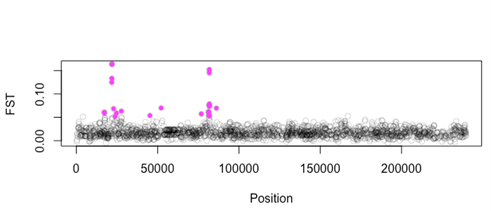
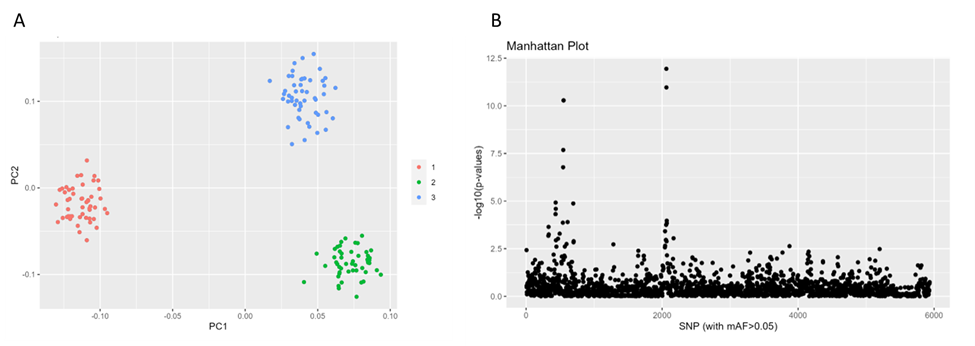
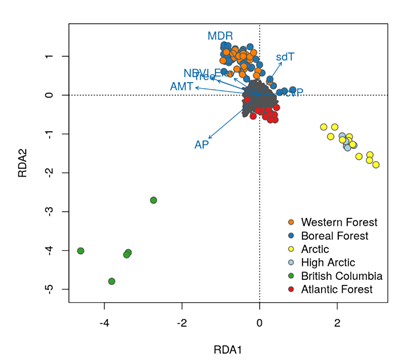
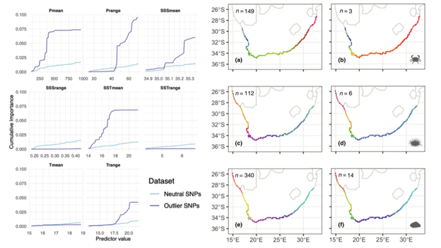
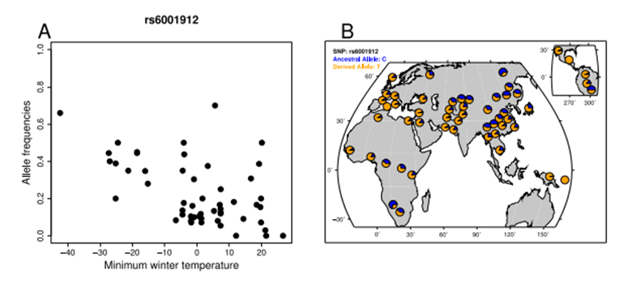
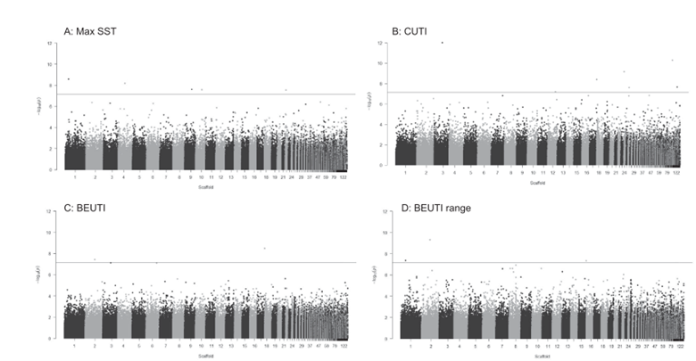
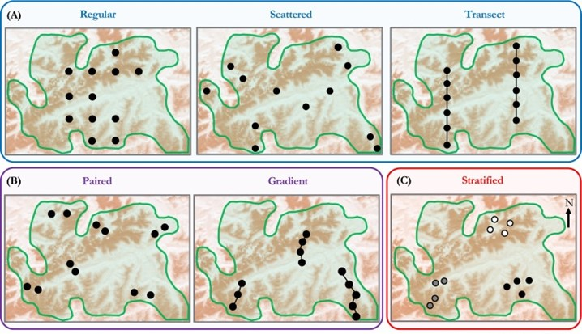
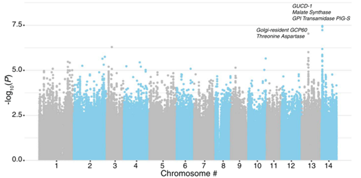

---
title: "A MarineOmics overview of methods to detect signatures of selection"
author: "Joanna Griffiths, Danielle Davenport, Madison Armstrong, Camille Rumberger"
date: "2025-02-24"
output:
  html_document:
    toc: yes
    toc_float:
      collapsed: true
bibliography: "POP_10_Signatures_Selection/common-bib_01.bib"
---


*Created using [HackMD](https://hackmd.io/) and [tablesgenerator](https://www.tablesgenerator.com/markdown_tables)* 

## Citation
[How to cite](https://marineomics.github.io/#How_to_Cite)

## Target audience
This page is designed for beginners (with some basic undergraduate-level of understanding of evolutionary biology) and provides a broad introduction to different methods commonly used to study natural selection in wild populations at a microevolutionary scale. On this page we will explore how techniques like outlier analyses, genotype-environment analysis (GEA) and genome-wide association studies (GWAS) can help us study natural selection. To learn more about specific methods, read through the suggested readings in each section and visit the tutorials where links are provided. 

## Introduction
This page provides an overview of different methods for detecting microevolutionary change, specifically identifying genetic loci that may be subject to selection. Natural selection is the differential survival and reproduction of individuals based on their inherited traits. Selection acts on observable characteristics (phenotypes), changing the prevalence of different gene variants (alleles) within a population over time. This leads to changes in allele frequencies over time (generations) and adaptation to spatially heterogeneous environments which may help a population better survive and reproduce in a specific environment. This is particularly relevant in the field of marine ‘omics, where understanding a population's ability to adapt to changing environments, such as climate change or habitat loss, is crucial for preventing extinction.

The methods discussed on this page focus on the microevolutionary scale and examine changes that occur within populations over a relatively short period. This is in contrast to the study of macroevolution, which examines large-scale evolutionary patterns over much longer timescales (i.e. variation in conservation or non-synonymous mutations). The methods described here are used to identify loci which may be subject to selection and are typically applicable to use for any type of population or individual genomic data (e.g. Whole Genome Sequencing, RADseq, etc). Some of the methods can be applied to datasets where you have phenotypic or fitness data (i.e. GWAS for growth, survival, phenotype, etc.), while other methods do not require any data related to either the environment or phenotypes at all!

Please note, if temporal samples are available, other approaches can be used to track allele frequency changes over time. For instance, [(@buffalo2020estimating)](#refs) describe methods for estimating the genome-wide contribution of selection to temporal allele frequency change, providing a framework for leveraging time-series data to detect selection more directly. These temporal methods allow for a more explicit examination of how selection shapes genetic variation across generations, which is not possible with single-time point datasets [(@brennan2022experimental)](#refs). 

<ins>On this page we describe three classes of methods to identify loci under selection at a microevolutionary scale using samples collected from a single time point across space/environments. .</ins>
1. **Outlier Analyses** identify extreme deviations from what would be expected under neutral evolution. 
2. **Genotype-Environment-Analysis (GEA)** links genomic variation to environmental gradients.
3. **Genome-Wide Association Studies (GWAS)** examine genetic variants and identify those statistically associated with a particular trait. When a specific phenotype shows a significant association with a particular loci, gene or region, it suggests that this genetic variation may be under selection. 


## Which method should I use to find loci under selection?
The method you choose will partly depend on the data that you have available: Outlier analyses require only genetic data, but GEA requires environmental data across sampled populations, and GWAS requires trait data for each genotyped individual. Addtionally, the biology of your system is always important to consider before conducting specific analyses, and no matter which method(s) you use, it is recommended that comparisons of outlier vs non-outliers (neutral loci) are performed [(@riginos2016navigating)](#refs) as a kind-of “validation” step, where we would expect loci under selection (i.e. outliers) to demonstrate a stronger signal of environmental dependence than non-outliers. However, a common but conservative approach taken by researchers performing outlier detection is to apply multiple test methods and identify outlier SNPs that are overlapping across them. For example, some studies perform a differentiation outlier test first (see [Outlier Analyses Section](#outlier-analyses)) and then use only the resulting outliers as input for the Genome-Environment Associations  [(@rellstab2015practical)](#refs). 

Importantly, to conduct outlier analyses you do not necessarily need to have neutral genetic differentiation (genetic variation among populations  primarily driven by random processes like genetic drift and migration) in your data. For example, marine invertebrates with pelagic larval dispersal and high gene flow which show very low to no detectable population structure at neutral alleles across their range (i.e using STRUCTURE, ADMIXTURE, PCA) still show signals of adaptation. Other examples include Pacific purple sea urchins ([(@petak2023whole-cp)](#refs);[(@rumberger2023selection)](#refs)) or scallops [(@van2017identifying)](#refs). 


# Outlier Analyses

## What are Outlier Analyses?

Genetic differences among groups may be driven by a combination of genetic drift, demography and/ or selection. Each of these processes can directly change the allele frequency of a population. However, alleles that are under selection and influence fitness are expected to occur at  frequencies different to those affected only by neutral processes. For example, loci under divergent selection (and those physically linked to them) exhibit stronger differentiation than neutral regions and so we might expect these loci to be more differentiated between populations/groups.  We can identify these differences in allele frequencies among different populations/environments using outlier tests. Outlier tests for selection assume a null model of neutrality, where allele frequencies drift randomly without selection pressures. Loci with significantly higher or lower differentiation (i.e. Fst) between populations/groups than expected under a neutral model are flagged as potential targets of selection. Specifically, while selectively neutral loci are expected to form a normal frequency distribution,  when alleles increase fitness (positive selection) they can be expected to be observed at higher frequencies and where they decrease fitness (negative selection) they can be expected to be observed at at lower frequencies [(@hoban2021genetic)](#refs).  These are  “outliers” or “putatively adaptive loci” which may be candidates of selection. 

There are two commonly applied approaches to outlier analysis; Fst-based analysis (Figure 1) and PCA-based analysis (Figure 2). Both are used to identify loci under selection, but they differ in their underlying methods. Fst is a standardized measure of the variance of allele frequencies among populations [(@wright1949population)](#refs). By directly comparing genetic differentiation between populations/groups to neutral expectations, Fst outlier tests can identify loci which may be under selection (Figure 1). In contrast, PCA-based methods use Principal Component Analysis (PCA) to capture population structure and can identify loci with extreme loadings on principal components as potential outliers (Figure 2).


```{r, echo=FALSE, out.width="75%", fig.align="center", fig.cap="left-aligned", fig.cap="Figure 1: Example of an Fst-based analysis using [OutFLANK](https://rstudio-pubs-static.s3.amazonaws.com/305384_9aee1c1046394fb9bd8e449453d72847.html). In this dataset, 1000 individuals were collected from across 39 populations  spanning an environmental gradient. Each dot is a SNP and its location in the genome plotted on the X-axis. The Y-axis is the Fst for each SNP. Higher Fst values are indicative of larger genetic differentiation and candidate SNPs under selection are highlighted in pink. [Source](https://htmlpreview.github.io/?https://github.com/whitlock/OutFLANK/blob/master/inst/doc/OutFLANKAnalysis.html)"}


```


```{r, echo=FALSE, out.width="75%", fig.align="center", fig.cap="left-aligned", fig.cap="Figure 2: Example of a PCA-based analysis using [pcadapt](https://bcm-uga.github.io/pcadapt/articles/pcadapt.html). In this dataset, a total of 150 individuals from three different populations were genotyped at 1,500 markers. Population structure was identified for three discrete groups of individuals, matching population assignment expectations (A). SNPs that are significantly associated with PC1 and PC2 are given higher weightings and are used as input for a Manhattan plot, where the SNP location in the genome is plotted on the X-axis and the weightings (or -log pvalue) are plotted on the Y-axis. SNPs that have higher weightings will have higher -log pvalues and are candidate SNPs under selection among populations (B). [Source](https://bcm-uga.github.io/pcadapt/articles/pcadapt.html)"}


```


## General Method Overview:

### Step 1 - Filtering your dataset

Non-selective evolutionary forces can affect the distribution of outlier loci from loci across a genome [(@lotterhos2014evaluation)](#refs), therefore, the first step is to identify the  underlying distribution that is expected under neutral processes by answering the question;  how much variation in among loci would be expected (i.e. the null distribution of Fst) in the absence of selection?  One must first create a null distribution using a set of SNPs (single nucleotide polymorphisms)  that accurately model the distribution expected under neutrality. An accurate null distribution typically requires some filtering of a set of SNPs, and in many cases, the best set of SNPs for neutral parameterization is not the entire set of SNPs that you want to evaluate for outliers. Common filtering steps could include a minor allele frequency/count, removing missing data and related individuals, genotype depth and quality, and removing SNPs in linkage disequilibrium (LD). As a general guide, we recommend the following [SNP filtering tutorial](https://ddocent.com//filtering/). Deciding on how much filtering is required can be tricky and can feel subjective. We recommend visualizing the filtering steps using a PCA, which will elucidate many common biases in the dataset (see the [MarineOmics page on PCAs](https://marineomics.github.io/POP_08_PCA.html)). We recommend using the same set of SNPs that you use for estimating population structure for neutral parameterization (which is often a set of SNPs not in LD). Once neutral parameterization is performed on one set of SNPs, for most programs that model can be applied to the larger filtered SNP dataset.

### Step 2 - choose an outlier method based on the biology of your system!

When choosing an outlier method, it is important to understand what biological assumptions are being ignored/violated and whether the model accounts for the demographic history when estimating divergence among populations (see [Table 1](#Table1)). For example, early models such as fdist and fdist2 [(@beaumont1996evaluating)](#refs) assume populations are all equal in size and there is equal probability of migration and gene flow among all populations (even if some populations are located further away than others). This method produced a lot of false positive outliers because more realistic scenarios violated these simple assumptions [(@lotterhos2014evaluation)](#refs). An improvement over this approach was implemented in the program BayeScan where each population has its own neutral model [(@foll2008genome)](#refs), but like fdist/fdist2, BayeScan also  suffers from a large false positive rate due to its violated assumptions of non-independence among populations. Newer outlier methods attempt to account for population demographic history and independence in different ways. For example,  pcadapt uses PC loadings (insead of Fst distributions) which are meant to be less reliant on assumptions about the underlying demography [(@duforet2015haplopop)](#refs). However, PC loadings can be influenced by recombination variation, so it is important to use a set of SNPs thinned for linkage disequilibrium for neutral parameterization [(@lotterhos2019effect)](#refs). These estimates of population structure are included as covariates in the final Outlier Analysis model. See [Table 1](#Table1) for more information on how each method accounts for population demographic history.

Population structure is also important to consider. For example, if you discover only one genetic cluster (K=1 in STRUCTURE or Admixture plot), perhaps any of the methods in [Table 1](#Table1) would work well for your data. On the other hand, if there is a lot of population structure (i.e., K>1), then a method that accounts for demographic history should be chosen. Additionally, consider what assumptions are made in the tutorials that you use as a resource. Does the tutorial you are using assume that your data is normally distributed? Multiple tutorials have been added below to help with comparing between different assumptions made for different kinds of data. 

Many researchers will identify outliers using two or three of these methods and look for overlap between them [(@silliman2019population)](#refs). This is a conservative approach, and researchers should keep in mind that they may not find much overlap among different analyses because of the different assumptions made by each method. 


<ins>Further Recommended Reading:</ins>
* [(@whitlock2015reliable)](#refs) (Outflank)--method comparison
* [(@silliman2019population)](#refs) --empirical study with method comparisons 
* [(@lotterhos2014evaluation)](#refs)(Fst outlier methods)--method comparison
* [(@lotterhos2019effect)](#refs)(pcadapt, Outflank, Baypass)--method comparison
* [(@lotterhos2022simulation)](#refs)–method validation
* [(@capblancq2018evaluation)](#refs) (GEA & pcadapt)--method comparison
* [(@luu2017pcadapt)](#refs) (pcadapt)--method details
* [(@hoban2016finding)](#refs)–helpful review and suggested best practices for statistical analyses
* [(@robertson1975gene)](#refs) – theory
* [(@ahrens2018search)](#refs) –review, summary of findings from outlier scans, and suggested best practices for experimental design


### TABLE 1. Common methods for identifying outliers {#Table1}
Common methods for identifying outliers and the associated approach for calculating divergence, the biological assumptions, and how demographic history is accounted for in the model. We also provide a link to public tutorials for each method.


| Model & Approach | Demographic History | Assumptions / Known issues | False Positive Rate | Tutorial | Citation |
|------------------|---------------------|-----------------------------|----------------------|----------|----------|
| fdist & fdist2 (Fst; using Arlequin software)       | * accounts for loci with different heterozygosities and with finite sample sizes per subpopulation  | * assumes populations are equal in size and migration rates <br>* non-independence among populations                                                                   | High [(@lotterhos2014evaluation)](#refs) [(@narum2011comparison)](#refs) [(@perez2010comparing)](#refs), [(@whitlock2015reliable)](#refs)               | Outdated due to high false positive rates                                                                                                                                                                                                                  | [(@beaumont1996evaluating)](#refs)                                  |
| Bayescan (Fst)    | * populations defined ahead of time <br>* Dirichlet-multinomial distribution: each population has its own parameter for neutral model     | * does not allow for the non-random correlations among pairs of populations that cause the non-independence of sampling <br>* slow run time [(@luu2017pcadapt)](#refs) | Low to high depending on the demography    | [Benestan tutorial (2020)](https://rpubs.com/lbenestan/outlier)      | [(@foll2008genome)](#refs)      |
| PCAdapt (PC loadings) | * Latent factors to estimate values of K <br>* uses PC loadings (less reliant on assumptions about the underlying demography) [(@duforet2015haplopop)](#refs) <br>* Important to use a set of SNPs thinned for linkage disequilibrium for neutral parameterization [(@lotterhos2019effect)](#refs)                           | * individuals not sorted into populations ahead of time <br>* Performs well in populations with high admixture                                                         | Low to medium [(@capblancq2018evaluation)](#refs), [(@luu2017pcadapt)](#refs) Might not be suitable for populations with complex demographic histories. | [Luu, Privé and Blum tutorial](https://bcm-uga.github.io/pcadapt/articles/pcadapt.html), [UC Davis Marine Genomics course tutorial ](https://baylab.github.io/MarineGenomics/week-7--fst-and-outlier-analysis.html#finding-outliers-using-pcadapt) | [(@duforet2015haplopop)](#refs)  [(@silliman2019population)](#refs) |
| Outflank (Weir and Cockerham’s Fst) | * populations defined ahead of time | * Estimates the number of K genetic clusters to inform a null model of Fst distributions <br>* Performs poorly in populations with admixture and PoolSeq samples <br>* Affected by finite sample sizes | Low, but suffers from low power | [Lotterhos Tutorial](https://github.com/whitlock/OutFLANK/blob/master/inst/doc/OutFLANKAnalysis.html) (2018), [UC Davis Marine Genomics course tutorial](https://baylab.github.io/MarineGenomics/week-7--fst-and-outlier-analysis.html#using-fst-to-find-outliers) | [(@lotterhos2014evaluation)](#refs), [(@schlotterer2014sequencing)](#refs) |
| FLK TF-LK                                    | Sensitive to complex patterns of migration and sharp differences in the migration rate among populations [(@bonhomme2010detecting)](#refs)     | * The program FLK uses a population tree (without migration) to describe the covariance among populations and build a null model of Fst distributions.   | Low [(@bonhomme2010detecting)](#refs)   | [UoF Bioinformatics Hub Tutorial](https://uofabioinformaticshub.github.io/GumCreek2012/scripts/S1_FLK )    | See supplementary file 1 from [(@bonhomme2010detecting)](#refs)    |
| BayPass XTX statistics | Assumes HWE for PoolSeq data [(@gautier2015genome)](#refs) | * Uses a covariance matrix of allele frequencies among populations [(@pickrell2012inference)](#refs) <br> * Can be used with or without environmental data | Low | [Barley-Agroclimatic-Association Tutorial](https://eead-csic-compbio.github.io/barley-agroclimatic-association/HOWTOXtX_BAYPASS.html), [Erica Nielson Tutorial](https://esnielsen.github.io/post/pool-seq-analyses-poolfstat-baypass/) | [(@gautier2015genome)](#refs) |


# Genome Environment Association (GEA)
## What is a Genome-Environment Association?

The distribution of genetic diversity within natural populations is significantly influenced by environmental conditions. Along environmental gradients, many marine species demonstrate genetic variation for adaptive traits [(@pinsky2021diversification)](#refs). Genotype environment association (GEA) analysis is a statistical framework that allows us to investigate these genotype-environment relationships and identify specific genetic markers (loci) associated with environmental variation across populations [(@rellstab2015practical)](#refs). In a heterogeneous environment, environmental factors may act as selective pressure for local adaptation. In this case, allele frequencies at loci underlying adaptive phenotypic traits should be associated with environmental factors that act as proxies for the unobserved selective pressures [(@frichot2015lea)](#refs). GEAs are distinct from  outlier detection methods previously described as they do not rely on an allele frequency distribution, but instead use the correlation between genotypes and environment for identifying both loci under selection and key climatic factors driving local adaptation. GEA analyses usually control for isolation by distance in addition to demography (i.e. ensuring that associations between genotype and environment are not driven by physical distance between environments).  

## General Method Overview: GEA Methods 
GEA broadly refers to any methodology that assesses the association between allele frequencies and environmental variables. Therefore, you will need four things before getting into GEAs - a good sampling regime, genetic data, geo-referenced environmental variables (see [Section 4. Environmental data](#env-data)). GEA methods commonly cited in the literature include: Redundancy Analysis (RDA), Gradient Forest (GF), Bayesian methods (i.e. Bayenv), and Latent Factor Mixed Models (LFMM). 


**Redundancy Analysis (RDA)** is a multivariate statistical technique used to explain the variation in a response variable (e.g., genotype) by a set of explanatory variables (e.g., environmental factors).  RDA is an extension of Principal Component Analysis (PCA) that relates two data matrices. It identifies linear relationships between the response variable and explanatory variables (Figure 3).


```{r, echo=FALSE, out.width="75%", fig.align="center", fig.cap="left-aligned", fig.cap="Figure 3: Example of a RDA plot. The blue vectors are the environmental predictors. Individuals are color coded by location and plotted in the ordination space based on their relationship with the axes (which are linear combinations of the predictor variables). SNPs are plotted gray in the center of the plot. Note that individual genotypes from wet and temperate British Columbia (green) are positively related to high annual precipitation (AP) and low temperature seasonality (sdT). Based on RDA results, SNPs are strongly correlated with these two precipitation values and these candidate SNPs are plotted along the AP vector out from the center of the plot. [Source](https://popgen.nescent.org/2018-03-27_RDA_GEA.html)"}


```


**Gradient forest (GF)** [(@ellis2012gradient)](#refs) is a machine learning method that is a multidimensional extension of the random forest algorithm [(@breiman2001random)](#refs). GF uses cross-validation to identify loci under selection, compute the importance of predictors and can identify important thresholds or change points in genetic variation along the environmental variable (Figure 4). GF can also handle non-linear relationships and correlated predictors.


```{r, echo=FALSE, out.width="75%", fig.align="center", fig.cap="left-aligned", fig.cap="Figure 4. In a study by [(@nielsen2021distinct)](#refs), GF modeling was used to infer genomic variation–environment relationships. Models were fitted to the allele frequencies of putatively neutral and outlier SNP datasets (detected with other methods) for three rocky shore species and environmental data from WorldClim and principal coordinates of neighbor matrices (PCNMs) were used as predictors in the model to account for spatial autocorrelation and unmeasured environmental variation. The figure shows cumulative importance curves based on the turnover functions for each environmental variable for the urchin (left) where the curve shape indicates the rate of change in allele frequencies along the environmental gradient, and the maximum height indicates the total turnover in allele frequencies. The authors then used the turnover functions from the GF models to transform the environmental variables into a common biological importance scale (i.e [(@fitzpatrick2015ecological)](#refs) (left). We can see neutral (a, c, e) or outlier (b, d, f) loci where the coloured map cells indicate similar allele frequencies and show that the genomic turnover patterns of putative neutral and outlier loci generally followed the biogeographical breaks of the marine environment in the region."}


```


**Bayenv** is a Bayesian hierarchical model that estimates the posterior probability of a locus being under selection. It models allele frequencies as random variables and estimates the probability of selection for each locus (Figure 5).

```{r, echo=FALSE, out.width="75%", fig.align="center", fig.cap="left-aligned", fig.cap="Figure 5:  An example of a SNP where a lower allele frequency was found to be significantly associated with warmer minimum winter temperatures using Bayenv. This SNP was characterized by a high Bayes factors and extreme allele frequencies. (A) Allele frequencies and standardized minimum winter temperatures of the SNP, rs6001912 (B) shows the geographical distribution of SNP rs6001912 [(@fitzpatrick2021experimental)](#refs)"}


```


**Latent factor mixed models** (LFMM) is a univariate regression model that includes unobserved variables (latent factors) that act to correct the model for confounding effects (i.e.population structure), which can improve power of the model when environment and demography are correlated (Figure 6) ([(@frichot2013testing)](#refs); [(@frichot2015lea)](#refs)).


```{r, echo=FALSE, out.width="75%", fig.align="center", fig.cap="left-aligned", fig.cap="Figure 6: In a study on red abalone population genomics by [(@griffiths2025seascape)](#refs), lfmm2 modeling was used to infer genomic variation–environment relationships with maximum sea surface temperature (SST) (A), Coastal Upwelling Transport Index (CUTI) (B), Biologically Effective Upwelling Transport Index (BEUTI) (C) and range BEUTI (D). The horizontal line on the manhattan plots represents the significance threshold after Bonferroni correction of 0.05 (red). Very few SNPs passed the significance threshold and they are spread across multiple scaffolds, suggesting there is weak evidence for local adaptation to these environmental gradients."}


```


## So you want to do a GEA?
So you want to perform GEA? You will need four things before getting started...

1. A good sampling regime
2. Genetic data
3. An understanding of population structure/ and/or isolation by distance (IBD) in your system 
4. Geo-referenced environmental variables and a GEA method (or two)!  

## Experimental Design Conditions for GEA
### 1. A good sampling regime 
Sampling design has implications for minimizing false-discoveries and for detecting true positives (statistical power) in relation to environmental selection. Compared with random or opportunistic sampling approaches, informed sampling designs based on the characteristics of the study area and species life history tend to improve the power of GEAs [(@whitlock2015reliable)](#refs) . The general consensus suggests “stratified sampling” [(@dauphin2023re)](#refs) - a sampling regime that is informed by a priori knowledge of neutral genetic differentiation (or geographic variation) and/or environmental representativeness to capture genetic diversity and population structure. To conduct a stratified sampling method you would collect an equal number of samples from each group, where each group is identified from  environmental and population structure information  ([(@dauphin2023re)](#refs), Figure 7). If you  are unsure of the genetic structure of your species, it is recommended that you conduct a PCA or build a map of the environmental variables across your potential study area, with the aim to visualize the environmental variation across geographical sites before sampling (see [section 4 on Environmental data](#env-data)). In this case, sampling locations that are environmentally different, but replicated within environments can help distinguish selection from neutral population structure. A key problem in this field is when unobserved variables  correlate with both the primary environmental variables and the genomic data. For example, GEAs tend to have low power and high rates of false positives when environmental gradients are correlated with neutral population structure ([(@whitlock2015reliable)](#refs); [(@caye2019lfmm)](#refs)). Several methods have been specifically developed to account for this issue (see [Table 2](#Table2)). 

```{r, echo=FALSE, out.width="75%", fig.align="center", fig.cap="left-aligned", fig.cap="Figure 7 (adapted from Figure 1 from [(@dauphin2023re)](#refs)): The green boundary represents the species regional range limit and the colors reflect topography. There are three main sampling design strategies that can be used in landscape genetic studies: (A) a sampling design that doesn’t rely on environmental or genetic data, (B) a sampling design that considers environmental data only, and (C) a sampling design that takes into account genetic and environmental information (Circles in box C represent sampling locations, with shadings referring to a priori known neutral genetic differences)."}


```


### 2. Genetic data
Any type of genetic data can be used for GEA. Whole genome data (WGS) is typical in GEA studies, though reduced representation data (i.e. RADSeq, [(@xuereb2018asymmetric)](#refs) is also commonly used. It is important that the genetic dataset is filtered for potential biases, such as applying minor allele frequency/count cut-offs, removing missing data and related individuals, and minimum genotype depth and quality. The same set of filtering guidelines we recommended above for Outlier Analyses, also applies here to GEA (please see Step 1 in the [Outlier Analyses Section](#outlier-analyses) more details and recommended tutorials).

<ins>Some examples of different genomic data applying GEA methods available in the literature include:</ins> 
* [(@xuereb2018asymmetric)](#refs)--RadSeq
* [(@griffiths2025seascape)](#refs); [(@rumberger2023selection)](#refs); [(@wooldridge2024limited)](#refs)-- WGS
* [(@forester2025population)](#refs)--Exome Capture


### 3. Understanding population structure in your data 
Just like the outlier methods previously described, understanding *Isolation by Distance (IBD)* and/or *population structure* is critical before performing GEA analysis. IBD refers to segments of the genome shared by individuals due to common ancestry, and the degree of relatedness which can vary with distance whereby genetic similarities might be influenced by shared ancestry rather than true genotype-environment associations. Population structure, which reflects how genetic variation is distributed across different groups, can also confound results by creating artificial associations between genotypes and phenotypes. Correcting for IBD and population structure ensures that the identified associations in GEA studies are reflective of actual biological relationships, improving the reliability and validity of the findings.

<ins>Some common approaches for controlling for IBD or population structure in GEA include:</ins>

**Principal Component Analysis (PCA)**: PCA is often used to detect and account for population structure. It reduces the dimensionality of genetic data and captures the main sources of variation. The first few principal components (PCs) usually correspond to major population substructures. By including these PCs as covariates in statistical models (such as GEA or GWAS), researchers can control for population structure and avoid spurious associations due to genetic differentiation between subpopulations.

**Ancestry**: Ancestry scores (like outputs from NGSadmix, STRUCTURE, ADMIXTURE) can quantify the proportion of an individual’s ancestry from different populations. These scores can be used to adjust for population structure in association analyses by including them as covariates, helping to differentiate genetic associations that arise from population demography vs actual genotype-environment relationships.

**Geographical Coordinates (Latitude/Longitude)**: In some studies, particularly those involving environmental associations, researchers may use the geographical location of individuals (latitude/longitude) as a covariate. This helps to account for geographic gradients in environmental variables that may correlate with genetic variation. 

**Distance-Based Moran's Eigenvector Maps (dbMEM)**: Distance-Based Moran's Eigenvector Maps (dbMEMS) are  derived from distance matrices, which reflect genetic or geographical distances between individuals. dbMEMs can be used to model spatial structure by decomposing distance matrices into eigenvectors that represent the underlying spatial patterns in genetic data. These eigenvectors are then incorporated into the model to control for spatial autocorrelation. 

### 4. Environmental data {#env-data}
Lastly, you will need geo-referenced environmental data (see [Table 3A](#Table3A) and [Table 3B](#Table3B)). There are two key types of environmental data that are used; in situ or spatially interpolated data:  

1. In situ data, are on-site measurements of environmental conditions usually collected directly from the field or from remote sensing devices. 
2. Spatially interpolated data (e.g. oceanographic models) using different models and processes to remove missing data and errors, extend the evaluation of environmental conditions to periods and locations not covered by in-situ measurements.

Spatially interpolated data are commonly derived from the assimilation of atmospheric and oceanographic data from models, satellites and in situ observations. These ocean models usually provide accurate estimates of the state of the system, and are commonly used for GEAs because they have broad spatial and temporal resolution, and are usually publicly available and accessible. Some of the useful databases hosting past, present and future climate information  can be found in [Table 3A](#Table3A), [Table 3B](#Table3B), and [Table 3C](#Table3C).

The most important consideration when selecting a database is the resolution and grain of the environmental dataset. For example, due to the small spatial scale of some key regionally specific processes (e.g. coastal processes), you should aim to identify and use an ocean model with a sufficiently high spatial and temporal resolution to resolve those processes (e.g. upwelling) which may be important for selection/adaptation in your system. In this case, you might choose to use a regional model (downscaled model) which uses data from a global climate model as input into a fine-scale, regional atmospheric model with detailed bathymetry, coastal boundaries, etc.

<ins>Resources for Environmental Data:</ins>
There are plenty of existing resources for processing this environmental data

* [Data extraction from the NetCDF databases](https://ropensci.org/blog/2019/11/05/tidync/)

* [How to extract and plot data from Worldclim](https://ouicodedata.com//posts/worldclim-with-r/)

* [Data extraction from the Bio-ORACLE databse](https://jorgemfa.medium.com/easy-to-use-marine-climate-layers-for-ecological-modelling-83950cd7a75f)

* [Another data extraction method from the Bio-ORACLE database](https://github.com/bio-oracle/biooracler)


<ins>Further recommended reading:</ins>
* [(@rellstab2015practical)](#refs) –method comparison
* [(@lotterhos2015relative)](#refs)–method comparison
* [(@franccois2016controlling)](#refs)–method comparison for false discovery rates
* [(@forester2016detecting)](#refs) (GEA)-- method comparison
* [(@dauphin2023re)](#refs)–discussion of how different types/scales of of environmental data can be used to answer different questions
* [(@capblancq2018evaluation)](#refs) -- method comparison (GEA & pcadapt)
* [(@alvarado2022genotype)](#refs) - example paper that uses gradientForest
* [(@riginos2016navigating)](#refs) – spatial scale in landscape genomics
* [(@capblancq2021redundancy)](#refs) –RDA
* [(@selmoni2020seascape)](#refs)– example landscape genomics study
* [(@assis2018bio)](#refs)– paper on bioclimatic modelling


### TABLE 2: Common methods for identifying candidate SNPs associated with environmental data (GEA) {#Table2}
Common methods for identifying candidate SNPs associated with environmental data (GEA), the associated approach for calculating divergence, the biological assumptions, and how demographic history is accounted for in the model. We also provide a link to public tutorials for each method. 

| Model & Package | Approach / Statistics | Demographic History | False Positive Rate | Tutorial / Citation |
|-----------------|-----------------------|----------------------|---------------------|----------------------|
|   Bayenv / Bayenv2 (Command Line)   | XtX statistics; Univariate correlation between environment and allele frequencies | Covariance matrix from genome-wide data controls for demography | Inflated; use PCs or Bonferroni correction | [Maier 2017 Tutorial](https://www.mountainmanmaier.com/software/pop_genom/#search-for-outliers-with-bayenv2) [(@coop2010using)](#refs) |
|   [BayPass (Command Line)](https://www1.montpellier.inrae.fr/CBGP/software/baypass/index.html)   | XtX statistics | Pairwise covariance matrix controls for demography | Similar to Bayenv; adjust for multiple testing | [XtX only](https://eead-csic-compbio.github.io/barley-agroclimatic-association/HOWTOXtX_BAYPASS.html), [With env data](https://esnielsen.github.io/post/pool-seq-analyses-poolfstat-baypass/), [(@gautier2015genome)](#refs) |
|   BayeScEnv (Command Line)   | Bayesian Fst; like BayeScan, populations defined a priori | Dirichlet-multinomial model with pop-specific parameters | Not well documented | [GitHub Tutorial](https://github.com/devillemereuil/bayescenv/wiki), [BayeScan PDF](http://evomics.org/wp-content/uploads/2016/01/BayeScan_BayeScEnv_exercises.pdf), [(@de2015new)](#refs) |
|   RDA (R, Vegan Package)   | Multiple regression + PCA; Mahalanobis distance (Q-values) | Partial RDA includes demographic covariates | Generally low; may be sensitive to multicollinearity | [KE Lotterhos Tutorial](https://marineomics.github.io/POP_05_RDAtraitPredictionTutorial.html), [Partial RDA](https://r.qcbs.ca/workshop10/book-en/partial-redundancy-analysis.html), [RDA GEA](https://popgen.nescent.org/2018-03-27_RDA_GEA.html), [(@capblancq2021redundancy)](#refs)  |
|   LFMM / LFMM2 (R, LEA Package)   | Univariate LFMM (MCMC or least-squares) | Latent factors (K) estimate neutral structure | Low, but higher in complex population structure; use FDR or Bonferroni | [Bay Lab Tutorial](https://baylab.github.io/MarineGenomicsSemester/genome-environment-association.html) [(@frichot2013testing)](#refs) |
|   Gradient Forest (GF)   | Random forest; multivariate machine learning | Requires prior filtering (e.g., Bayenv) or spatial predictors (MEMs) | Thought to be lower; avoids multiple testing directly | [GF Tutorial](https://github.com/pgugger/LandscapeGenomics/blob/master/2018_China/Exercise3.md) [(@ellis2012gradient)](#refs) |
|   Generalized Dissimilarity Modeling (GDM)   | Distance-based multivariate; nonlinear relationships | Can include population structure if provided | Fewer assumptions; less affected by marker independence | [(@ferrier2007using)](#refs) [(@fitzpatrick2015ecological](#refs) |
|   Weighted-Z Analysis (WZA)   | Window-based GEA; aggregated signal across SNPs | Does not explicitly model structure; looks at patterns across windows | Reported lower than BayPass and LFMM | [WZA GitHub Tutorial](https://github.com/CoAdapTree/WZA), [(@booker2024wza)](#refs) |


### TABLE 3A. Oceanographic databases {#Table3A}
A summary (not an exhaustive list) of freely available oceanographic databases to find environmental data for your GEAs

| Database                                                            | Description                                                                                                                                                                                                           | Link/ Reference                                          |
|---------------------------------------------------------------------|-----------------------------------------------------------------------------------------------------------------------------------------------------------------------------------------------------------------------|----------------------------------------------------------|
| WorldClim                                                           | A set of global climate layers (gridded climate data in GeoTiff format) that can be used for mapping and spatial modeling.                                                                                            | [WorldClim Website](https://www.worldclim.org/)                               |
| World Ocean Database (WOD)                                          | Includes temperature, salinity, sea surface topography, chemistry/biology optics                                                                                                                                      | [WOD Website](www.nodc.noaa.gov/OC5/WOD/pr_wod.html)                    |
| NASA’s Earth Observing System Data and Information System (EOSDIS)  | Includes temperature, salinity, sea surface topography, chemistry/biology optics                                                                                                                                      | [EOSDIS Website](https://earthdata.nasa.gov/discipline/ocean)              |
| Australian Ocean Data Network (AODN)                                | Online network of marine and climate data resources, includes a wide range of parameters in different ocean environments collected from ocean-going ships, autonomous vehicles, moorings and other platforms.         | [AODN Website](https://imos.org.au/facilities/aodn)                      |
| NOAA Data Buoy Center (NDBC)                                        | National Oceanic and Atmospheric Administration’s (NOAA) National Weather Service (NWS) which operates, and maintains a network of data collecting buoys and coastal stations.  Can be accessed using R package rnoaa |  [NDBC Website](www.ndbc.noaa.gov)                                       |
| ICES Data Centre - Ocean (North Atlantic)                           | Oceanographic data which includes includes temperature, salinity, oxygen, chlorophyll a, and nutrients                                                                                                                | [ICES Website](http://ices.dk/marine-data/data-portals/Pages/ocean.aspx) |
| Baltic Environmental Database (BED) (Baltic Sea)                    | Bathymetry, hydrography, nutrients, sediment data, atmospheric nutrient input, and runoff data for the Baltic Sea.                                                                                                    | [BED Website](www.balticnest.org/bed)                                  |


### TABLE 3B: Environmental data reanalyses {#Table3B}
Climate reanalyses combine past observations with models and so they tend to have wide coverage and can provide data for variables and locations where we don't have observations (i.e [here](https://www.youtube.com/watch?v=FAGobvUGl24))

| Database                                            | Description                                                                                                                                                                                                                                                                                                                                                                                                                                                                                                                                                                                                 | Link/ Reference                                                           |
|-----------------------------------------------------|-------------------------------------------------------------------------------------------------------------------------------------------------------------------------------------------------------------------------------------------------------------------------------------------------------------------------------------------------------------------------------------------------------------------------------------------------------------------------------------------------------------------------------------------------------------------------------------------------------------|---------------------------------------------------------------------------|
| Copernicus Marine                                   | A database hosting various re-analysis products. Includes For example Global Ocean Physics Reanalysis (GLORYS12V1 [(@lellouche2018recent)](#refs)) includes GLOBAL_MULTIYEAR_PHY_001_030 which specifically provides an eddy resolving (1/12°) global ocean simulation, covering the recent period,  at 1/12 degree (approx. 8km) and on 50 standard levels, in four dimensions.  ERA5 provides a snapshot of the atmosphere, land surface and ocean waves for each hour from 1940 onwards (i.e  reanalysis ERA5)  Many code examples for accessing data using your fave language (R, python, Julia) here.  |[Copernicus Link](https://data.marine.copernicus.eu/products) [(@jean2021copernicus)](#refs) |
| Bluelink ReANalysis (BRAN) (Australsia region)      | A series of ocean reanalyses; the most recent being BRAN2020 [(@chamberlain2021multiscale)](#refs)  BRAN is closely related to OceanMAPS, an operational ocean reanalysis system used by the Australian Bureau of Meteorology [(@brassington2007bluelink)](#refs)                                                                                                                                                                                                                                                                                                                                           | [(@chamberlain2021multiscale)](#refs)                                     |
| European Centre for Medium-Range Weather Forecasts  | ERA5 provides a snapshot of the atmosphere, land surface and ocean waves for each hour from 1940 onwards (i.e  reanalysis ERA5)                                                                                                                                                                                                                                                                                                                                                                                                                                                                             | [ECMWF Link](https://www.ecmwf.int/en/research/climate-reanalysis)                      |

### TABLE 3C: Regional projections/ Future Climate Scenarios {#Table3C}
Examples of some present and future climate change predictions (regional, typically modeled with reanalysis products). 

| Database                                                                              | Description                                                                                                                                                                                                                                                                                                                                                                                                                      | Link/ Reference                                                                             |   |
|---------------------------------------------------------------------------------------|----------------------------------------------------------------------------------------------------------------------------------------------------------------------------------------------------------------------------------------------------------------------------------------------------------------------------------------------------------------------------------------------------------------------------------|---------------------------------------------------------------------------------------------|---|
| Bedford Institute of Oceanography North Atlantic Model (BNAM)                         | An eddy-resolving, Nucleus for European Modelling of the Ocean (NEMO) based ice–ocean coupled model. Includes past, present day and future projections.                                                                                                                                                                                                                                                                          | [(@wang2021life)](#refs), Contact the authors for the data, .nc files.                      |   |
| The Gulf of Maine (GoM) Projections                                                   | Includes two high resolution numerical ocean models used to downscale global climate projections to produce four estimates of ocean physical properties in the GoM in 2050 for the “business as usual” carbon emission scenario.                                                                                                                                                                                                 | [(@brickman2021projections)](#refs) model outputs are available upon request as .nc files.  |   |
| Northeastern Pacific Canadian Ocean Ecosystem Model (NEP36-CanOE) Climate Projections | Three simulations from the Northeastern Pacific Canadian Ocean Ecosystem Model (NEP36-CanOE), a configuration of the Nucleus for European Modelling of the Ocean (NEMO) V3.6. Includes a  historical simulation of the 1986-2005 mean climate and two future simulations project the 2046-2065 mean climate for representative concentration pathways (RCP) 4.5 (moderate mitigation scenario) and 8.5 (no mitigation scenario). | Contact authors                                              |                                                                         
# Genome-Wide Association Study (GWAS)

## What is a Genome-Wide Association Study?
A GWAS is used to associate some phenotypic trait with putatively causative loci/SNPs. The methods used are similar to GEA, but instead of environmental data as the explanatory variable, phenotypic traits are used. Importantly, the phenotypic and genotypic data must be tied to each individual in the study. This has primarily been used in humans to identify genetic variants associated with disease [(@uffelmann2021genome)](#refs), but it is becoming more prominent for use in non-model organisms for how a particular trait related to climate adaptation (e.g., physiological, morphological, and life history) is under selection.  For example, identifying loci associated with coral bleaching (Figure 8) [(@fuller2020population)](#refs) and beak size/morphology in Galapagos finches [(@enbody2023community)](#refs). Effect sizes of loci can also be determined based on how strongly associated variants are with phenotypic variation. 

In contrast to GEA, GWAS often requires a much larger sample size (and even more so for polygenic traits). This is why many GWAS studies are now emerging that employ a low-coverage sequencing approach combined with genotype imputation ([(@lou2021beginner)](#refs); [(@jorsboe2022efficient)](#refs)),where a larger number of individuals are sequenced, increasing the power to detect significant associations. Additionally, the inclusion of a larger sampling strategy will encompass a wide range of genomic diversity to identify all of the SNPs associated with the trait, such as rare SNPs.

Similar to outlier and GEA studies, GWAS are also subject to genotyping bias issues and false positives resulting from demographic history [(@tam2019benefits)](#refs). We recommend the researcher perform some combination of filtering on their dataset, which could include removing rare SNPs, SNPs not in Hardy-Weinberg equilibrium, and SNPs that are missing from a fraction of the individuals genotypes. Go back to our "Outlier Analyses" section for more details and recommended tutorials for filtering.

```{r, echo=FALSE, out.width="75%", fig.align="center", fig.cap="left-aligned", fig.cap="Figure 8: Example of GWAS implemented using a linear regression in the program PLINK. 237 coral samples were collected across 12 reefs from the Great Barrier reef. Low-coverage WGS was performed and bleaching susceptibility was measured in each individual. Each dot is a SNP and it is plotted by its location in the genome on the X-axis. The Y-axis is the -log p value for the linear regression of each SNP and its association with bleaching susceptibility. Larger values demonstrate stronger associations. The authors identified two genes with significant loci that were associated with bleaching susceptibility. Source: [(@fuller2020population)](#refs)"}


```


## Different GWAS Sampling Strategies Will Require Different Statistical Model Designs
GWAS studies could take two approaches where traits and genotype information are collected from wild, unrelated, individuals (a population-based GWAS), or from related individuals (a family-based GWAS). In addition, these two types of GWAS could include a GxE interaction where traits are measured under different experimental treatment exposures and genotype information is collected at the end of the study. While both approaches employ similar statistical analyses, such as a linear or logistic regression depending on whether the trait is continuous (e.g., body size), or binary (alive/dead) (See [Table 4](#Table4)), the model matrix design may require a different set up. For example, if sampling spans across a large and variable landscape, significant genotype-phenotype associations may actually be false positives due to population structure [(@tam2019benefits)](#refs). Demographic history should be accounted for as a covariate in the model. Different methods outlined in [Table 4](#Table4) will estimate population structure differently and the reader may want to choose a method that is best suited to the biology of their system. 

Accounting for sample relatedness and ancestry is incredibly important for family-based GWAS approaches and may otherwise result in over-estimates of SNP-based heritability for the trait. In outlier and GEA, you may want to remove related individuals from the analysis, but for GWAS approaches, related individuals may increase your power to detect significant and heritable SNPs! Some GWAS designs specifically use a breeding or pedigree based approach for this reason, but related individuals must be identified first and pedigree information provided as a covariate in the model design to GWAS. 

Other model matrix designs may include the addition of a fixed effect based on treatment exposures, specficially if it's a part of the experimental design. There may be other important covariates to include in the model as random effect terms, such as the age or sex of individuals depending on the biology of the system, or independent replicant treatment exposures depending on the experimental design.

## General Method Overview:
There are a variety of methods for GWAS, many that vary based on the type of sequencing or experimental design. For example, ANGSD-asso and SNPTEST are designed to work well with genotype probabilities from low-coverage data or data that has been imputed first. PLINK/PLINK2 is a widely used tool with lots of documentation. Other methods differ on the types of statistical associations employed. For example, the programs GEMMA and fastGWA were designed to efficiently (and quickly) test for associations for large numbers of individuals using linear mixed models. Methods also differ widely for how they estimate population structure and genetic relatedness among individuals. Some methods use a PCA based approach for estimating population structure (GEMMA, fastGWA, and SNPTEST). In a slightly similar approach, PLINK/PLINK2 uses classical Multidimensional scaling (MDS) and LEA uses latent factors to estimate values of K. Other programs, such as ANGSD-asso, require external programs for estimating population structure, but accept multiple inputs from PCAngsd, ADMIXTURE, or NGSadmix. For genetic relatedness, some approaches, EMMAX and GEMMA generate a kinship matrix or genetic matrix that is used as a covariate in the GWAS model. Tutorials for ANGSD-asso, PLINK/PLINK2, LEA, and SNPTEST don't specifically touch on whether genetic relatedness is accounted for, thus these methods are not recommended for family-based GWAS approaches. Even if researchers were to use this method for population-based GWAS, we recommend researchers use external programs to estimate genetic relatedness (i.e., COLONY, CERVUS, AlpaAssign, King’s relatedness matrix) to identify related individuals to remove them from the dataset before proceeding with GWAS. For more details, see [Table 4](#Table4) and our further recommended reading below.

<ins>Further recommended reading:</ins>
* [(@uffelmann2021genome)](#refs)–overview of different programs available
* [(@fuller2020population)](#refs)– GWAS example study
* [(@enbody2023community)](#refs)–GWAS example study
* [(@tam2019benefits)](#refs)–benefits and limitations of GWAS
* [(@yanez2023genome)](#refs)–Applied uses of GWAS
* [(@kijas2018evolution)](#refs)–example study


### TABLE 4: Common methods for identifying candidate SNPs associated with phenotypic data (GWAS) {#Table4}
Common methods for identifying candidate SNPs associated with phenotypic data (GWAS), the associated approach for calculating divergence, the biological assumptions, and how demographic history is accounted for in the model. We also provide a link to public tutorials for each method. 

| Program                              | Approach/ Method                                                                                                                                                                                                                               | Demographic History                                                                                                                                                                                                                                                                              | Tutorial                                                                                                                                                                                         | Citation                                                                                       |
|--------------------------------------|------------------------------------------------------------------------------------------------------------------------------------------------------------------------------------------------------------------------------------------------|--------------------------------------------------------------------------------------------------------------------------------------------------------------------------------------------------------------------------------------------------------------------------------------------------|--------------------------------------------------------------------------------------------------------------------------------------------------------------------------------------------------|------------------------------------------------------------------------------------------------|
| BEAGLE + ANGSD-asso                  | Impute missing genotypes with Beagle, and use beagle output as input for ANGSD -latent model (using GLM framework) that can account for genotype probabilities for low depth seq data                                                          | * Pop. structure detected with NGSadmix or ADMIXTURE or PCAngsd programs -changes allele freq prior if pop structure is present <br>* does not account for  closely related individuals–our suggestion would be to remove these individuals from the dataset                                            | [Bay Lab Tutorial](https://baylab.github.io/MarineGenomicsSemester/week-10-genome-wide-association-study-gwas.html) <br>[ANGSD Tutorial](https://www.popgen.dk/angsd/index.php/Association)                                              | [(@jorsboe2022efficient)](#refs)                                                               |
| GEMMA (command line)                 | Univariate and multivariate Linear mixed models (LMMs)                                                                                                                                                                                         | * user accounts for pop structure independently by calculating eigenvalues from user-generated PCA as covariate option <br>* relatedness matrices calculated using either the centered or standardized genotype methods                                                                                | [U of Chicago Workshop Tutorial](https://github.com/rcc-uchicago/genetic-data-analysis-2) <br>[Northwestern Tutorial](http://htmlpreview.github.io/?https://github.com/northeastern-rc/training_GEMMA/blob/main/GWAS_2023.html)                                  | [(@zhou2012genome)](#refs) [(@zhou2014efficient)](#refs)                                       |
| PLINK/PLINK2                         | Multiple methods:  Cochran-Armitage trend test, Fisher’s exact test, genotypic tests (general, dominant, and recessive models), and Cochran-Mantel-Haenszeltests for stratified tables and standard linear regressions for quantitative traits | * Calculates identity by descent; calculates  complete-linkage hierarchical clustering to assess population stratification, OR can use a data-reduction technique of classical MDS to produce a k-dimensional representation of any substructure. <br>* You need to remove closely related individuals  | [Plink Tutorial](https://www.cog-genomics.org/plink/1.9/assoc) <br>[Plink2 Tutorial](https://www.cog-genomics.org/plink/2.0/assoc)                                                                                         | [(@purcell2007plink)](#refs)                                                                   |
| LEA (R package)                      | Latent factor mixed model Lfmm: MCMC Lfmm2: least-squares estimates (for large SNP datasets)                                                                                                                                                   | * Uses latent factors to estimate values of K <br>* does not account for closely related individuals–our suggestion would be to remove these individuals from the dataset                                                                                                                             | [Bay Lab Tutorial](https://baylab.github.io/MarineGenomicsSemester/genome-environment-association.html) <br>*Note that phenotypic traits must be in the env format (substitute environmental data for phenotypic traits) | [(@frichot2013testing)](#refs) [(@frichot2015lea)](#refs) [(@franccois2016controlling)](#refs) |
| fastGWA                              | mixed linear model                                                                                                                                                                                                                             | * uses SNP-derived PCs to correct for the effect due to population stratification <br>* estimates relatedness using a genetic relationship matrix (GRM) between pairs of individuals from a set of SNPs                                                                                                | [Yang Lab Tutorial](https://yanglab.westlake.edu.cn/software/gcta/#fastGWA)                                                                                                                                           | [(@jiang2019resource)](#refs)                                                                  |
| SNPTEST (improved imputation method) | Options for both frequentist linear models or bayesian models                                                                                                                                                                                  | * uses eigenvectors from a PCA analysis to code for unobserved population structure and included as a covariate in the model <br>* does not account for closely related individuals–our suggestion would be to remove these individuals from the dataset                                               | [SNPTest Tutorial](https://www.chg.ox.ac.uk/~gav/snptest/#introduction )                                                                                                                                             | [(@marchini2007new)](#refs)                                                                    |
| EMMAX                                | restricted maximum likelihoods (REML)                                                                                                                                                                                                         | * generates kinship matrix (IBS or BN, BN is preferred) using emmax-kin flag <br>* used for both population stratification and closely related individuals                                                                                                                                             | [EMMAX Tutorial](https://genome.sph.umich.edu/wiki/EMMAX)                                                                                                                                                         | [(@kang2010variance)](#refs)                                                                   |

# So you found some candidate SNPs…What next?
Great! There are many possible follow-up steps and post-hoc validation to choose from!

You might want to investigate whether loci under selection overlap any genes or are in linkage disequilibrium (LD) with genes, consider using the program LDannot if you have adequate genomic resources [(@prunier2019ld)](#refs). You need an annotated genome, but hot tip: If you don’t have an annotated genome, you can email NCBI to annotate it for you, or you can do it yourself with a program such as [Liftoff](https://github.com/agshumate/Liftoff) (more details in see [Table 5](#Table5)). The program calculates linkage disequilibrium information in your VCF file using known gene regions from your annotation file to identify which loci under selection are in LD with genes. 

If you have identified a long list of candidate SNPs that overlap with genes, you can perform a functional enrichment test using Gene Ontology terms (GO; a standardized database of the biological process, molecular function and cellular component of a gene) using R packages such as REVIGO or TopGO. Alternatively, if you have identified a small number of SNPs that overlap with genes (>10 or less; note that this exact number will be subjective), you can look at the functions of just those set of genes, either from the annotated genome itself, or blasting the sequence on NCBI. 

Other types of questions that can be answered are the rate of genetic load in candidate SNPs. This can be explored by investigating the occurrence of nonsynonymous SNPs (a variant that changes amino acid in the protein) and the ratio of nonsynonymous vs synonymous substitutions (dN/dS). The increased ratio of dN/dS substitutions are hypothesized to be increased evidence for their relevance to adaptation [(@rellstab2015practical)](#refs).

Another growing area of research is to investigate the genomic vulnerability of the species, which uses identified outlier loci to estimate the magnitude of adaptation required to keep up with predicted changes in climate [(@capblancq2020genomic)](#refs). The R package LEA can compute values of genetic offset statistics based on new or predicted environments (see the functions genetic.gap, genetic.offset). 

### TABLE 5: Annotating your candidate SNPs under selection {#Table5}
A short list of a few resources for annotating your candidate SNPs under selection. This is not an exhaustive list!. We also provide a link to public tutorials for each method.

|   Program          |   Program Function              |   Tutorial                                                                                                                                        |   Reference                      |
|--------------------|----------------------------------|---------------------------------------------------------------------------------------------------------------------------------------------------|----------------------------------|
|   topGO            | Functional enrichment            | [TopGO Tutorial](https://datacatz.wordpress.com/2018/01/19/gene-set-enrichment-analysis-with-topgo-part-1/)                                      | [@sayols2023rrvgo](#refs)       |
|   REVIGO / rrvgo   | Functional enrichment            | [GUI Web App](http://revigo.irb.hr/), [rrvgo Manual](https://www.bioconductor.org/packages/release/bioc/vignettes/rrvgo/inst/doc/rrvgo.html)    | [@supek2011revigo](#refs)       |
|   LD-annot         | Find overlap of SNPs with genes  | [GitHub Repository](https://github.com/ArnaudDroitLab/LD-annot)                                                                                  | [@prunier2019ld](#refs)         |
|   Liftoff          | Annotate your genome             | [GitHub Repository](https://github.com/agshumate/Liftoff)                                                                                        | [@shumate2021liftoff](#refs)    |


# References{#refs}
