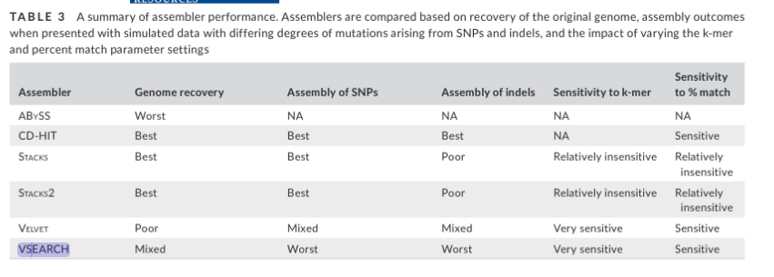

```{r,message = FALSE,echo = FALSE}
library(knitr)
knitr::opts_chunk$set(echo = TRUE)
library(knitcitations)
library(kableExtra)
opts_chunk$set(fig.width = 10,
               fig.height = 5,
               cache = FALSE)
cite_options(citation_format = "pandoc", max.names = 3, style = "html", 
             hyperlink = "to.doc")
```
---
title: 'RADseq'
subtitle: '*Katherine Silliman, Danielle Davenport*'
bibliography: RCN_site-Nov05.bib
---

```{r setup, include=FALSE}
knitr::opts_chunk$set(echo = TRUE, cache = TRUE)

colorize <- function(x, color) {
  if (knitr::is_latex_output()) {
    sprintf("\\textcolor{%s}{%s}", color, x)
  } else if (knitr::is_html_output()) {
    sprintf("<span style='color: %s;'>%s</span>", color,
      x)
  } else x
}
#set bash code chunks to use bash_profile
knitr::opts_chunk$set(engine.opts = list(bash = "-l"))

```

# Setup for running code  

If you would like to run the R code examples that are scattered throughout the guide (recommended but not required!), you will need to install some R packages. Only need to run this code once:  
```{r, eval=F}
install.packages("tidyverse")
if (!requireNamespace("BiocManager", quietly = TRUE))
    install.packages("BiocManager")

BiocManager::install("SeqArray")
BiocManager::install("SNPRelate")
```

Now load those packages, if using:  
```{r}
library(SeqArray) # efficient storage and filtering of genomic data
library(tidyverse) # plotting data formatting and manipulation
library(SNPRelate) # PCA and other popgen analyses
```

We also provide optional alternative coding examples that are based only on the command line, requiring these software packages: 

* [vcftools](https://vcftools.github.io/man_latest.html)
* [gnuplot](https://riptutorial.com/gnuplot/example/11275/installation-or-setup)  

# Reduced Representation Sequencing (RADseq/GBS)

"Restriction-site   Associated   DNA   sequencing"  - RADseq - combines  restriction  enzymes  with next-gen, massively parallel,  short-read  sequencing. RADseq involves the use of restriction enzymes, which are used to shear DNA at restriction enzyme cutsites. RADseq comes in different flavors. Double-digest RADseq (ddRAD; @Peterson2012-tr)  selects  markers  with  two  restriction enzymes  with  different  cut  frequencies. Genotype-by-Sequencing  (GBS;  @Elshire2011-or)  uses  a  frequent-cutting  restriction  enzyme  with PCR size selection. There are a number of reviews comparing different RADseq and GBS methods (e.g., @Andrews2016-ay). In this guide we use the term "RADseq" to refer to any of these protocols, including those that don't involve random shearing of data. When recommendations are specific to a certain type of RAD/GBS, we will explicitly say so.  

<!--Some aspects of RADseq data that are unique compared to whole genome resequencing (more):-->

Using RADseq to generate single nucleotide polymorphisms (SNPs) involves: 

1. library preparation in the lab
2. bioinformatic processing through assembly and/or mapping to a reference, then 
3. filtering of SNPs and individuals for quality.  

All of these steps can (and will) introduce some error, so the goal is to minimize this error through mitigation steps at all three parts of the process. Every dataset is different!  
<!--add more about philosophy over best practices-->

Much of this guide is directly inspired by [this excellent review paper](https://onlinelibrary.wiley.com/doi/10.1111/mec.14792) [@OLeary2018-iy], especially the section on minimizing errors due to library prep. We recommend reading and cross-referencing with this paper, and citing it if you follow its suggestions. Table 1 from this paper summarizes the various potential issues that can arise from RAD datasets and some mitigation steps. The goal of this guide is to expand on the O'Leary paper and provide some example code to help implement quality control and mitigation steps.

![Table 1 from [@OLeary2018-iy].](images/oleary_table1.png)

# Considerations During Lab Work {#labwork}  

There are steps you can take before you even sequence RAD libraries that can help minimize issues downstream. Here, we use "library" to refer to a set of RADseq fragments from a group of individuals that are barcoded and sequenced together on a single lane or group of lanes. While specific RAD library prep methods have their own nuances for minimizing error, there are some steps you can take that are common across methods.      

* If this RAD/GBS method has not been done in your species or in your molecular lab setup before, spend some time optimizing the protocol using a representative subset of individuals. Then try to keep everything about the library prep as consistent as possible across samples (eg, DNA extraction kit, PCR cycles, sequencing platform). This isn't always possible, especially if you need to optimize the protocol for certain tricky samples. Just make sure to keep track of everything!   

* Randomize samples across library prep batches and sequencing lanes! For example, if you are sequencing two different groups of samples on two different sequencing lanes, make sure they are randomized with respect to sample location or whatever your groups of interest are. If you are preparing groups of individuals in different batches to be pooled later, randomize across these batches. [Alicia Mastretta-Yanes](https://mastrettayanes-lab.org/) even recommends randomizing across DNA extractions, especially if the person doing the extractions is new to molecular work. This is to allow you to control for potential [batch effects](#batch) that are often observed with RAD data.  

<!--ADW: add figure showing random plate design-->
```{r, eval = F, include=FALSE}
# This code reads in a comma-delimited STRATA/meta-data file, randomises samples, and returns a file with wells and plates and duplicates which may be used to assist with plating libraries
# ** TODO** will need to consider where to duplicate samples - need to consider STARTA, DOC, ect..?
# maybe have user write in a list of samples to replicate

wells = 96 # how many wells can you use on your plate?
data.in = read.table("./data/example.metadata.csv", sep = ",", header = T) # each sample should be in its own ROW
l = length(data.in[,1])
plates = rep(1:length(ceiling(101/ wells)), wells)
data.out = cbind(
   data.in[sample(1:l, l, replace = F),], # randomise samples
   PLATEID = plates[c(1:l)],  # add plate info
   WELLID = rep(1:wells, length(unique(plates)))[1:l] # add well info
) # add duplicates **TODO**

# print example
 print(head(data.out))

#save to file

```
* Keep track of all potential batch effect sources in a Metadata file (eg, storage conditions of tissue/DNA, date/method of DNA extraction, date/method library prep batch, sequencing lane).   
* Have a core set of 2-4 technical sample replicates across all libraries. Ideally these are true technical replicates, meaning the same tissue/DNA sample is processed multiple times all the way from library preparation to sequencing. Sequencing replicates, where you sequence the same sample library preparation multiple times, can also be useful for downstream quality control.

<!--ADW: add figure or text to define sequencing replicates vs technical replicates-->

# Principles for Analyzing Your Data

## Steps for a robust RAD analysis 
This is just one approach for working through your data. Some people will prefer to run just a subset of samples through a pipeline at first and evaluate parameters, then run all the samples through. Either way, be prepared to make MULTIPLE assemblies and go through this process iteratively, especially if this is a new-to-you study system.  

<!-- 1) [Look at your raw data.](#fastqc)
2) [Run an assembly pipeline](#assembly) through to a SNP dataset, using either all samples or a representative subset. Parameters can come from those used in a similar study, or default parameters.
3) Filter your data minimally, then [evaluate for potential sources of error.](#error)
4) Subset or remove individuals based on initial evaluation.  
5) Using a representative subset of samples, [test key parameters](#test) to optimize your assembly.
6) Run your optimized assembly on all non-removed samples.
7) Evaluate the difference between multiple filtering schemes for your analyses of interest. *Popgen analysis guide coming soon*
8) Repeat as needed. --> 

1) [Look at your raw data.](#fastqc)
2) [Run an assembly pipeline](#assembly), using either all samples or a representative subset.
3) [Evaluate potential sources of error.](#error)
4) [Remove individuals based on initial evaluation](#bad).  
5) [Test a range of key parameters](#test) to optimize your assembly.
6) Run your optimized assembly on all non-removed samples.
7) [Filter your SNPs](#filter)
8) [Repeat as needed!](#repeat)  

## First, look at the raw data! {#fastqc}  
Always look at your data with [FastQC](https://www.bioinformatics.babraham.ac.uk/projects/fastqc/) before starting an assembly. First, this is a good check to just make sure the sequencing worked. If you have demultiplexed data, you can use [MultiQC](https://multiqc.info/) to generate FastQC plots for all individuals and quickly identify ones that did not sequence well.  

Check out [this informative tutorial](https://datacarpentry.org/wrangling-genomics/02-quality-control/index.html) on running FastQC and interpreting the output.  

**Questions to ask:** Do you have a lot of adapter sequences? Are the ends of your reads very low quality? If so, you should expect a fair amount of trimming and read filtering to occur prior to assembly. If that doesn't occur or if too many reads are being filtered so as to only recover a small number of SNPs, something might need to be tweaked with your trimming and filtering step.
<!--ADW: elaborating what you mean by 'tweaked' or possibly providing a link to some resources for how someone might thoughtfully change the parameters for their trimming and filtering steps.-->

You should also look at the top few reads in the Terminal.  
```
## zcat: unZip and conCATenate the file to the screen
## head -n 20: Just take the first 8 lines of input

$ zcat raw-fastqs/BC2_10_C5.fastq.gz | head -n 20
@BC2_10_C5.1 1 length=96
CAGCGTGTAATAGTCACCGGCGGCTCCCTCTGGAGAATAGCACAAGTGATCATTTTGCTCATCTTCCGTCCACTGGTGATTGTGGACCAGCCTCAC
+BC2_10_C5.1 1 length=96
<GGGGGA<GGGGIIIGIGGIGGGIIIIIGGGGGGGGGGGGGGGGGIIIIIIIIGGIIIGGGGIGIIGIGGGIIIIIAGGGGIIIGIIGGGGGAAGG
@BC2_10_C5.2 2 length=96
CTGCTACATGCAGTGTTCTGTATTACTTTTATTGTACGTTGATATGAATGAATGAGTGTTTTGTATACTTAGAGTACAAGTTTGTCAGTCATATCG
+BC2_10_C5.2 2 length=96
GIIIIIIIIIIIIIIIIIIIIIIIIIIIIIIGGIIIIIIIIIIIIIIIIIIIIIIIIIIIIIIIIIIIIIIIIIIIIIIIIIIIIIIIIIIIIIIG
@BC2_10_C5.3 3 length=96
CAGCACATGTTCCTGTGTAGAAAGCTTGTTAGTAGAATAAATAACACATGGCTGGTCAAACACAACACATGAAGAAACAACTTTCTGAACAGTTTT
+BC2_10_C5.3 3 length=96
GIIGIIIIIIIIIIIIIIIIIIIIIIIIIIIIIIIIIIIIIIIIIIIIIIIIIIIIGIIIIIIIIIIIIIIIIIIIIIIIIGGGGIIGIIIGGGII
@BC2_10_C5.4 4 length=96
CAGCGATTCGGCCCAAATTTGCACCACATCAGGCCCTTGACAGGGCGCTTCGATGGTGCAAATTTGGTGCGATTCGCTGCGCACCTAGCATATATG
+BC2_10_C5.4 4 length=96
AGGGIGIIIGIGGGIIGIGGGIIIGGGGAGGGGGAGGIGIGGIGGGGAGGGGGGGGGGGGGGGIIIII.G<GGIGGGIIIGGGGGIGGIIIGAGGI
@BC2_10_C5.5 5 length=96
CAGCAGTTTGGTGGAGTTCTGCAACCTTCCATTTCCAAAGAATTACCCAGGAGCTCTTCCCAGTGAATTTCTTCGGCACTTTTCATTGACCTTTTA
+BC2_10_C5.5 5 length=96
GGAGAAA.<AGAA.G.GGAGA<.GGA.<GAAGGAAGGIA<...<GA<..<G.<.<<.<AAAGGGG..<GGGGG<G.A.<GGGII.AG..<.GGGGG

```

If the sequencing center gave you one fastq file with all your samples, you should expect to see a barcode sequence, followed by the cutsite at the start of the read. If the Data are already demultiplexed (as the example is), you should only see the cutsite overhang (in this case, CWGC). Sometimes you can look at your fastq data files and see that there was a problem with the sequencing such that the cut site is either offset by one or more bases, or contains many errors. If this is not being addressed by the default filtering steps in your assembly pipeline, you can trim off N bases from the beginning or end of R1 and R2 reads in [ipyrad](https://ipyrad.readthedocs.io/en/latest/index.html) (`trim_reads` param), or with cutadapt before using stacks, or customize the Trimmoatic step for [dDocent](https://www.ddocent.com/).  

## Run an assembly pipeline {#assembly}  

There are a number of freely available pipelines for processing RADseq data, with the most popular being [dDocent](https://www.ddocent.com/), [Stacks](https://catchenlab.life.illinois.edu/stacks/), and [ipyrad](https://ipyrad.readthedocs.io/en/latest/index.html). These pipelines vary slightly in their underlying methodologies, customization options, and additional included analyses.  

|  | [dDocent](https://www.ddocent.com/) | [ipyrad](https://ipyrad.readthedocs.io/en/latest/index.html)| [Stacks2](https://catchenlab.life.illinois.edu/stacks/) |
|---|---|---|---|
| Supported datatypes | Paired-end: ddRAD, ezRAD, RAD (random shearing), data with large overlap between forward and reverse reads; Single-end: any RADseq method  de novo and reference-based. If doing de novo assembly, reads cannot be trimmed outside of dDocent | Wide range of RAD/GBS methods with paired/single end data, see [ipyrad documentation](https://ipyrad.readthedocs.io/en/master/4-data.html) | Paired-end and single-end data for single and double digest RAD and DART; GBS with single-end sequencing. NOT suitable for paired-end GBS. |
| Unique aspects | Novel data reduction approach used to inform coverage cutoffs | Python API for popgen and phylogenetic analyses written specifically for RAD data | `populations` module calculates sliding window and site-specific popgen metrics |
| Documentation | Very good (esp. tutorials), active community support on Google Groups | Excellent (esp. installation, parameter explanations, and tutorials), active community support on Gitter | Very good, in depth tutorials as published manuscripts, active community support on Google Groups |
| Speed/Accuracy (based on discussion in [panel seminar](https://www.youtube.com/watch?v=C74GBESeIq4)) | fastest and most accurate | close to dDocent accuracy, more over-splitting is possible  if parameters are not tuned | produces some untrue genome fragments (esp. with higher levels of indel polymorphism), but can be addressed with downstream filtering |
| Open source/development | Open source, primarily combines existing software | Open source | No |
| Filtering options | Minimal default filtering as implemented in VCFtools. Ideal for those who want full freedom in filtering their SNPs. | Wide range of filtering options, some hard-coded filtering to deal with paralogs  | Moderate range of filtering options |
| Output options | Only produces a VCF, fasta of the de novo assembly, and individual BAM files  from mapping to the reference  | Lots of output formats (see [documentation](https://ipyrad.readthedocs.io/en/master/output_formats.html)) | Lots of Stacks-specific output and log files, as well as various inputs for popgen programs (see [documentation](https://catchenlab.life.illinois.edu/stacks/comp/populations.php)) |
| Popgen analyses | No additional popgen analyses included  | Unique, flexible Python API implementing range of popgen and phylogenetic methods (see [documentation](https://ipyrad.readthedocs.io/en/master/API-analysis/index.html))   | Popgen summary statistics (F-statistics, pi), including kernel-smoothing along reference genome. Underlying equations and assumptions for these are not very clear. |
|  |  |  |  |  

Some groups have also developed pipelines for specific flavors of RAD (e.g., [Matz lab for 2b-RAD](https://github.com/z0on/2bRAD_denovo/blob/master/2bRAD_README.sh)) or proprietary software (eg, [DARTseq](http://georges.biomatix.org/storage/app/media/uploaded-files/dartR_Workbook.pdf)). **In most cases, it is recommended that you use a pipeline developed and tested for RAD data, especially if you are making a de novo assembly.** [@LaCava2020-bg] have an excellent study where they review various *de novo* assemblers that are used in these pipelines. Assemblers that were not explicitly developed for short reads (eg, Velvet, ABySS) performed very poorly, while CD-HIT (the assembler in dDocent) performed the best. Stacks/Stacks2 and vsearch (the assembler in ipyrad) both performed worse when analyzing simulated data with indels. It should be noted that all of these RAD pipelines have optimized the specific parameters of these de novo assemblers to work with RAD data of various flavors, which may not be fully reflected in the LaCava study.  

Based on the MarineOmics RAD panel, the general consensus is that all the popular pipelines can produce adequately accurate datasets (with appropriate parameter optimization and data filtering).     



## Evaluate potential sources of error {#error}

Once you have processed your samples (or a subset of samples) through a genotyping pipeline, you will have a bunch of different output file options for genetic data. The VCF file is one of the most popular file formats, and is the most versatile for initial data exploration as many programs exist to filter and accept VCF files. Below are a list of potential confounding factors that may exist in your data, and how to tease them out.  

**Using SeqArray in R** 
If you are following along with the R code examples, we need to 1st read in our data (skip this section if not running R code).  

For the code examples in this section, we primarily make use of the R package SeqArray [@Zheng2017-pl], which can read and manipulate VCFs. If you’re familiar with R, SeqArray is simple to use. The package can efficiently store sequence variant calls with hundreds of thousands of individuals, variants (e.g., SNPs, indels and structural variation calls) and annotations.  It employs a data container called a CoreArray Genomic Data Structure (GDS). It’s super-fast (5X faster than PLINK v1.9; 16X faster than vcftools) and it integrates well with other R packages you might use in your analysis pipeline. (i.e. SNPRelate, SeqVarTools). We also like it because you can filter your data before running certain analyses without 1st generating a separate filtered VCF file.  

First, we need to convert our VCF file into the GDS format. We will do this once here, then use the GDS file for subsequent code examples.
```{r}
filename = "OL_subset" #replace with your file name 
filename.gds = paste0("RAD_data/", paste0(filename, ".gds"))
filename.vcf = paste0("RAD_data/", paste0(filename, ".vcf"))
  # 1 . Convert VCF to GDS
SeqArray::seqVCF2GDS(vcf.fn = filename.vcf, out.fn = filename.gds, storage.option="ZIP_RA")
gdsin = SeqArray::seqOpen(filename.gds)
print(paste0("The number of SAMPLES in data: ", length(c(SeqArray::seqGetData(gdsin, "sample.id")))))
print(paste0("The number of SNPs in data: ",  length(c(SeqArray::seqGetData(gdsin, "variant.id")))))
```
It is always helpful to have a metadata file with information for each sample, such as sampling site, sequencing library, etc. In our example, our metadata file (OL.popmap) is tab-delimited and has the column headers:  
ID: sample ID
STRATA: sampling location/population
PLATE: sequencing batch  
Next we read in our metadata file, and make sure the samples are in the same order as your VCF file:  
```{r}
metafile = "RAD_data/OL.popmap"
sample.ids = seqGetData(gdsin, "sample.id")
sample.strata =  read.table(metafile, header = T, sep = "\t") %>%
                  dplyr::select(ID, STRATA, PLATE)
```
Now, on to evaluating our data!  

### "Bad" samples {#bad}  

Sometimes a sample doesn't sequence well (few sequencing reads, higher error rate). This can be due to DNA quality, an issue during library prep, or not enough sequencing depth (average # of reads per sample). Generally, it will lead to a sample with fewer sequencing reads, higher missing data in a SNP dataset, and fewer shared loci with other samples. Identifying and then removing these samples *prior* to the final RADseq assembly analysis can help minimize mis-assembled loci, genotyping errors, and excessive filtering of acceptable loci.

The process of identifying low quality individuals is usually iterative, as the way you initially filter your SNPs will influence the amount of missing data and locus sharing among samples. This is why we recommend minimally filtering your SNPs for sample coverage (the # of individuals a locus is called in) when initially exploring your data. Some ways to identify bad samples:  

1) For every SNP dataset you generate, it is a good idea is always evaluate the missingness per sample (and report this distribution in your manuscript!). Identify samples with way more missingness than the rest, and observe how they look in a PCA and locus sharing plot. If they stick out or all cluster together in the middle, then try removing them from the assembly and seeing if it changes downstream analyses. If so, you may want to specify a missingness cutoff for including samples in the final analysis.  

**Missingness in R with SeqArray**
```{r}
#using previously loaded gdsin object
print("Per variant: ")
summary(m1 <- SeqArray::seqMissing(gdsin, per.variant=TRUE))
print("Per sample: ")
summary(m2 <- SeqArray::seqMissing(gdsin, per.variant=FALSE))
samples <- SeqArray::seqGetData(gdsin, "sample.id")
cbind(samples,m2)[order(-m2),]
#plot histogram 
hist(m2,breaks=50)
```

Another common method of filtering and evaluating you data without ever using R is [VCFtools](https://vcftools.github.io/man_latest.html).  

**Missingness with vcftools, on the command line**  
```{bash, eval = T}
vcftools --vcf RAD_data/OL_subset.vcf --missing-indv --out RAD_data/OL_subset
# sort the file by most missing data and print the top 10 samples  
cat RAD_data/OL_subset.imiss | (read h; echo "$h"; sort -k5 -r) 
```
You can open the file analysis/OL_subset.imiss in any text editor an look at the missingness values by eye.  

To plot the missingness on the command line, you can use gnuplot:
```{bash, eval = T}
#code from Jon Puritz
mawk '!/IN/' RAD_data/OL_subset.imiss | cut -f5 > totalmissing
gnuplot << \EOF
set terminal dumb size 120, 30
set autoscale
unset label
set title "Histogram of % missing data per individual"
set ylabel "Number of Occurrences"
set xlabel "% of missing data"
#set yr [0:100000]
binwidth=0.01
bin(x,width)=width*floor(x/width) + binwidth/2.0
plot 'totalmissing' using (bin($1,binwidth)):(1.0) smooth freq with boxes
pause -1
EOF
```

It looks like samples OR3_13_C3,CA4_12_C1, OR3_3_C7, CA4_13_C1, BC2_6_C2, BC2_9_C4 have a lot of missing data relative to other samples. We can remove them from our dataset for now, and just keep exploring our data, but if you decide to exclude them permanently from the analysis you should eventually rerun your genotyping pipeline without those samples, esp. if doing a de novo assembly. 

2) Another great way to explore missingness with your data is to construct a heatmap of loci that are genoptyped between pairs of samples. Generally, samples that are more closely related will share more loci with each other due to cutsite dropout. Deviations from that pattern can pinpoint bad samples as well as batch effects.
  + [ipyrad API tutorial](https://ipyrad.readthedocs.io/en/latest/API-analysis/cookbook-sharing.html) for making a locus sharing heatmap, requires ipyrad output or ipyrad's vcf2hdf5 conversion  
  + [code to generate locus sharing/missingness heatmap from a VCF](https://github.com/atcg/clustOpt)

### The power of PCA   

One of the most powerful methods for exploring your data is a Principle Components Analysis. From [this genetics tutorial](https://comppopgenworkshop2019.readthedocs.io/en/latest/contents/03_pca/pca.html): "To understand how PCA works, consider a single individual and its representation by its 593,124 markers. Formally, each individual is a point in a 593,124-dimensional space, where each dimension can take only the three possible genotypes indicated above, or have missing data. To visualize this high-dimensional dataset, we would like to project it down to two dimensions. But as there are many ways to project the shadow of a three-dimensional object on a two dimensional plane, there are many (and even more) ways to project a 593,124-dimensional cloud of points to two dimensions. What PCA does is figuring out the “best” way to do this project in order to visualise the major components of variance in the data." See [here](https://michaelaalcorn.medium.com/yet-another-pca-explanation-727dff6ce26a) for a linear algebra-based explanation of PCA.   

When you have a VCF file with SNPs, use PCA before extensive filtering or playing with parameters to look at the data. Check which SNPs are associated with axes showing the most variation. 

Here we use _SeqArray_ and _SNPRelate_ to run a PCA in R. 

<!--Other popular methods for PCA include pcangsd(link), ...., but note that ... requires some file conversions everytime you filter.-->

*Reminder:* Missing data is a feature of RAD. Be aware of how different analysis tools deal with missingness, especially PCA which will fill in all missing data with some values. Here, the PCA from _SNPRelate_ imputes missing genotypes as the mean genotype across samples. 

##### Doing a PCA with SeqArray and SNPRelate in R. 


```{r}
#open the gds file previously created, if not already open
#filename.gds = "RAD_data/OL_subset.gds" #replace with your file name 
#gdsin = SeqArray::seqOpen(filename.gds)
# exclude samples previously identified as having too much missing data
bad_samples = c("OR3_13_C3","CA4_12_C1","OR3_3_C7","CA4_13_C1","BC2_6_C2","BC2_9_C4")
sample.ids = seqGetData(gdsin, "sample.id")
keep = sample.ids[which(!sample.ids %in% bad_samples)]

```
Whether your data are denovo or reference-based, it is important to filter out linked sites before performing a PCA. Here's how to do it in SeqArray. Note, if you have already filtered your VCF file to have only 1 SNP per RAD locus, you don't need to do this: 
```{r,results='hide'}
snpset <- SNPRelate::snpgdsLDpruning(gdsin, ld.threshold=0.2, autosome.only = F, start.pos="random", num.thread=1, remove.monosnp = T, sample.id = keep)  
snpset.id <- unlist(unname(snpset))
```

Now we will actually run the PCA, again removing the samples with missing data, keeping unlinked SNPs, and removing SNPs with less than 5% minor allele frequency. 
```{r}
# PCA only on SNPs with a minor allele freq greater than 5%
pca.out = SNPRelate::snpgdsPCA(autosome.only = F, gdsin, num.thread=2, remove.monosnp = T, maf = 0.05,
                               snp.id=snpset.id,
                               sample.id = keep) # filtering for pruned SNPs
#close the gds file (saves memory)
#seqClose(gdsin)

eig = pca.out$eigenval[!is.na(pca.out$eigenval)]
barplot(100*eig/sum(eig), main="PCA Eigenvalues")
```

<!-- Data Info: Below we use RAD data from an Australian marine species complex. ---> 
```{r, eval =F,include=F}

## The following code will read from a text file containing a list of the VCF files you wish to explore (one file per line) 
## Each line must contain the full file path 
## The code will convert your VCF to GDS
## Perform PCA
## Plot the results 

list_vcfs = read.table("analysis/Pop_Map/vcf.list")[[1]]
lapply(list(list_vcfs), function(x) { 
  filename = gsub(".vcf", "", gsub("data/", "", x)) ## NOTE:: you want a pattern that will remove the file path 
  print(paste0("PCA for ... ", filename))
  filename.gds = paste0("data/gds/", paste0(filename, ".gds"))
  gdsfmt::showfile.gds(closeall=TRUE)
  # 1 . Convert VCF to GDS
  SeqArray::seqVCF2GDS(vcf.fn = x, out.fn = filename.gds, storage.option="ZIP_RA")
  gdsin = SeqArray::seqOpen(filename.gds)
  print(paste0("The number of SAMPLES in data: ", length(c(SeqArray::seqGetData(gdsin, "sample.id")))))
  print(paste0("The number of SNPs in data: ",  length(c(SeqArray::seqGetData(gdsin, "variant.id")))))
}) # end apply 


sample.ids = seqGetData(gdsin, "sample.id")
sample.strata =  read.table("data/test.metadata.csv", header = T, sep = "\t") %>%
                  dplyr::select(TARGET_ID, STRATA, LONG, LAT, PLATE)
id.order = sapply(sample.ids, function(x,df){which(df$TARGET_ID == x)}, df=sample.strata) #incase your strata file is not in the same order as your vcf
sample.strata.order = sample.strata[id.order,]

# get pruned SNPs
# NOT WORKING YET, issue with chromosome names
# Try this with vcf https://github.com/zhengxwen/SNPRelate/issues/10  
#snpset <- SNPRelate::snpgdsLDpruning(gdsin, ld.threshold=0.2, autosome.only = F, start.pos="random", num.thread=1)  
#snpset.id <- unlist(unname(snpset))

# PCA only on SNPs with a minor allele freq greater than 2.5%
pca.out = SNPRelate::snpgdsPCA(autosome.only = F, gdsin, num.thread=2, remove.monosnp = T, maf = 0.025)
#                               snp.id=snpset.id) # filtering for pruned SNPs
eig = pca.out$eigenval[!is.na(pca.out$eigenval)]
barplot(100*eig/sum(eig), main="PCA Eigenvalues")
```


First color/shape the individuals by the factor you expect to matter (eg, sampling site or region, family, ecotype).  
```{r, eval=T}
#PLOT PCA
#PC1 v PC2 colored by collection location
id.order = sapply(keep, function(x,df){which(df$ID == x)}, df=sample.strata) #incase your strata file is not in the same order as your vcf
sample.strata.order = sample.strata[id.order,]
print(
  as.data.frame(pca.out$eigenvect) %>%
      tibble::add_column(., STRATA =  sample.strata.order$STRATA) %>%
      ggplot(., aes(x=V1, y=V2, color = STRATA)) + 
      geom_point(size=2) +
      stat_ellipse(level = 0.95, size = 1) +
      geom_hline(yintercept = 0) +
      geom_vline(xintercept = 0) +
      theme_bw() +
      xlab(paste0("PC1 [",paste0(round(eig[1], 2)), "%]")) +
      ylab(paste0("PC2 [",paste0(round(eig[2], 2)), "%]")) +
      ggtitle("PCA Colored by Collection Location")
)
```

#### Questions to ask about your PCA: {.unlisted .unnumbered}

* Is there any clustering? If so, is it different than your expectation?
  + If different than expectation, suggests either [batch effects](#batch), [cryptic variation](#cryptic) among individuals, or systematic biological issues affecting assembly/mapping
* Are there outlier samples driving a large amount of variation?
  + If so, they may be [cryptic species](#cryptic), clones/sample replicates, or they [sequenced/genotyped poorly](#bad)
  + In our example we see 2 potential outlier samples in the bottom left corner. We can check which samples they are by plotting the PCA with sample ID and/or looking at the actual PC scores.

```{r, eval=T}
#PLOT PCA
#PC1 v PC2 with Sample Labels
print(
  as.data.frame(pca.out$eigenvect) %>%
      tibble::add_column(., ID =  sample.strata.order$ID) %>%
      ggplot(., aes(x=V1, y=V2, label = ID)) +
      geom_text(size =3) +
      geom_hline(yintercept = 0) +
      geom_vline(xintercept = 0) +
      theme_bw() +
      xlab(paste0("PC1 [",paste0(round(eig[1], 2)), "%]")) +
      ylab(paste0("PC2 [",paste0(round(eig[2], 2)), "%]")) +
      ggtitle("PCA with Labels")
)
```

```{r, eval=F}
# which samples have PC1 > -0.7 and PC2 < -0.3?
as.data.frame(pca.out$eigenvect) %>%
      tibble::add_column(., ID =  sample.strata.order$ID) %>%
  filter(V1 > 0.7 & V2 < -0.3) %>%
  select(ID,V1,V2)
```

* Is there no clustering at all? If so, it may be due to:  
  + bioinformatic artifacts leading to noise, [see Testing Parameters](#test)
  + issues with how you are [filtering the data](#filter) (eg, too strict or too lax)
  + issues with how your PCA is treating missing data
  + or you actually have no structure in your dataset!

<!--`r colorize("figure example, no clustering", "red")`-->

* If you used sample replicates, first see if replicates cluster very close together. If not, then there may be batch effects or bioinformatic artifacts leading to genotyping error that must be addressed. Then remove replicates for a subsequent PCA evaluation. 

<!--Here is an example of a PCA with sample replicates, and then with sample replicates removed: -->

When removing a sample replicate, you can choose one at random or pick the replicate with the least [missing data](#bad). 
```{r, eval=FALSE}
# example code for removing samples from a SNPRelate PCA 
# assumes you have already loaded a vcf file as a GDS
samples.to.remove = c("SampleA_rep","SampleB_rep")
sample.ids = seqGetData(gdsin, "sample.id")
keep = sample.ids[which(!sample.ids %in% bad_samples)]

# PCA only on SNPs with a minor allele freq greater than 2.5%, only keeping samples in keep
pca.out.noreps= SNPRelate::snpgdsPCA(autosome.only = F, gdsin, num.thread=1, remove.monosnp = T, maf = 0.05,
                               snp.id=snpset.id,
                               sample.id = keep)

```

Next, color the individuals by potential sources of batch effects (sequencing lane, library prep batch, age of tissue sample, person doing the DNA extraction...).    
```{r, eval=T}
# again, but colored by batch
print(
  as.data.frame(pca.out$eigenvect) %>%
      tibble::add_column(., PLATE =  as.factor(sample.strata.order$PLATE)) %>%
      ggplot(., aes(x=V1, y=V2, color = PLATE))  + #label = ID
      geom_point(size=2) +
      stat_ellipse(level = 0.95, size = 1) +
      geom_hline(yintercept = 0) +
      geom_vline(xintercept = 0) +
      theme_bw() +
      xlab(paste0("PC1 [",paste0(round(eig[1], 2)), "%]")) +
      ylab(paste0("PC2 [",paste0(round(eig[2], 2)), "%]")) +
      ggtitle("PCA colored by Batch/Sequencing Plate")
)

```

* Do any observed clusters match a source of batch effect? [How to remove batch effects](#batch)  

<!-- #### Visually inspect alignments {#align}  
Another useful approach is to visually inspect alignments for SNPs or loci that are identified as "weird" in the subsequent analyses. In ipyrad this can be done by searching the .loci file, in dDocent... If the alignment looks wonky, you can feel better about removing the whole locus (?).  
`r colorize("code example .loci", "red")`
`r colorize("code dDocent", "red")`  
`r colorize("code stacks", "red")`    
-->


### Batch effects {#batch}
As discussed in [Considerations During Lab Work](#labwork), batch effects can arise by minor (or not so minor) differences during the library prep and sequencing stage. Randomizing samples across libraries and sequencing lanes can help mitigate the influence of batch effects on your downstream analyses, but sometimes this isn't possible, esp. when using pre-existing data. Even if you randomize your samples, it is a good idea to check for batch effects with a PCA and then try to mitigate them.  

Nicolas Lou and Nina Therkildsen have a [great article](https://onlinelibrary.wiley.com/doi/abs/10.1111/1755-0998.13559) and [Github repo](https://github.com/therkildsen-lab/batch-effect) discussing causes, detection, and mitigation of batch effects in low coverage WGS, where batch effects can have particularly large effects [@@Lou2021-ew]. While some of their recommendations are specific to reference-based analyses, others are relevant to RAD methods too (eg, batch effects due to different sequencing platforms, DNA degradation levels, and sequencing depth).

<!--`r colorize("PCA figure of batch effect", "red")`-->

You can identify which loci are driving the batch effect by 1) identifying the top SNPs contributing to PC variation (termed "loadings") and/or 2) do an Fst outlier analysis with the batches specified as populations (eg, Bayescan). Both of these methods are most appropriate if you've randomized your samples between batches. If you have not randomized samples but are certain there is a batch effect driving variation in your dataset, you can still remove loci this way but you may also be removing biologically informative loci.  

In SeqArray/SNPRelate, if you have batch effects that are identifiable by PCA, you would extract the PC loadings for each SNP at the PC which represents the batch effect, plot a histogram to see the distribution, choose a cutoff, then filter those SNPs out and create a new VCF for downstream analyses. For this example, let's pretend that we see a batch effect on PC1. 
```{r, eval=T}
# assume you have a GDS object called gdsin and a PCA object called pca.out
# extract PCA loadings
SnpLoad <- snpgdsPCASNPLoading(pca.out, gdsin)
names(SnpLoad)
dim(SnpLoad$snploading)
#plot a histogram of absolute PC loading values for PC1, with larger loading meaning more effect on PC1
pc<-1
hist(sort(abs(SnpLoad$snploading[pc,]),decreasing=T,index.return=T)[[1]],breaks = 30,main="PC loadings: PC1",)
```
Let's remove the largest effect loci over abs(0.010) and see if it changes our PCA.
```{r}
#extract SNP.IDs for loadings on PC 1 > abs(0.010) 
batch.snp.ids <- SnpLoad$snp.id[which(abs(SnpLoad$snploading[1,]) >= 0.010)]

#rerun PCA
snp.id.allfilt <- setdiff(snpset.id,batch.snp.ids)
pca.out.pcfilt = SNPRelate::snpgdsPCA(autosome.only = F, gdsin, num.thread=2, remove.monosnp = T, maf = 0.05,
                               snp.id=snp.id.allfilt,
                               sample.id = keep) # filtering for pruned SNPs
print(
  as.data.frame(pca.out.pcfilt$eigenvect) %>%
      tibble::add_column(., STRATA =  sample.strata.order$STRATA) %>%
      ggplot(., aes(x=V1, y=V2, color = STRATA)) + 
      geom_point(size=2) +
      stat_ellipse(level = 0.95, size = 1) +
      geom_hline(yintercept = 0) +
      geom_vline(xintercept = 0) +
      theme_bw() +
      xlab(paste0("PC1 [",paste0(round(eig[1], 2)), "%]")) +
      ylab(paste0("PC2 [",paste0(round(eig[2], 2)), "%]")) +
      ggtitle("PCA Colored by Collection Location")
)

```

Our PCA is now clustering better by population, so we will now export a new VCF that includes all the filtering we've done so far: 1) removed individuals with missing data, 2) thinned our SNPs for linkage, and 3) removed SNPs driving a batch effect. 

To save your filtered GDS object as a VCF in SeqArray: 
```{r}
# set a filter to exclude samples with missing data, and SNPs in linkage or with a batch effect
seqSetFilter(gdsin, sample.id=keep,variant.id=snp.id.allfilt)

# convert to vcf
seqGDS2VCF(gdsin, "RAD_data/OL-miss-pc1-linkage-filt.vcf.gz")

#close the gds file to save memory
closefn.gds(gdsin)

```

### Cryptic species/contamination/clones {#cryptic}  
One issue that is particularly common, especially for marine invertebrates, are cryptic, yet highly diverged lineages occurring in the same geographic location. If you are trying to do a landscape/seascape genetics study, cryptic species can dramatically throw off population genetic analyses. A PCA using all the samples can help identify cryptic species if samples are forming clusters that do not align with any other possible factor (eg, geography, sequencing batch).   

<!--Note: Notice the huge variation explained along the first PC-axis.-->

You can also check heterozygosity. Large differences in heterozygosity between outliers can suggest different species or cryptic hybrids. Two outliers are obvious in the previous PCA. Large differences in heterozygosity between samples are clear, with one location showing two distinct clusters of samples. These samples were later determined using mtDNA and morphological analysis to be cryptic species.
*Unpublished data from a marine species in Australian waters.*

<!--Note: -->

You can then estimate genetic divergence between these clusters using pairwise Fst and/or phylogenetic inference to determine how diverged the groups are. If they are very diverged, it may be better to assemble each cryptic species separately, especially for denovo assemblies with dDocent and Stacks, especially since often times restriction cut-sites are not always conserved; see [@Wagner2013-ff; @Rubin2012-hw]. These two pipelines used a set of given samples to create a "reference" or "catalog" to which all other samples are mapped. If highly diverged samples are included in creating this reference, it can lead to [oversplitting](#cluster).  

Cryptic clones can also dramatically throw off population genetic analyses. In a PCA, clones will often appear as their own very tight cluster, similar to sample replicates. A calculation of sample pairwise distance (e.g., Manhattan distance) can very duplicates/clones.

<!--Below the PCA shows x and a simple calculate of pairwise-distance (i.e. here manhattan distance) shows x known duplicates, and x unknown clones. 
`r colorize("PCA figure of cryptic clones", "red")`-->

## Test a range of key parameters {#test}  

There are many parameter choices to make when assembling and genotyping, and those parameters vary slightly across pipelines. The parameters below are general across RADseq pipelines (although with different names), and are shown to have the largest impact on genoyping error rates.  

### Clustering threshold {#cluster}  
#### (de novo assembly only)  
During *de novo* RADseq assembly, reads are assembled into contigs (contiguous sequences), so that each contig represents a single locus. This assembly can occur separately for each individual (ipyrad) or jointly for multiple individuals (dDocent, Stacks). To call SNPs, in the case of ipyrad, contigs are then clustered and aligned across individuals, while in dDocent and Stacks, reads for each individual are mapped to the "reference" contigs. All of these pipelines use sequence similarity (or **clustering threshold**) to determine if fragments are homologous (from the same place in the genome) and therefore should be clustered together. 

If the clustering threshold is too low, *undersplitting* can occur so that multiple loci are combined into a single contig. Undersplitting is common with repetitive regions and paralogs. It can inflate mean observed heterozygosity. If the threshold is too high, it can lead to *oversplitting*, where alleles of the same locus are split into two or more contigs. This can lead to reduced mean observed heterozygosity.  

If severely off, both of these issues can bias the models used to identify SNPs. Undersplitting a little is better than oversplitting, as it is easier to identify lumped paralogs downstream and remove them.  

#### **What influences the "optimal" clustering threshold of your data?**  
Clustering threshold is usually determined by how much genetic diversity you have in your dataset. If your dataset has high genetic diversity (eg., a single species with high heterozygosity, multiple highly diverged populations, multiple species), then you will need a lower clustering threshold. If your dataset has low genetic diversity (a single species with lower heterozygosity, a single family), then you will need a higher clustering threshold. Polyploid or highly repetitive (i.e., large) genomes may also have different requirements than diploid species with smaller genomes. Other factors, such as sequencing error rate, may play a role as well. **We recommend always testing a few clustering thresholds with a new dataset and/or new species**. However, as long as your clustering threshold is in the ballpark it shouldn't affect downstream analyses (according to [Isaac Overcast](https://isaacovercast.github.io/)).

There are a few strategies to identify a good clustering threshold for your data, all of which require assembling your data with a range of clustering thresholds.  
1) Metrics developed by [@McCartney-Melstad2019-ac], based on popgen theory and landscape genetic expectations  
2) Utilize sample replicates (either exact replicates or individuals from the same locality) to quantify genotyping error and minimize error while maximizing the number of informative loci [@Mastretta-Yanes2015-jb]
3) Evaluating the number of haplotypes across loci, with many 3+ haplotypes indicating undersplitting [@Harvey2015-vh;@Ilut2014-ja]
4) Make assemblies at a range of thresholds and parameters, plot the # of SNPs or contigs per assembly, and make a judgement call [example in dDocent tutorial](https://www.ddocent.com/assembly/). If most parameters give you about the same # of SNPs or contigs, you can feel confident that this parameter doesn't matter much for your data and just choose a reasonable value.  

### Mapping parameters 
#### (reference-based and some de novo assemblers) {.unlisted .unnumbered}    
When a sequencing read maps to the wrong assembled contig or place in a reference genome (ie, a non-homologous locus), this can result in erroneous SNPs. In many cases, these SNPs can be filtered out later (link to filtering). However, data should be checked to make sure there aren't systematic, wide-scale mapping issues that need to be addressed.

For referenced-based assembly, both dDocent and ipyrad make use of bwa(link) to map reads, while Stacks allows the user to choose their aligner. dDocent also utilizes bwa for de novo assemblies. 

Mapping defaults for popular RADseq pipelines:  
`L`: clipping penalty for 5' and 3'  
`A`: matching score  
`O`: gap open penalty  
`T`: mapping quality filter  

dDocent: `bwa mem -L 20,5 -t 8 -a -M -T 10 -A1 -B 3 -O 5 -R`

* can change -A and -O interactively during the dDocent pipeline.  

ipyrad: (defaults) `-L 5,5 -B 4 -A1 -O 6 -T 30`  

* requires changing the ipyrad source code to change parameters

Our [whole genome resequencing tutorials](https://marineomics.github.io/WGS_intro.html)] has some good content on mapping. General considerations with RAD data:   

* how many reads aligned for each sample? If many reads didn't aligned, this could be an issue with the reference, read trimming/filtering, or the mapping parameters.
* What is the distribution of mapping scores?  
* ratio of mean (across individuals) mapping quality scores for reference and alternate allele [@OLeary2018-iy]. 0.25-1.75 cut off implemented in dDocent.  
  + this info might not be coded in all VCFs

### Read depth threshold {#seq}  

Mistakes that occur during sequencing can lead to a base-calling error in a read, which can then lead to an erroneous SNP. This type of error most commonly manifests as rare alleles (eg, only observed in one individual) or singletons (only one copy of the minor allele across all individuals). A conservative approach to deal with these errors is to filter out all loci with rare alleles (link filtering), but for some demographic analyses this filtering is inappropriate as they require the site frequency spectrum.  
The best ways to minimize the impact of sequencing error during bioinformatic processing is to 1) properly trim and filter your data, and 2) require higher read depth thresholds for assembly and genotyping.   

##### 1) Filtering reads  

FASTQ files that typically come from the sequencing center include a [Phred scale quality score](https://gatk.broadinstitute.org/hc/en-us/articles/360035531872-Phred-scaled-quality-scores) for each base, which indicates the probability of that base call being correct. This information can be used prior to assembly to trim low-quality sections from either end of reads or remove reads altogether. Some SNP callers, including FreeBayes which is part of dDocent, also use Phred scores when calling SNPs (ipyrad and Stacks do not). All three of the most popular RAD pipelines include steps to filter reads due to low quality bases low quality bases or adapter sequences, but vary slightly on what kinds of read trimming are allowed. Always make sure to filter out adapter sequences (this is not default with stacks), otherwise default parameters are usually adequate. If your initial [fastqc](#fastqc) indicates that you have many low quality bases in your reads, you may lose too much of your data during filtering. In this case, you may want to make your read filtering a little more permissible (keeping in mind that this may increase SNP error rate).  
**Always make sure to check with your sequencing center to see if they have done anything to the raw reads before you received them!**
<!---turn these into html tabs--->  

**dDocent: **  

* does not allow you to use reads that have already been trimmed and filtered for de novo assembly, only referenced-based.
* Uses Trimmomatic to trim Illumina TruSeq adaters and low quality bases. Make sure to change the defaults if you used a different adapter/sequencing system.  

**Stacks: **  

* requires your reads to be all the same length, so if they were previously trimmed of low quality bases or adapter sequence this must be specified and they will be truncated to the same length.  

##### 2) Require higher read depth thresholds for assembly and genotyping.  
For RADseq, ideally you are generating an average of *at least* 10-20 sequence reads (10x-20x coverage) for each RAD locus in your library preparation (but this doesn't always happen...). For diploid species, this would be sequencing each RAD haplotype at least 5x-10x. The SNP calling step of RAD pipelines all require setting a minimum number of reads to determine whether a site is homozygous or heterozygous. If this threshold is too low, sequencing errors are more likely to be included and the SNP caller will have a harder time accurately identifying SNPs ([in which case, you'd be better off with genotype likelihood methods](https://github.com/therkildsen-lab/genomic-data-analysis/blob/master/lcwgs_data_analysis.md). If it's too high, then real polymorphic loci will be excluded. The *too high* threshold for your dataset can usually best be determined by using a few different read depth thresholds and comparing how the results change downstream analyses. 


## Filtering SNPs {#filter}

### (and embrace the missingness!) {.unlisted .unnumbered}  

`r colorize("Tutorials for this section are still under development! Please contribute on Github or provide feedback in [Discussions](https://github.com/MarineOmics/marineomics.github.io/discussions)", "red")`  

Even with a reduced representation sequencing approach, your assembly and genotyping pipeline will generate data for thousands of SNPs across your individuals. These SNPs will always need to be filtered before doing downstream analyses.  

#### Main reasons to filter your data:  

* Remove potentially erroneous SNPs that remain after optimizing your assembly pipeline
* Remove SNPs that are uninformative for downstream analyses 
* Subsample to remove SNPs that are in linkage disequilibrium (required for analyses that assume independence like PCA, Structure)

Unique to RADseq approaches is the missingness of RAD data. 

* Don't over filter for missingness
    + Papers showing how too much filtering can skew results:
       + Empirical:  [@Eaton2017-gx; @Tripp2017-cp; @Martin-Hernanz2019-bu; @Silliman2021-oo; @Diaz-Arce2019-nh]  
       + Simulation investigating effects and sources of missing data: [@Huang2016-na; @Leache2015-eg; @Gautier2013-vj; @Rivera-Colon2021-en]
* Some ways to account for missing data in downstream analyses:
   + impute mising data (PCA), subsample (PCA, structure, pretty much anything with SNPs), try a few different missing filters and see what impact it has on results  
   
Jon Puritz has a [great tutorial](http://www.ddocent.com/filtering/) on filtering SNPs from RADseq data assembled with dDocent. While it requires certain VCF fields to be present that aren't generated by ipyrad or Stacks, it contains great concepts on how to filter. 

<!-- use [pcANGSD](link)-->


<!--## Special Cases  
### DARTseq  
### 2bRAD

### Reference-based vs. de novo RADseq
-->


## Repeat as needed {#repeat}  

# Helpful tutorials  
* [Marine Genomics open course](https://baylab.github.io/MarineGenomics/)
* [UNIX tutorial](http://evomics.org/learning/unix-tutorial/)
* [what is a VCF file and how can I filter it?](http://evomics.org/learning/population-and-speciation-genomics/2020-population-and-speciation-genomics/first-steps-in-genomic-data-analysis/)


# References

