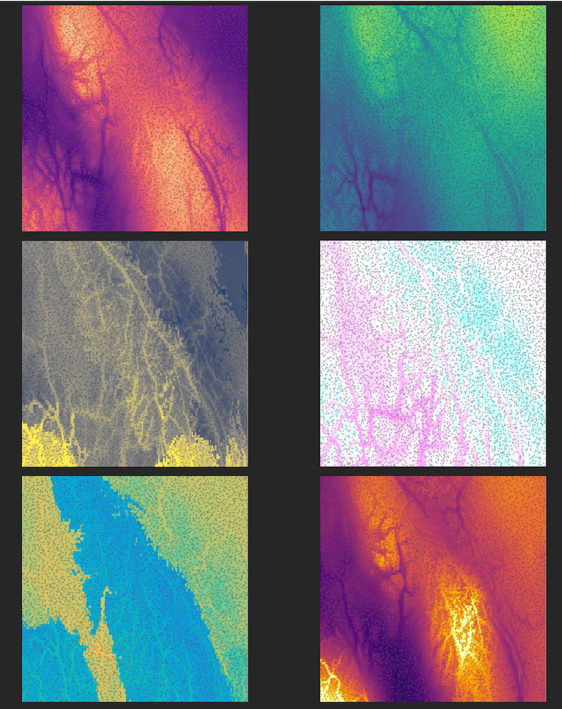

This tutorial accompanies the paper "The paradox of adaptive trait clines with non-clinal patterns in the underlying genes" published in PNAS [add link].

# Abstract

Multivariate climate change presents an urgent need to understand how species adapt to complex environments. Population genetic theory predicts that loci under selection will form monotonic allele frequency clines with their selective environment, which has led to the wide use of genotype-environment associations (GEAs). However, the accuracy of GEA methods to identify adapted loci is limited, as shown in the main paper.

This tutorial shows how to apply a novel extension of multivariate ordination, which accurately predicted individual multivariate traits from genotype and environmental data on simulated data regardless of whether inference from GEAs was accurate. 

# Install packages

If the following packages are not installed, be sure to install them first:
```
install.packages("vegan")
install.packages("lfmm")
install.packages("gplots")

if (!require("BiocManager", quietly = TRUE))
    install.packages("BiocManager")

BiocManager::install("LEA")
```

## Load the libraries:


```{r setup, eval=TRUE, echo=TRUE, message = FALSE, include = TRUE}


libraries_needed <- c("vegan", "LEA", "lfmm", "gplots")

for (i in 1:length(libraries_needed)){
  library(libraries_needed[i],character.only = TRUE) #laptop
}

knitr::opts_chunk$set(message = FALSE, warning = FALSE, cache = TRUE) 
```


Don't forget to set your working directory!

# Background on the simulation

This data was simulated in SLiM and is associated with the complex multivariate simulation presented in Figure 6 in the paper. Briefly, a non-Wright-Fisher model was simulated on a landscape with 6 environmental variables that reflect different aspects of thermal stress and precipitation in British Columbia. The simulation included 6 environmental traits, each of which adapted to a different environmental variable.

The six environmental variables are based on real data from western Canada and are shown below, clockwise from upper right: Clockwise from upper left: precipitation of driest month, precipitation of warmest quarter, mean annual temperature, precipitation of wettest month, mean temperature of wettest quarter, mean temperature of driest quarter. Background colors correspond to the optimum trait value on each landscape, and each small square is a simulated individual, with its color representing its trait value in that environment. 




# Load the data

* A matrix of genotypes in 012 format (counts of reference allele)
  * number of rows = number of individuals
  * number of columns = number of SNPs
* A table with information about sampled individuals (each individual in a row)
* A table with information about SNPs (each SNP in a row)

The `ind` table includes the xy location for each individual, the 6 exact trait values (note that these won't exactly equal the trait value calculated from the genotype matrix because of MAF filtering), and the 6 environmental values at their xy location.

The `muts` table includes the linkage group `LG`, the position of the mutation on the genetic map `pos_pyslim`, a unique ID `mutname`, the allele frequency based on the 1000 sampled individuals `a_freq_subset`, and whether or not it had effects on one or more phenotypes `causal`.

Note that you will have to change the working directory to where the data is stored on your computer.

```{r load data}


G <- read.table(unz("rda_tutorial/Genotypes.txt.zip", "Genotypes.txt"))
dim(G) # 1000 individuals and 26371 loci


ind <- read.table("rda_tutorial/Individuals.txt", header=TRUE)
dim(ind) #corresponds to rows in G
head(ind)

muts <-  read.table("rda_tutorial/SNPs.txt", header=TRUE)
dim(muts) #corresponds to columns in G
head(muts)

rownames(G) <- as.character(paste0("i_",ind$ind_index))
colnames(G) <- as.character(muts$mutname)
#G <- as.matrix(G)
head(G[,1:10])
```

# RDA trait prediction function

This function predicts an environmental trait through the back-transformation of the RDA "site score" of an individual to a chosen environmental variable (Equation 1 in the manuscript). It makes the prediction for all the individuals that were used to run the RDA.

```{r function}
rda_trait_pred <- function(rdaobj, env_row, K){
  #rdaobj is RDA object
  #env_row is the row of the environment in the biplot output
  #K is the number of RDA axes
  scores <- scores(rdaobj, choices=1:K)
  ind.sc <- scores$sites
  pred <- matrix(NA, nrow=nrow(ind.sc), ncol=K)
  for (k in 1:K){
    pred[,k] <- ind.sc[,k]*eigenvals(rdaobj)[k]*summary(rdaobj)$biplot[env_row,k]
  }
  trait_pred <- scale(rowSums(pred))
 return(trait_pred) 
}
```

## Example of an RDA-predicted environmental trait value

1. First, run the RDA:

Scale the environmental variables to have a mean of 0 and standard deviation of 1.
```{r example}

ind$env1_mat <- scale(ind$env1_mat)
ind$env2_MTWetQ <- scale(ind$env2_MTWetQ)
ind$env3_MTDQ <- scale(ind$env3_MTDQ)
ind$env4_PDM <- scale(ind$env4_PDM)
ind$env5_PwarmQ <- scale(ind$env5_PwarmQ)
ind$env6_PWM <- scale(ind$env6_PWM)

# Run the RDA
rdaout <- rda(G ~ ind$env1_mat +
                ind$env2_MTWetQ +
                ind$env3_MTDQ + 
                ind$env4_PDM +
                ind$env5_PwarmQ +
                ind$env6_PWM
              )


```

2. Next, check the biplot output and decide how many RDA axes to use in the prediction. 

```{r}
# Check the biplot output
rdaout$CCA$biplot

# Decide how many RDA axes to use in calculation
  a<- screeplot(rdaout)
  str(a)
  a$y # save this it's the eigenvalues
  prop_var <- round(a$y[1:6]/sum(a$y),3)
  cumsum(prop_var)
  plot(cumsum(prop_var), xlab="Number of RDA axes", 
       ylab="Cumulative percent of variation explained", ylim=c(0,1))
```

3. In this case, the first 3 RDA axes explain 80% of the variance. Note that choosing too many axes may result in overfitting. Here is an example of a trait prediction for MAT using the first 3 RDA axes:
```{r}
# Make the trait prediction for MAT (1st row in biplot output)
K = 3 # use 3 RDA axes to make the trait prediction

MATtraitPredict <- rda_trait_pred(rdaout, 1, K)

# Since this is a simulation, we can compare the prediction to the true value
# Similarly, an empirical study could compare an empirically measured trait value 
# to the RDA-predicted trait value to test how well landscape genomic data 
# can predict functional traits
plot(scale(ind$phenotype1_mat), MATtraitPredict, xlab="Evolved trait value in simulations",
     ylab="RDA trait prediction")
abline(0,1)

#Correlation between the prediction and the true value:
cor(ind$phenotype1_mat, MATtraitPredict) 
```

### Compare to other functions in RDA

Note that the `predict` function and it's variations in the R package `vegan` do not make the same kind of predictions as `rda_trait_pred`. Here are the types of outputs produced by the function `predict` and its variations:

```{r}

# This option in the `predict` function outputs the scores for each locus in RDA space
loci_scores_predict <- predict(rdaout, type="sp", newdata=G, scaling=2)
str(loci_scores_predict)

# This option in the `predict` function outputs the fitted values from the multiple regression
# performed on each locus within each individual 
fitted_values_predict <- predict(rdaout, newdata=G, type="response")
str(fitted_values_predict)
  
  # As a side note, it outputs the same thing as the `fitted` function
  fitted_values_predict2 <- fitted(rdaout)
  str(fitted_values_predict2)

# This option  in the `predict` function outputs the individual scores in RDA space 
# based on a linear combination of the predictor variables
X <- data.frame(ind$env1_mat ,
                ind$env2_MTWetQ ,
                ind$env3_MTDQ ,
                ind$env4_PDM ,
                ind$env5_PwarmQ ,
                ind$env6_PWM)
ind_scores_predict <- predict(rdaout, type="lc", new=X, scal=2)
str(ind_scores_predict)
```

The `predict` function and its variations make predictions in RDA space, and therefore do not output the same kind of predictions as `rda_trait_predict` and Equation 1 in the paper.


# Understanding how the RDA is built on multiple regressions

Prior to ordination in the RDA, each locus is used in a multiple regression model with the environmental variables to produce fitted values for that locus across individuals.

_SNP Genotype_ ~ _Env1_ + _Env2_ + _Env3_ etc.

For example for the first SNP in the data:

```{r}
 # multiple regression of 1st locus

mod <- lm(G[,1] ~ ind$env1_mat + ind$env2_MTWetQ + ind$env3_MTDQ +  ind$env4_PDM +
                ind$env5_PwarmQ +   ind$env6_PWM)
 coef(summary(mod))
```

Although multiple regression is a linear combination of multiple variables, it is able to model complex multivariate responses that appear to be non-monotonic in any one dimension. For example, let's look at a the relationship between explanatory variable temperature and the response variable genotype, across decreasing and increasing values of the other explanatory variables:

```{r}
otherenv <- c(seq(1,0,length.out=100), seq(0,1,length.out=101))
newdata=data.frame(ind.env1_mat = seq(-1,1, by=0.01),
                   ind.env2_MTWetQ = otherenv,
                   ind.env3_MTDQ = otherenv,
                   ind.env4_PDM = otherenv,
                   ind.env5_PwarmQ =otherenv,
                   ind.env6_PWM = otherenv)
pred <- t(newdata)*(coef(summary(mod))[2:7,1]) + coef(summary(mod))[1,1]
plot(seq(-1,1, by=0.01), colSums(pred), xlab="Temperature", ylab="Genotype prediction")
```


Thus, there is flexibility with the RDA to capture the way environmental variables may influence the patterns at one locus in a different way than at another locus, which may not correlate with the relationship between the environment and population structure.

It may be interesting for some studies to understand how each locus is shaped by the environment - in other words, what are the slopes associated with the environmental variables in the multiple regression model for each locus?

Unfortunately there is not a way to output these slopes in the R package `vegan`, but we can reproduce the first step of the RDA to get the regression coefficients:
(vegan source code at https://github.com/cran/vegan/blob/master/R/simpleRDA2.R)

```{r}

X <- data.frame(ind$env1_mat ,
                ind$env2_MTWetQ ,
                ind$env3_MTDQ ,
                ind$env4_PDM ,
                ind$env5_PwarmQ ,
                ind$env6_PWM)
    
# Perform qr decomposition to do the regression for all SNPs at the same time 
 Q <- qr(X, tol=1e-6)
# str(Q) run this line if you want to understand the structure of Q
 
# Get the matrix of regression coefficients
 Qr.coeff <- qr.coef(Q, G)
 # This matrix has each SNP in a column and the regression coefficients 
 # for that SNP corresponds to each environmental variable. 
 # This is the step that is not performed in the `vegan` package - 
 # the package skips directly to predicting the fitted values, 
 # on which the ordination is performed.
 
# Here is an example of regression coefficients for the first 10 SNPs:
 head(Qr.coeff[,1:10])
 
# Note that the regression coefficients for the first SNP from this 
# approach is exactly the same as from our model above:
 Qr.coeff[,1]
 coef(summary(mod))[,1]
```

We can visualize the regression coefficients with a heatmap. In this case, we know the causal loci in the simulations, so we will just visualize those loci.

This visualization illustrates how there are unique ways in which environments are combined in the model to predict the pattern at each SNP.

```{r, fig.height=7, fig.width=8}
dim(Qr.coeff)
colnames(Qr.coeff) <- muts$mutname
  
# look at the range of coefficients in the multiple regression model
summary(as.numeric(Qr.coeff[,which(muts$causal)]))

brks <- seq(-0.7, 0.7, by=0.05) #set the color scale

heatmap.2(t(Qr.coeff[,which(muts$causal)]),
        scale="none", 
        col = cm.colors(length(brks)-1), 
        breaks=brks,
        dendrogram = "column",
        Rowv=FALSE, #set this to "TRUE" if you would like to see which groups
        trace="none",
        key.title = "Coefficient in multiple\nregression model",
        ylab="SNPs",
        cexCol=1)
```

In the above heatmap, each row is a SNP. The SNPs are named according to their linkage group (1 through 10) and cumulative position in the genome (e.g. 9-448632 is on the 9th linkage group). Each linkage group was 50,000 bases long, so the cumulative position ranges from 1 to 500,000 over the 10 linkage groups. Each column in the heatmap is an environment, which is an explanatory variable in the model. 

The color of the heatmap cells for a SNP shows the coefficients in the multiple regression model for each corresponding environment. In other words, the colors show how environments are combined in a multiple regression model to predict the patterns at that SNP on the landscape. 

If we want to visualize clusters of SNPs that have similar coefficients in the multiple regression model, we can allow for clustering in the heatmap:

```{r, fig.height=7, fig.width=8}
heatmap.2(t(Qr.coeff[,which(muts$causal)]),
        scale="none", 
        col = cm.colors(length(brks)-1), 
        breaks=brks,
        dendrogram = "both",
        Rowv=TRUE, 
        trace="none",
        key.title = "Coefficient in multiple\nregression model",
        ylab="SNPs",
        cexCol=1)
```

 
Here is the information about the session when the tutorial was built:
```{r}
sessionInfo()
```