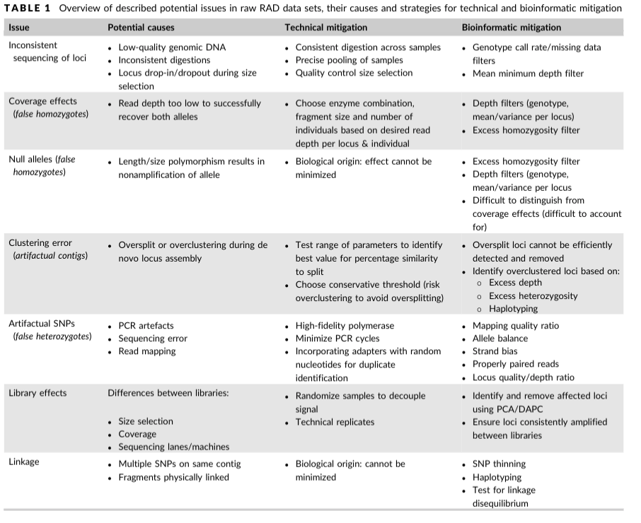
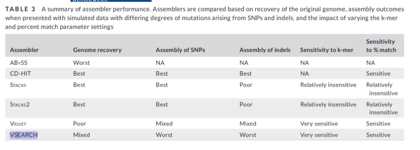

# RADseq  
{: .no_toc }

<details open markdown="block">
  <summary>
    Table of contents
  </summary>
  {: .text-delta }
1. TOC
{:toc}
</details>

If you want to run the acompanying code chunks, install Docker container.


library(ggplot2)
library(SeqArray)
library(tidyverse)


<!-- Dani to do: make a dockerfile with all the packages used in this Rscript for reproducibility -->

<!-- Example files needed: example strata file 'data/example.metadata.csv', example vcf for PCA './data/test.vcf'  -->


# Reduced Representation Sequencing (RADseq/GBS)  
<!-- What kinds of protocols is this advice relevant to?   -->
"Restriction-site   Associated   DNA   sequencing"  - RADseq - combines  restriction  enzymes  with next-gen, massively parallel,  short-read  sequencing. RADseq involves the use of restriction enzymes which are used to shear DNA at selected sites. RADseq comes in different flavors. Double-digest RADseq (ddRAD; Peterson et al.,2012)  selects  markers  with  two  restriction enzymes  with  different  cut  frequencies. Genotype-by-Sequencing  (GBS;  Elshire  et  al.,  2011)  uses  a  frequent-cutting  restriction  enzyme  with PCR size selection. See this review for a comparison of some of the more popular protocols (link). In this guide we use the term "RADseq" to refer to any of these protocols, including those that don't involve random shearing of data. When recommendations are specific to a certain type of RAD/GBS, we will explicitly say so.  

<!-- characteristics of radseq that are different/ important to know compared to other types of sequencing    -->

Using RADseq to generate single nucleotide polymorphisms (SNPs) involves 1) library preparation in the lab, 2) bioinformatic processing through assembly and/or mapping to a reference, then 3) filtering of SNPs and individuals for quality. All of these steps can (and will) introduce some error, so the goal is to minimize this error through mitigation steps at all three parts of the process. Every dataset is different [add more about philosophy over best practices].   
Much of this guide is directly inspired by this [excellent review paper by O'Leary et al. (2018)](link), especially the section on minimizing errors due to library prep. We recommend reading and cross-referencing with this paper, and citing it if you follow its suggestions. Table 1 from this paper summarizes the various potential issues that can arise from RAD datasets and some mitigation steps. The goal of this guide is to expand on the O'Leary paper and provide some example code to help implement quality control and mitigation steps.



## Considerations During Lab Work -- Setting up for Success {#labwork}  

There are steps you can take before you even sequence RAD libraries that can help minimize issues downstream. Here, we use "library" to refer to a set of RADseq fragments from a group of individuals that are barcoded and sequenced together on a single lane or group of lanes. While specific RAD library prep methods have their own nuances for minimizing error, there are some steps you can take that are common across methods.      

* If this RAD/GBS method has not been done in your species or in your molecular lab setup before, spend some time optimizing the protocol using a representative subset of individuals. Then try to keep everything about the library prep as consistent as possible across samples (eg, DNA extraction kit, PCR cycles, sequencing platform). This isn't always possible, especially if you need to optimize the protocol for certain tricky samples. Just make sure to keep track of everything!   
* Randomize samples across library prep batches and sequencing lanes! For example, if you are sequencing two different groups of samples on two different sequencing lanes, make sure they are randomized in respect to sample location or whatever your groups of interest are. If you are preparing groups of individuals in different batches to be pooled later, randomize across these batches. Alicia MY even recommends randomizing across DNA extractions, especially if the person doing the extractions is new to molecular work. This is to allow you to control for potential [batch effects](#batch) that are often observed with RAD data.  


# This code reads in a comma-delimited STRATA/meta-data file, randomises samples, and returns a file with wells and plates and duplicates which may be used to assist with plating libraries
# ** TODO** will need to consider where to duplicate samples - need to consider STARTA, DOC, ect..?
# maybe have user write in a list of samples to replicate

wells = 96 # how many wells can you use on your plate?
data.in = read.table("./data/example.metadata.csv", sep = ",", header = T) # each sample should be in its own ROW
l = length(data.in[,1])
plates = rep(1:length(ceiling(101/ wells)), wells)
data.out = cbind(
   data.in[sample(1:l, l, replace = F),], # randomise samples
   PLATEID = plates[c(1:l)],  # add plate info
   WELLID = rep(1:wells, length(unique(plates)))[1:l] # add well info
) # add duplicates **TODO**

# print example
 print(head(data.out))




##    TARGET_ID INDIVIDUALS STRATA    LAT   LONG PLATEID WELLID
## 21     CM152       CM152    WLG -41.28 174.83       1      1
## 61     CM153       CM153   WCSI -42.39 170.42       1      2
## 91     CM218       CM218     SA     NA     NA       1      3
## 18     CM243       CM243    VIC     NA     NA       1      4
## 50     CM230       CM230    VIC     NA     NA       1      5
## 11     CM207       CM207     SA     NA     NA       1      6




#save to file

* Keep track of all potential batch effect sources in a Metadata file (eg, storage conditions of tissue/DNA, date/method of DNA extraction, date/method library prep batch, sequencing lane).   
* Have a core set of 2-4 technical sample replicates across all libraries. Ideally these are true technical replicates from library preparation to sequencing, but even just sequencing replicates can be useful for downstream quality control.

## Principles for Analyzing Your Data

### Steps for a robust RAD analysis  
This is just one approach for working through your data. Some people will prefer to run just a subset of samples through a pipeline at first and evaluate parameters, then run all the samples through. Either way, be prepared to make MULTIPLE assemblies and go through this process iteratively, especially if this is a new-to-you study system.  

1) [Look at your raw data.](#fastqc)
2) [Run an assembly pipeline](link assembly) through to a SNP dataset, using either all samples or a representative subset. Parameters can come from those used in a similar study, or default parameters.
3) Filter your data minimally, then [evaluate for potential sources of error.](#error)
4) Subset or remove individuals based on initial evaluation.  
5) Using a representative subset of samples, [test key parameters](#test) to optimize your assembly.
6) Run your optimized assembly on all non-removed samples.
7) Evaluate the difference between multiple filtering schemes for your analyses of interest. *Popgen analysis guide coming soon*
8) Repeat as needed.  

### First, look at the raw data! {#fastqc}  
Always look at your data with fastqc(link) before starting an assembly. First, this is a good check to just make sure the sequencing worked. If you have demultiplexed data, you can use multiqc(link) to generate fastqc plots for all individuals and quickly identify ones that did not sequence well.  
Check out [this informative tutorial](https://datacarpentry.org/wrangling-genomics/02-quality-control/index.html) on running fastqc and interpreting the output.  
Do you have a lot of adapter sequences? Are the ends of your reads very low quality? If so, you should expect a fair amount of trimming and read filtering to occur prior to assembly. If that doesn't occur or if too many reads are being filtered so as to only recover a small number of SNPs, something might need to be tweaked with your trimming and filtering step. [See how to evaluate for sequencing error](#seq)

You should also look at the top few reads in the Terminal.  
```
## zcat: unZip and conCATenate the file to the screen
## head -n 20: Just take the first 8 lines of input

$ zcat raw-fastqs/BC2_10_C5.fastq.gz | head -n 20
@BC2_10_C5.1 1 length=96
CAGCGTGTAATAGTCACCGGCGGCTCCCTCTGGAGAATAGCACAAGTGATCATTTTGCTCATCTTCCGTCCACTGGTGATTGTGGACCAGCCTCAC
+BC2_10_C5.1 1 length=96
<GGGGGA<GGGGIIIGIGGIGGGIIIIIGGGGGGGGGGGGGGGGGIIIIIIIIGGIIIGGGGIGIIGIGGGIIIIIAGGGGIIIGIIGGGGGAAGG
@BC2_10_C5.2 2 length=96
CTGCTACATGCAGTGTTCTGTATTACTTTTATTGTACGTTGATATGAATGAATGAGTGTTTTGTATACTTAGAGTACAAGTTTGTCAGTCATATCG
+BC2_10_C5.2 2 length=96
GIIIIIIIIIIIIIIIIIIIIIIIIIIIIIIGGIIIIIIIIIIIIIIIIIIIIIIIIIIIIIIIIIIIIIIIIIIIIIIIIIIIIIIIIIIIIIIG
@BC2_10_C5.3 3 length=96
CAGCACATGTTCCTGTGTAGAAAGCTTGTTAGTAGAATAAATAACACATGGCTGGTCAAACACAACACATGAAGAAACAACTTTCTGAACAGTTTT
+BC2_10_C5.3 3 length=96
GIIGIIIIIIIIIIIIIIIIIIIIIIIIIIIIIIIIIIIIIIIIIIIIIIIIIIIIGIIIIIIIIIIIIIIIIIIIIIIIIGGGGIIGIIIGGGII
@BC2_10_C5.4 4 length=96
CAGCGATTCGGCCCAAATTTGCACCACATCAGGCCCTTGACAGGGCGCTTCGATGGTGCAAATTTGGTGCGATTCGCTGCGCACCTAGCATATATG
+BC2_10_C5.4 4 length=96
AGGGIGIIIGIGGGIIGIGGGIIIGGGGAGGGGGAGGIGIGGIGGGGAGGGGGGGGGGGGGGGIIIII.G<GGIGGGIIIGGGGGIGGIIIGAGGI
@BC2_10_C5.5 5 length=96
CAGCAGTTTGGTGGAGTTCTGCAACCTTCCATTTCCAAAGAATTACCCAGGAGCTCTTCCCAGTGAATTTCTTCGGCACTTTTCATTGACCTTTTA
+BC2_10_C5.5 5 length=96
GGAGAAA.<AGAA.G.GGAGA<.GGA.<GAAGGAAGGIA<...<GA<..<G.<.<<.<AAAGGGG..<GGGGG<G.A.<GGGII.AG..<.GGGGG

```

If the sequencing center gave you one fastq file with all your samples, you should expect to see a barcode sequence, followed by the cutsite at the start of the read. If the Data are already demultiplexed (as the example is), you should only see the cutsite overhang (in this case, CWGC). Sometimes you can look at your fastq data files and see that there was a problem with the sequencing such that the cut site is either offset by one or more bases, or contains many errors. If this is not being addressed by the default filtering steps in your assembly pipeline, you can trim off N bases from the beginning or end of R1 and R2 reads in ipyrad (`trim_reads` param), or with cutadapt before using stacks, or customize the Trimmoatic step for dDocent.  

### Evaluate potential confounding factors {#confound}

#### The power of PCA   

One of the most powerful methods for exploring your data for issues is a Principle Components Analysis (see [here](https://michaelaalcorn.medium.com/yet-another-pca-explanation-727dff6ce26a) for a linear algebr-based explanation of PCA). From [this genetics tutorial](https://comppopgenworkshop2019.readthedocs.io/en/latest/contents/03_pca/pca.html): "To understand how PCA works, consider a single individual and its representation by its 593,124 markers. Formally, each individual is a point in a 593,124-dimensional space, where each dimension can take only the three possible genotypes indicated above, or have missing data. To visualise this high-dimensional dataset, we would like to project it down to two dimensions. But as there are many ways to project the shadow of a three-dimensional object on a two dimensional plane, there are many (and even more) ways to project a 593,124-dimensional cloud of points to two dimensions. What PCA does is figuring out the “best” way to do this project in order to visualise the major components of variance in the data.  

As soon as you have a file with SNPs for all samples, before extensive filtering or playing with parameters, do a PCA on it and look at all the axes with the most variation. Be careful that you understand how missing data is imputed for PCA.  

For the code examples in this section, we mostly make use of the R package SeqArray, which can read in and manipulate VCFs (*notes on Docker install*). We like this program because .... For those you are less familiar with R or more familar with Plink, check out [this tutorial]() which uses Plink and minimal R plotting.  a tutorial that uses We also include some examples using VCFtools and minimal R plotting, for those who are less familiar with R.

(?) dani asks: you want me to make this take multiple different vcfs from pipeline outputs for plotting? should we implement pcANGSD which can handle missing data better  (?)  
K: Making it take multiple vcfs is a secondary goal, and can be added later if we have time/interest. Adding a code example for pcANGSD would be useful though.


## ill get onto this sorry

Doing a PCA with SeqArray and SNPRelate in R. Filtering for SNPs with a MSF > 2.5%


## read in VCF and convert to GDS format
#vcf.file = "./data/test.vcf"
#seqVCF2GDS(vcf.file, "test.gds.rad", storage.option="ZIP_RA")

# read in existing gds file  
filename = "data/test.gds.rad"
gdsin= SeqArray::seqOpen(filename,)




## Error in openfn.gds(gds.fn, readonly = readonly, allow.fork = TRUE, allow.duplicate = allow.duplicate): The file '/home/ksilliman/Postdoc_Projects/RCN_MarineOmics/Website/marineomics.github.io/RAD_code/data/test.gds.rad' has been created or opened.




# summarize the data
print(paste0("The number of SAMPLES in data: ", length(c(SeqArray::seqGetData(gdsin, "sample.id")))))




## [1] "The number of SAMPLES in data: 93"




print(paste0("The number of SNPs in data: ",  length(c(SeqArray::seqGetData(gdsin, "variant.id")))))




## [1] "The number of SNPs in data: 21040"




#read in metadata
sample.ids = seqGetData(gdsin, "sample.id")
sample.strata =  read.table("data/test.metadata.csv", header = T, sep = "\t") %>%
                  dplyr::select(TARGET_ID, STRATA, LONG, LAT, PLATE)
id.order = sapply(sample.ids, function(x,df){which(df$TARGET_ID == x)}, df=sample.strata) #incase your strata file is not in the same order as your vcf
sample.strata.order = sample.strata[id.order,]

# get pruned SNPs
# NOT WORKING YET, issue with chromosome names
# Try this with vcf https://github.com/zhengxwen/SNPRelate/issues/10  
#snpset <- SNPRelate::snpgdsLDpruning(gdsin, ld.threshold=0.2, autosome.only = F, start.pos="random", num.thread=1)  
#snpset.id <- unlist(unname(snpset))

# PCA only on SNPs with a minor allele freq greater than 2.5%
pca.out = SNPRelate::snpgdsPCA(autosome.only = F, gdsin, num.thread=2, remove.monosnp = T, maf = 0.025)




## Principal Component Analysis (PCA) on genotypes:
## Calculating allele counts/frequencies ...
## Excluding 14,519 SNVs (monomorphic: TRUE, MAF: 0.025, missing rate: NaN)
## Working space: 93 samples, 21,040 SNVs
##     using 2 (CPU) cores
## CPU capabilities: Double-Precision SSE2
## Sun Oct 24 13:23:24 2021    (internal increment: 3828)
## 
[..................................................]  0%, ETC: ---        
[==================================================] 100%, completed, 0s
## Sun Oct 24 13:23:24 2021    Begin (eigenvalues and eigenvectors)
## Sun Oct 24 13:23:24 2021    Done.




#                               snp.id=snpset.id) # filtering for pruned SNPs
eig = pca.out$eigenval[!is.na(pca.out$eigenval)]
barplot(100*eig/sum(eig), main="PCA Eigenvalues")



* If you used sample replicates, first see if replicates cluster very close together. If not, then there may be batch effects or bioinformatic artifacts leading to genotyping error that must be addressed. Then remove replicates for a subsequent PCA evaluation.  



#look at PC values for reps
#remove reps



First color/shape the individuals by the factor you expect to matter (eg, sampling site or region, family, ecotype).  


#PLOT PCA
#PC1 v PC2 colored by collection location
print(
  as.data.frame(pca.out$eigenvect) %>%
      #tibble::add_column(., ID =  sample.ids) %>%
      tibble::add_column(., STRATA =  sample.strata.order$STRATA) %>%
      ggplot(., aes(x=V1, y=V2, color = STRATA))  + #label = ID
      geom_point(size=2) +
      #geom_text() +
      stat_ellipse(level = 0.95, size = 1) +
      #scale_color_manual(values = gds_colors) +
      geom_hline(yintercept = 0) +
      geom_vline(xintercept = 0) +
      theme_bw() +
      xlab(paste0("PC1 [",paste0(round(eig[1], 2)), "%]")) +
      ylab(paste0("PC2 [",paste0(round(eig[2], 2)), "%]")) +
      ggtitle("PCA Colored by Collection Location")
)




## Too few points to calculate an ellipse
## Too few points to calculate an ellipse
## Too few points to calculate an ellipse




## Warning: Removed 3 row(s) containing missing values (geom_path).



* Is there any clustering? If so, is it different than your expectation?
  + If different than expectation, suggests either [batch effects](#batch), [cryptic variation](#cryptic) among individuals, or systematic biological issues affecting assembly/mapping (eg, inversions (Katies inversion, also paper ref))  
  <!-- + figure example, weird clustering -->
* Are there outlier samples driving a large amount of variation?
  + If so, they may be [cryptic species](#cryptic), clones/sample replicates, or they [sequenced/genotyped poorly](#bad)
  + In our example we see 2 potential outlier samples in the bottom left corner. We can check which samples they are by plotting the PCA with sample ID and/or looking at the actual PC scores.


#PLOT PCA
#PC1 v PC2 colored by collection location
print(
  as.data.frame(pca.out$eigenvect) %>%
      tibble::add_column(., ID =  sample.ids) %>%
      ggplot(., aes(x=V1, y=V2, label = ID)) +
      geom_text(size =1.5) +
      geom_hline(yintercept = 0) +
      geom_vline(xintercept = 0) +
      theme_bw() +
      xlab(paste0("PC1 [",paste0(round(eig[1], 2)), "%]")) +
      ylab(paste0("PC2 [",paste0(round(eig[2], 2)), "%]")) +
      ggtitle("PCA with Labels")
)




# which samples have PC1 < -0.1 and PC2 < -0.6?
as.data.frame(pca.out$eigenvect) %>%
      tibble::add_column(., ID =  sample.ids) %>%
  filter(V1 < -0.1 & V2 < -0.6) %>%
  select(ID,V1,V2)




##       ID         V1         V2
## 1  CM083 -0.1159629 -0.6910028
## 2 CM0831 -0.1130069 -0.6811986



* Is there no clustering at all? If so, it may be due to:  
  + bioinformatic artifacts leading to noise, [see Testing Parameters](#test)
  + issues with how you are [filtering the data](#filter) (eg, too strict or too lax)
  + issues with how your PCA is treating missing data
  + or you actually have no structure in your dataset!
  <!-- + figure example, no clustering -->

Next, color the individuals by potential sources of batch effects (sequencing lane, library prep batch, age of tissue sample, person doing the DNA extraction...).    


# again, but colored by batch
print(
  as.data.frame(pca.out$eigenvect) %>%
      tibble::add_column(., PLATE =  as.factor(sample.strata.order$PLATE)) %>%
      ggplot(., aes(x=V1, y=V2, color = PLATE))  + #label = ID
      geom_point(size=2) +
      stat_ellipse(level = 0.95, size = 1) +
      geom_hline(yintercept = 0) +
      geom_vline(xintercept = 0) +
      theme_bw() +
      xlab(paste0("PC1 [",paste0(round(eig[1], 2)), "%]")) +
      ylab(paste0("PC2 [",paste0(round(eig[2], 2)), "%]")) +
      ggtitle("PCA colored by Batch/Sequencing Plate")
)



* Do any observed clusters match a source of batch effect? [how to remove batch effects](#batch)  

#### Visually inspect alignments {#align}  
Another useful approach is to visually inspect alignments for SNPs or loci that are identified as "weird" in the subsequent analyses. In ipyrad this can be done by searching the .loci file, in dDocent... If the alignment looks wonky, you can feel better about removing the whole locus (?).  
<!-- code example .loci -->
<!-- code dDocent   -->
<!-- code stacks     -->

#### Batch effects {#batch}
As discussed in [Setting up for success](#labwork), batch effects can arise by minor (or not so minor) differences during the library prep and sequencing stage. Randomizing samples across libraries and sequencing lanes can help mitigate the influence of batch effects on your downstream analyses, but sometimes this isn't possible, esp. when using pre-existing data. Even if you randomize your samples, it is a good idea to check for batch effects with a PCA and then try to mitigate them.  

<!-- PCA figure of batch effect -->

You can identify which loci are driving the batch effect by 1) identifying the top PC loadings (SNPs) and/or 2) do an Fst outlier analysis with the batches specified as populations (eg, Bayescan). Both of these methods are most appropriate if you've randomized your samples between batches. If you have not randomized samples but are certain there is a batch effect driving variation in your dataset, you can still remove loci this way but you may also be removing biologically informative loci.  

Nicolas Lou and Nina Therkildsen have a [great preprint](https://www.authorea.com/users/380682/articles/532568-batch-effects-in-population-genomic-studies-with-low-coverage-whole-genome-sequencing-data-causes-detection-and-mitigation) and [Github repo](https://github.com/therkildsen-lab/batch-effect) discussing causes, detection, and mitigation of batch effects in low coverage WGS, where batch effects can have particularly large effects. While some of their recommendations are specific to reference-based analyses, others are relevant to RAD methods too (eg, batch effects due to different sequencing platforms, DNA degradation levels, and sequencing depth).

Once you've identified these batch effect SNPs, it can be useful to [visualize the alignments](#align) before removing them. If the entire alignment for that locus looks wonky, you should remove all SNPs from that RAD locus from your final dataset before conducting analyses.     
<!-- code to identify top loading snps -->


#### Cryptic species/contamination/clones {#cryptic}  
One issue that is particularly common, especially for marine invertebrates, are cryptic, yet highly diverged lineages occurring in the same geographic location. If you are trying to do a landscape/seascape genetics study, cryptic species can dramatically throw off population genetic analyses. A PCA using all the samples can help identify cryptic species if samples are forming clusters that do not align with any other possible factor (eg, geography, sequencing batch).   
<!-- PCA figure of cryptic species   -->


Note: Notice the huge variation explained along the first PC-axis.

You can also check heterozygosity, and missingness!


 Note: Two outliers are obvious. Large differences in heterozygosity between samples are clear, with one location showing two distinct clusters of samples. These samples were later determined using mtDNA and morphological analysis to be cryptic species.
*Unpublished data from a marine species in Australian waters.*

You can then estimate genetic divergence between these clusters using pairwise Fst and/or phylogenetic inference to determine how diverged the groups are. If they are very diverged, it may be better to assemble each cryptic species separately, especially for denovo assemblies with dDocent and Stacks, especially since often times restriction cut-sites are not always conserved; see [Wagner et al., 2013](link), [Rubin et al., 2012](link)  These two pipelines used a set of given samples to create a "reference" or "catalog" to which all other samples are mapped. If highly diverged samples are included in creating this reference, it can lead to [oversplitting](#cluster).  

Cryptic clones can also dramatically throw off population genetic analyses. In a PCA, clones will often appear as their own very tight cluster, similar to sample replicates. Below the PCA shows x and a simple calculate of pairwise-distance (i.e. here manhattan distance) shows x known duplicates, and x unknown clones. *other ways to tell they are clones*  
<!-- PCA figure of cryptic clones -->


#### "Bad" samples {#bad}  
Sometimes a sample doesn't sequence well (few sequencing reads, higher error rate). This can be due to DNA quality, an issue during library prep, or not enough sequencing depth (average # of reads per sample). Generally, it will lead to a sample with fewer sequencing reads, higher missing data in a SNP dataset, and fewer shared loci with other samples. Identifying and then removing these samples *prior* to the final RADseq assembly analysis can help minimize mis-assembled loci, genotyping errors, and excessive filtering of acceptable loci.

The process of identifying low quality individuals is usually iterative, as the way you initially filter your SNPs will influence the amount of missing data and locus sharing among samples. This is why we recommend minimally filtering your SNPs for sample coverage (the # of individuals a locus is called in) when initially exploring your data. Some ways to identify bad samples:  

* For every SNP dataset you generate, it is a good idea is always evaluate the missingness per sample (and report this distribution in your manuscript!). Identify samples with way more missingness than the rest, and observe how they look in a PCA and locus sharing plot. If they stick out, then try removing them from the assembly and seeing if it changes downstream analyses. If so, you may want to specify a missingness cutoff for including samples in the final analysis.
**vcftools example, on the command line**  


vcftools --vcf data/stickleback_ferchaud_2015.vcf --missing-indv --out analysis/stickleback
# sort the file by most missing data and print the top 10  
cat analysis/stickleback.imiss | (read h; echo "$h"; sort -k5 -r) | head -n 10

##### Plot missingness {.tabset .tabset-fade .tabset-pills}
###### With R


miss <- read.table("analysis/stickleback.imiss",header = T,sep="\t")
hist(miss$F_MISS,breaks=50)



###### With bash (requires gnuplot installed)


#code from Jon Puritz
mawk '!/IN/' analysis/stickleback.imiss | cut -f5 > totalmissing
gnuplot << \EOF
set terminal dumb size 120, 30
set autoscale
unset label
set title "Histogram of % missing data per individual"
set ylabel "Number of Occurrences"
set xlabel "% of missing data"
#set yr [0:100000]
binwidth=0.01
bin(x,width)=width*floor(x/width) + binwidth/2.0
plot 'totalmissing' using (bin($1,binwidth)):(1.0) smooth freq with boxes
pause -1
EOF




##                                                                                                                         
##                                          Histogram of % missing data per individual                                     
##                                                                                                                         
##      140 +----------------------------------------------------------------------------------------------------------+   
##          |*         +         +          +          +          +         +          +          +         +          |   
##          |*                                                   'totalmissing' using (bin($1,binwidth)):(1.0) ******* |   
##      120 |*+                                                                                                      +-|   
##          |*                                                                                                         |   
##          |*                                                                                                         |   
##          |*                                                                                                         |   
##      100 |*+                                                                                                      +-|   
##          |*                                                                                                         |   
##          |*                                                                                                         |   
##       80 |*+                                                                                                      +-|   
##          |*                                                                                                         |   
##          |*                                                                                                         |   
##       60 |*+                                                                                                      +-|   
##          |*                                                                                                         |   
##          |*                                                                                                         |   
##       40 |*+                                                                                                      +-|   
##          |*                                                                                                         |   
##          |*                                                                                                         |   
##          |*                                                                                                         |   
##       20 |*+                                                                                                      +-|   
##          |**                                                                                                        |   
##          |******    +         +          +          +          +         +          +          +         +          |   
##        0 +----------------------------------------------------------------------------------------------------------+   
##          0         0.1       0.2        0.3        0.4        0.5       0.6        0.7        0.8       0.9         1   
##                                                       % of missing data                                                 
## 

##### {-}

* Construct a locus sharing heatmap between pairs of samples, which shows the proportion of loci that are genotyped in both samples. Generally, samples that are more closely related will share more loci with each other due to cutsite dropout. Deviations from that pattern can pinpoint bad samples as well as batch effects.
  + [ipyrad API tutorial](https://ipyrad.readthedocs.io/en/latest/API-analysis/cookbook-sharing.html) for making a locus sharing heatmap, requires ipyrad output or ipyrad's vcf2hdf5 conversion  
  + [code to generate locus sharing/missingness heatmap from a VCF](https://github.com/atcg/clustOpt)


### Test a range of key parameters {#test}  

#### Clustering threshold (de novo assembly) {#cluster}  
During de novo RADseq assembly, reads are assembled into contigs so that each contig represents a single locus. This can occur separately for each individual (ipyrad) or jointly for all or a subset of individuals (dDocent, Stacks). To call SNPs, in the case of ipyrad, contigs are then clustered and aligned across individuals, while in dDocent and Stacks, reads for each individual are mapped to the "reference" contigs. All of these pipelines use sequence similarity thresholds to determine if fragments are homologous (from the same place in the genome) and therefore should be clustered together. If the sequence similarity threshold is too low, *undersplitting* can occur so that multiple loci are combined into a single contig.  
<!-- figure example, undersplit   -->
Undersplitting is common with repetitive regions and paralogs. It can inflate mean observed heterozygosity.  

If the threshold is too high, it can lead to *oversplitting*, where alleles of the same locus are split into two or more contigs. This can lead to reduced mean observed heterozygosity.  
<!-- figure example, oversplit   -->
If severely off, both of these issues can bias the models used to identify SNPs. Undersplitting a little is better than oversplitting, as it is easier to identify lumped paralogs downstream and remove them.  
**What influences the "optimal" clustering threshold of your data?**  
Clustering threshold is usually determined by how much genetic diversity you have in your dataset. If your dataset has high genetic diversity (eg., a single species with high heterozygosity, multiple highly diverged populations, multiple species), then you will need a lower clustering threshold. If your dataset has low genetic diversity (a single species with lower heterozygosity, a single family), then you will need a higher clustering threshold. Polyploid or highly repetitive (ie large) genomes may also have different requirements than diplod species with smaller genomes. Other factors, such as sequencing error rate, may play a role as well so it is usually a good idea to always test a few clustering thresholds with a new dataset. However, as long as your clustering threshold is in the ballpark it shouldn't affect downstream analyses (according to Isaac).

There are a few strategies to identify a good clustering threshold for your data, all of which require assembling your data with a range of clustering thresholds.  
1) Metrics developed by [McCartney-Melstad 2017](link), based on popgen theory and landscape genetic expectations  
2) Utilize sample replicates (either exact replicates or individuals from the same locality) to quantify genotyping error and minimize error while maximizing the number of informative loci [Mastretta-Yanes 2015](link)
3) Evaluating the number of haplotypes across loci, with many 3+ haplotypes indicating undersplitting [Harvey 2015](link), [Ilut 2014](link)  
4) Make assemblies at a range of thresholds and parameters, plot the # of SNPs or contigs per assembly, and make a judgement call [example in dDocent tutorial](link). If most parameters give you about the same # of SNPs or contigs, you can feel confident that this parameter doesn't matter much for your data and just choose a reasonable value.  

#### Mapping parameters (reference-based and some de novo assemblers)   
When a sequencing read maps to the wrong assembled contig or place in a reference genome (ie, a non-homologous locus), this can result in erroneous SNPs. In many cases, these SNPs can be filtered out later (link to filtering). However, data should be checked to make sure there aren't systematic, wide-scale mapping issues that need to be addressed.

For referenced-based assembly, both dDocent and ipyrad make use of bwa(link) to map reads, while Stacks allows the user to choose their aligner. dDocent also utilizes bwa for de novo assemblies.   *  

* how many reads aligned for each sample? If many reads didn't aligned, this could be an issue with the reference, read trimming/filtering, or the mapping parameters.
* What is the distribution of mapping scores?  
* ratio of mean (across inds) mapping quality scores for reference and alternate allele (O'Leary cite). 0.25-1.75 cut off implemented in dDocent.  
  + this info might not be coded in all VCFs

(link to WGS mapping quality section)

Mapping defaults:
dDocent: bwa mem -L 20,5 -t 8 -a -M -T 10 -A1 -B 3 -O 5 -R
L: clipping penalty for 5' and 3'
A: matching score
O gap open penalty
T: mapping quality filter
ipyrad: (defaults) -L 5,5 -B 4 -A1 -O 6 -T 30

#### Read depth threshold {#seq}  

Mistakes that occur during sequencing can lead to a base-calling error in a read, which can then lead to an erroneous SNP. This type of error most commonly manifests as rare alleles (eg, only observed in one individual) or singletons (only one copy of the minor allele across all individuals). A conservative approach to deal with these errors is to filter out all loci with rare alleles (link filtering), but for some demographic analyses this filtering is inappropriate as they require the site frequency spectrum.  
The best ways to minimize the impact of sequencing error during bioinformatic processing is to 1) properly trim and filter your data, and 2) require higher read depth thresholds for assembly and genotyping.   


2) Require higher read depth thresholds for assembly and genotyping.  
For RADseq, ideally you are generating an average of *at least* 10-20 sequence reads (10x-20x coverage) for each RAD locus in your library preparation (but this doesn't always happen...). For diploid species, this would be sequencing each RAD haplotype at least 5x-10x. The SNP calling step of RAD pipelines all require setting a minimum number of reads to determine whether a site is homozygous or heterozygous **add image example**. If this threshold is too low, sequencing errors are more likely to be included and the SNP caller will have a harder time accurately identifying SNPs ([but see our section on low coverage WGS methods!](link). If it's too high, then real polymorphic loci will be excluded. All of the three major pipelines allow users to implement read depth thresholds   

Generating multiple sequencing reads per locus is helpful when calling SNPs in order to  distinguishing between reads with sequencing errors and        

<!-- Fountain et al 2016 found error rates > 0.06 with minimum 20 read depth and Stacks v1. Can this be due to not optimizing other Stacks parameters? Hard to interpret/ know how relevant it is now, even to Stacks2 -->


#### Filtering reads  

FASTQ files that typically come from the sequencing center include a [Phred scale quality score](link) for each base, which indicates the probability of that base call being correct. This information can be used prior to assembly to trim low-quality sections from either end of reads or remove reads altogether. Some SNP callers, including FreeBayes which is part of dDocent, also use Phred scores when calling SNPs (ipyrad and Stacks do not). All three of the most popular RAD pipelines include steps to filter reads due to low quality bases low quality bases or adapter sequences, but vary slightly on what kinds of read trimming are allowed. Always make sure to filter out adapter sequences (this is not default with stacks), otherwise default parameters are usually adequate. If your initial [fastqc](#fastqc) indicates that you have many low quality bases in your reads, you may lose too much of your data during filtering. In this case, you may want to make your read filtering a little more permissible (keeping in mind that this may increase SNP error rate).  
**Always make sure to check with your sequencing center to see if they have done anything to the raw reads before you received them!**
<!---turn these into html tabs--->  

**dDocent: **  

* does not allow you to use reads that have already been trimmed and filtered for de novo assembly, only referenced-based.
* Uses Trimmomatic to trim Illumina TruSeq adaters and low quality bases. Make sure to change the defaults if you used a different adapter/sequencing system.  

**Stacks: **  

* requires your reads to be all the same length, so if they were previously trimmed of low quality bases or adapter sequence this must be specified and they will be truncated to the same length.  


### Filter your data many ways (and embrace the missingness!)
* Don't over filter for missingness
 + papers showing how too much filtering can skew results  
  + Empirical: Diaz-Arce 2019, Tripp 2017, Silliman 2021, Eaton 2017, Martin-Hernanz (2019)
  + Simulations: Huang & Knowles 2016, Leaché et al., 2015, Gautier et al., 2012, Rivera-Colón et al., 2021


* some ways to account for missing data in downstream analyses
 + impute (PCA), subsample (PCA, structure, pretty much anything with SNPs), try a few different missing filters and see what impact it has on results
 + use [pcANGSD](link)


## Assembly and Genotyping Pipelines  {#assembly}  

There are a number of freely available pipelines for processing RADseq data, with the most popular being dDocent, Stacks, and ipyrad. These pipelines vary slightly in their underlying methodologies, customization options, and additional included analyses.  

|  | dDocent | ipyrad | Stacks2 |
|---|---|---|---|
| Supported datatypes | Paired-end: ddRAD, ezRAD, RAD (random shearing), data with large overlap  between forward and reverse reads Single-end: any RADseq method  de novo and reference-based  If doing de novo assembly, reads cannot be trimmed outside of dDocent |  |  |
| Unique aspects | Novel data reduction approach used to inform coverage cutoffs |  |  |
| Documentation | Very good (esp. tutorials), active community support on Google Groups | Excellent (esp. installation, parameter explanations, and tutorials), active community support on Gitter | Very good, active community support on Google Groups |
| Speed/Accuracy | fastest and most accurate | close to dDocent accuracy, more over-splitting is possible  if parameters are not tuned | produces some untrue genome fragments (esp. with higher levels of indel polymorphism), but can be addressed with downstream filtering |
| Open source/development | Open source | Open source | no |
| Filtering options | Minimal default filtering as implemented in VCFtools. Ideal for those who want full freedom in filtering their SNPs. |  |  |
| Output options | Only produces a VCF, fasta of the de novo assembly, and individual BAM files  from mapping to the reference  |  |  |
| Popgen analyses | No additional popgen analyses included  |  |  |
|  |  |  |  |  

Some groups have also developed pipelines for specific flavors of lab (e.g., Matz lab and 2bRAD) or proprietary software (eg, DARTseq), which we touch on below. **In most cases, it is recommended that you use a pipeline developed and tested for RAD data, especially if you are making a de novo assembly.** LaCava et al, 2019 have an excellent study where they review various de novo assemblers that are used in these pipelines. Assemblers that were not explicitly developed for short reads (eg, Velvet, ABySS) performed very poorly, while CD-HIT (the assembler in dDocent) performed the best. Stacks/Stacks2 and vsearch (the assembler in ipyrad) both performed worse when analyzing simulated data with indels. It should be noted that all of these RAD pipelines have optimized the specific parameters of these de novo assemblers to work with RAD data of various flavors, which may not be fully reflected in the LaCava study. Based on the MarineOmics RAD panel, the general consensus is that all the popular pipelines can produce adequately accurate datasets (with appropriate parameter optimization and data filtering).     


### iPyrad walkthrough  


Link to annotated ipyrad notebook


## Special Cases  
### DARTseq  
### 2bRAD

### Reference-based vs. de novo RADseq
<!---brief outline on general pipeline--->  

## Good tutorials  
* [Marine Genomics open course](https://baylab.github.io/MarineGenomics/)
* [UNIX tutorial](http://evomics.org/learning/unix-tutorial/)
* [what is a VCF file and how can I filter it?](http://evomics.org/learning/population-and-speciation-genomics/2020-population-and-speciation-genomics/first-steps-in-genomic-data-analysis/)


