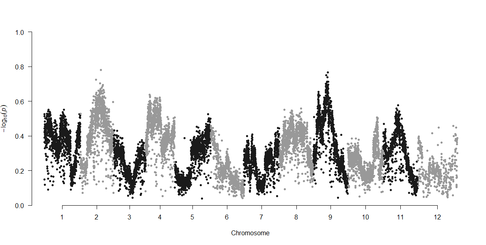

```{r setup, include=FALSE}
knitr::opts_chunk$set(echo = TRUE, cache = TRUE)
```

I mostly followed the PoPoolation and PoPoolation2 pipelines by Robert Kofler and Christian Schlötterer (https://sourceforge.net/p/popoolation2/wiki/Main/). The website has an easy-to-follow tutorial for using PoPoolation2 and how to use their scripts. This pipeline extends the use of the scripts for running on a Linux cluster. I highly recommend following the PoPoolation2 tutorial and manual and using these scripts if you have any modifications from default flags.
*Note: These scripts were written for use on Louisiana State University’s high performance cluster “SuperMike-II” running Red Hat Enterprise Linux 6 (more info found here: http://www.hpc.lsu.edu/resources/hpc/system.php?system=SuperMike-II)

The following scripts were used to analyze data from an experimental evolution study on *Tigriopus californicus* copepods [@Griffiths2020]. Raw sequencing data are deposited in NCBI's Short Reads Archive (https://www.ncbi.nlm.nih.gov/bioproject/PRJNA597336/). To download this dataset, go to: https://trace.ncbi.nlm.nih.gov/Traces/sra/sra.cgi?view=run_browser , then type in the accession number for the identified files you want to download (e.g., the accession no. for the file Bodega population file is SRR10760095, identified under the "Run" heading). Then click on the "Data access" tab, and there will be a downloadable link. Additional analyses and scripts can be found at: https://github.com/JoannaGriffiths/Tigriopus_HER

***Strengths and weaknesses of Pool-seq***\
Due to the nature of Pool-seq where multiple individuals are pooled to prepare a single library, this results in a loss of haplotype information. Therefore, analyses rely on allele frequency estimates rather than hard “genotype calls”. PoPoolation2 is primarily used for comparing allele frequency differences between populations or treatments in comparison to a reference genome. The pooling of many individuals can be a cost-effective tool to characterize genetic variation present at the population level (e.g., genome wide association studies and experimental evolution). For example, to identify small changes in allele frequencies, you would need to genotype hundreds of individuals across the entire genome, which may be too cost-prohibitive with individual barcoding. However, individual genotype information is lost, as well as information on dominance and
effect sizes. For example, individual genotypes cannot be linked to individual phenotypes. Additionally, estimations of linkage disequilibrium are limited to a single sequencing read since that is the known limit of haplotype information for a single individual. Finally, distinguishing between sequencing errors and rare, low-frequency alleles is limited. Unlike sequencing of individuals, this cannot be solved by analyzing multiple reads from the same region of a single chromosome. One way to ameliorate this issue is to sequence replicates of pools. In addition, Pool-seq analyses can be prone to inaccurate estimations of allele frequencies based on the experimental methods. Care must be taken to ensure the the experimental design maximizes the ratio sequencing coverage to the number of individuals pooled.

***Notes on Experimental Design for Downstream Analyses:***\
It is important to try to standardize the number of individuals (and thus DNA) pooled for each sample. Robert Kofler and team also recommend that the pool size should be larger than the goal coverage for sequencing, because this minimizes re-sampling the same allele from a single individual several times. Because PoPoolation is designed for comparing differences in allele frequencies among treatments/population, accuracy will depend on the pool size and sequencing coverage. For example, smaller differences in allele frequency changes can be seen if you have a large number of individuals in a single pool and more coverage. The PoPoolation2 Manual page provides the following calculation to detect significant allele frequency differences:\"To detect a significant (Fisher's exact test; p=0.01) allele frequency difference between two populations of 30%, a coverage (and pool size) of 50 will be sufficient. If however significant (Fisher's exact test; p=0.01) allele frequency differences of 10% need to be detected the coverage as well as the pool size should be about 400."\
It is critical to note, the sequencing accuracy of Pool-seq increases with larger pool sizes; if the number of sequenced individuals is approximately equal to the coverage, then the sequency accuracy is no longer superior to an individual level of sequencing (see Fig. 1a from [@Schlotterer2014]). 


***Alternative Pipelines***\
Low Coverage Pool-seq Data:\ 
https://github.com/petrov-lab/HAFpipe-line \
Alternative pipelines have been created for low coverage (<5x) pool-seq data that can provide accurate estimates of allele frequencies. This pipeline is designed for Evolve and Re-sequence studies where the founder haplotypes are known. 

Customizable Filtering and Assessing Quality of Pool-Seq Data:\
https://github.com/ToBoDev/assessPool \
This pipeline filters SNPs based on adjustable criterion with suggestions for pooled data. It determines pool number and prepares proper data structure for analysis, creates a customizable run script for Popoolation2 for all pairwise comparisons, runs Popoolation2 and poolfstat, imports Popoolation2 and poolfstat output, and finally, generates population genetic statistics and plots for data visualization.

## Filter Raw Sequences
The script below uses the wrapper TrimGalore to remove Adapter/Barcode sequences and removes poor quality reads. 
This example dataset uses paired end sequencing so I used the flag (--paired) in TrimGalore. Because these example files had high coverage, I was able to use conservative filters. 
For example, the default length of reads is 20 bp (so if a read is less than 20 bp then the read will be removed). Since I had high coverage and long read lengths (150 bp), I used a minimum read length of 40 bp. 
The --max_n flag specifies how many "Ns" can be in the read before the read if discarded as "poor quality". Again, depending on your sequencing depth you may want to be more or less conservative. There is no default value specified in TrimGalore, but I used a highly conservative value of 1 (ie any instances of N in the read and that read will be discarded). This is probably more conservative than you need to be, because the read may still contain informative sequencing data.
Please note that these parameters are not specific to a Pool Seq dataset.
```{bash eval = FALSE}
#!/bin/bash

#PBS -q checkpt
#PBS -A hpc_kelly_19_3
#PBS -l nodes=1:ppn=16
#PBS -l walltime=72:00:00
#PBS -o /work/jgrif61/Tigs/output_files
#PBS -j oe
#PBS -M jgrif61@lsu.edu
#PBS -N trimgalore_Tigs

date

#Go to the directory where the raw sequencing files are located
cd /work/jgrif61/Tigs/raw_data/raw

trim_galore --paired --length 40 --max_n 1 Tig-1S_S6_L008_R1_001.fastq.gz Tig-1S_S6_L008_R2_001.fastq.gz -o /work/jgrif61/Tigs/raw_data/raw
trim_galore --paired --length 40 --max_n 1 Tig-1U_S3_L001_R1_001.fastq.gz Tig-1U_S3_L001_R2_001.fastq.gz -o /work/jgrif61/Tigs/raw_data/raw
trim_galore --paired --length 40 --max_n 1 Tig-2S_S7_L008_R1_001.fastq.gz  Tig-2S_S7_L008_R2_001.fastq.gz  -o /work/jgrif61/Tigs/raw_data/raw
trim_galore --paired --length 40 --max_n 1 Tig-2U_S9_L008_R1_001.fastq.gz Tig-2U_S9_L008_R2_001.fastq.gz -o /work/jgrif61/Tigs/raw_data/raw
trim_galore --paired --length 40 --max_n 1 Tig-3S_S1_L001_R1_001.fastq.gz Tig-3S_S1_L001_R2_001.fastq.gz -o /work/jgrif61/Tigs/raw_data/raw
trim_galore --paired --length 40 --max_n 1 Tig-4S_S2_L001_R1_001.fastq.gz Tig-4S_S2_L001_R2_001.fastq.gz -o /work/jgrif61/Tigs/raw_data/raw
trim_galore --paired --length 40 --max_n 1 Tig-4U_S10_L008_R1_001.fastq.gz Tig-4U_S10_L008_R2_001.fastq.gz -o /work/jgrif61/Tigs/raw_data/raw
trim_galore --paired --length 40 --max_n 1 Tig-5S_S8_L008_R1_001.fastq.gz Tig-5S_S8_L008_R2_001.fastq.gz -o /work/jgrif61/Tigs/raw_data/raw
trim_galore --paired --length 40 --max_n 1 Tig-5U_S4_L001_R1_001.fastq.gz Tig-5U_S4_L001_R2_001.fastq.gz -o /work/jgrif61/Tigs/raw_data/raw
trim_galore --paired --length 40 --max_n 1 Tig-6U_S11_L008_R1_001.fastq.gz Tig-6U_S11_L008_R2_001.fastq.gz -o /work/jgrif61/Tigs/raw_data/raw
trim_galore --paired --length 40 --max_n 1 Tig-BR_S5_L001_R1_001.fastq.gz Tig-BR_S5_L001_R2_001.fastq.gz -o /work/jgrif61/Tigs/raw_data/raw
trim_galore --paired --length 40 --max_n 1 Tig-SD_S12_L008_R1_001.fastq.gz Tig-SD_S12_L008_R2_001.fastq.gz -o /work/jgrif61/Tigs/raw_data/raw
date
exit 0
```


## Map Reads to Reference Genome 
```{bash eval = FALSE}
#!/bin/bash

#PBS -q workq
#PBS -A hpc_kelly_19_3
#PBS -l nodes=1:ppn=16
#PBS -l walltime=72:00:00
#PBS -o /work/jgrif61/Tigs/output_files
#PBS -j oe
#PBS -M jgrif61@lsu.edu
#PBS -N bowtie_tigs_BRSD

cd /work/jgrif61/Tigs/raw_data/raw

#prepare and index the reference genome so you can map reads to it
bowtie2-build reference/full_genome_mito_tigs.fasta reference/reference_index

bowtie2 -x ../reference/reference_index -1 Tig-1S_S6_L008_R1_001_val_1.fq.gz -2 Tig-1S_S6_L008_R2_001_val_2.fq.gz -S 1S_out_PE.sam

bowtie2 -x ../reference/reference_index -1 Tig-1U_S3_L001_R1_001_val_1.fq.gz -2 Tig-1U_S3_L001_R2_001_val_2.fq.gz -S 1U_out_PE.sam

bowtie2 -x ../reference/reference_index -1 Tig-2S_S7_L008_R1_001_val_1.fq.gz -2 Tig-2S_S7_L008_R2_001_val_2.fq.gz -S 2S_out_PE.sam

bowtie2 -x ../reference/reference_index -1 Tig-2U_S9_L008_R1_001_val_1.fq.gz -2 Tig-2U_S9_L008_R2_001_val_2.fq.gz -S 2U_out_PE.sam

bowtie2 -x ../reference/reference_index -1 Tig-3S_S1_L001_R1_001_val_1.fq.gz -2 Tig-3S_S1_L001_R2_001_val_2.fq.gz -S 3S_out_PE.sam

bowtie2 -x ../reference/reference_index -1 Tig-4S_S2_L001_R1_001_val_1.fq.gz -2 Tig-4S_S2_L001_R2_001_val_2.fq.gz -S 4S_out_PE.sam

bowtie2 -x ../reference/reference_index -1 Tig-4U_S10_L008_R1_001_val_1.fq.gz -2 Tig-4U_S10_L008_R2_001_val_2.fq.gz -S 4U_out_PE.sam

bowtie2 -x ../reference/reference_index -1 Tig-5S_S8_L008_R1_001_val_1.fq.gz -2 Tig-5S_S8_L008_R2_001_val_2.fq.gz -S 5S_out_PE.sam

bowtie2 -x ../reference/reference_index -1 Tig-5U_S4_L001_R1_001_val_1.fq.gz -2 Tig-5U_S4_L001_R2_001_val_2.fq.gz -S 5U_out_PE.sam

bowtie2 -x ../reference/reference_index -1 Tig-6U_S11_L008_R1_001_val_1.fq.gz -2 Tig-6U_S11_L008_R2_001_val_2.fq.gz -S 6U_out_PE.sam

bowtie2 -x ../reference/reference_index -1 Tig-BR_S5_L001_R1_001_val_1.fq.gz -2 Tig-BR_S5_L001_R2_001_val_2.fq.gz -S BR_out_PE.sam

bowtie2 -x ../reference/reference_index -1 Tig-SD_S12_L008_R1_001_val_1.fq.gz -2 Tig-SD_S12_L008_R2_001_val_2.fq.gz -S SD_out_PE.sam

bowtie2 -x ../reference/reference_index -1 Tig-allU_R1_001_val1_new.fq -2 Tig-allU_R2_001_val2_new.fq -S allU_out_PE.sam


#turn mapped sam files into bam file and then sort and remove ambiguously mapped reads
samtools view -bS 1S_out_PE.sam | samtools sort -o 1S_out.sorted
samtools view -bS 1U_out_PE.sam | samtools sort -o 1U_out.sorted
samtools view -bS 2S_out_PE.sam | samtools sort -o 2S_out.sorted
samtools view -bS 2U_out_PE.sam | samtools sort -o 2U_out.sorted
samtools view -bS 3S_out_PE.sam | samtools sort -o 3S_out.sorted
samtools view -bS 4S_out_PE.sam | samtools sort -o 4S_out.sorted
samtools view -bS 4U_out_PE.sam | samtools sort -o 4U_out.sorted
samtools view -bS 5S_out_PE.sam | samtools sort -o 5S_out.sorted
samtools view -bS 5U_out_PE.sam | samtools sort -o 5U_out.sorted
samtools view -bS 6U_out_PE.sam | samtools sort -o 6U_out.sorted
samtools view -bS BR_out_PE.sam | samtools sort -o BR_out.sorted
samtools view -bS SD_out_PE.sam | samtools sort -o SD_out.sorted
samtools view -bS allU_out_PE.sam | samtools sort -o allU_out.sorted

date 
exit
```

## Determine mean coverage across the genome
This code can be used to determine the mean coverage across the genome for each sample/library. This information can be used to inform the min and max coverage used in downstream analyses (such as the Fisher's exact test and Fst analyses). You will want to choose a min and max coverage window spanning the mean coverage.
```{bash eval = FALSE}
#!/bin/bash

#PBS -q workq
#PBS -A hpc_kelly_19_3
#PBS -l nodes=1:ppn=16
#PBS -l walltime=24:00:00
#PBS -o /work/jgrif61/Tigs/output_files
#PBS -j oe
#PBS -M jgrif61@lsu.edu
#PBS -N coverage

cd /work/jgrif61/Tigs/raw_data/raw
/home/jgrif61/samtools-1.13/samtools coverage 1S_out.sorted -o 1S.coverage
/home/jgrif61/samtools-1.13/samtools coverage 1U_out.sorted -o 1U.coverage
/home/jgrif61/samtools-1.13/samtools coverage 2S_out.sorted -o 2U.coverage
/home/jgrif61/samtools-1.13/samtools coverage 3S_out.sorted -o 3S.coverage
/home/jgrif61/samtools-1.13/samtools coverage 4S_out.sorted -o 4S.coverage
/home/jgrif61/samtools-1.13/samtools coverage 4U_out.sorted -o 4U.coverage
/home/jgrif61/samtools-1.13/samtools coverage 5S_out.sorted -o 5S.coverage
/home/jgrif61/samtools-1.13/samtools coverage 5U_out.sorted -o 5U.coverage
/home/jgrif61/samtools-1.13/samtools coverage 6U_out.sorted -o 6U.coverage
/home/jgrif61/samtools-1.13/samtools coverage BR_out.sorted -o BR.coverage
/home/jgrif61/samtools-1.13/samtools coverage SD_out.sorted -o SD.coverage
/home/jgrif61/samtools-1.13/samtools coverage allU_out.sorted -o allU.coverage

date 
exit
```

## Compiling SNPs for all samples
This script compiles all the identified SNPs for each sample into a matrix. This sync file format is required for downstream analyses such as Fst, creating Manhattan plots, or CMH tests to be used in both the PoPoolation and PoPoolation2 pipelines. You will want to make sure that the --fastq-type flag is set to "sanger" (this is for Phred quality score matching--yes, this is correct even if you used Illumina sequencing). The min-qual flag must be above 0, the default is 20 which gives you a 99% base call accuracy rate).

**What is an Mpileup file?**\
Pileup format is a text-based format for summarizing the base calls of aligned reads to a reference sequence. This format facilitates visual display of SNP/indel calling and alignment. (Source: Wikipedia)
```{bash eval = FALSE}
#!/bin/bash

#PBS -q checkpt
#PBS -A hpc_kelly_19_3
#PBS -l nodes=1:ppn=16
#PBS -l walltime=72:00:00
#PBS -o /work/jgrif61/Tigs/output_files
#PBS -j oe
#PBS -M jgrif61@lsu.edu
#PBS -N mpileup

cd /work/jgrif61/Tigs/raw_data/raw

samtools mpileup -f full_genome_mito_tigs.fasta 1S_out.sorted 1U_out.sorted 2S_out.sorted 2U_out.sorted 3S_out.sorted 4S_out.sorted 4U_out.sorted 5S_out.sorted 5U_out.sorted 6U_out.sorted BR_out.sorted SD_out.sorted > all_indiv.mpileup

perl /work/jgrif61/Tigs/popoolation2_1201/mpileup2sync.pl --fastq-type sanger --min-qual 20 --input all_indiv.mpileup --output all_indiv.sync

#Alternative code for generation sync file that is 78x faster
java -ea -Xmx7g -jar /work/jgrif61/Tigs/popoolation2_1201/mpileup2sync.jar --input all_indiv.mpileup --output all_indiv_java.sync --fastq-type sanger --min-qual 20 --threads 8

#Making mpileup files for each sample. Can be used for calculating nucleotide diversity for each sample.
samtools mpileup -f full_genome_mito_tigs.fasta 1S_out.sorted BR_out.sorted > 1S.mpileup
samtools mpileup -f full_genome_mito_tigs.fasta 1U_out.sorted > 1U.mpileup
samtools mpileup -f full_genome_mito_tigs.fasta 2S_out.sorted > 2S.mpileup
samtools mpileup -f full_genome_mito_tigs.fasta 1U_out.sorted > 2U.mpileup
samtools mpileup -f full_genome_mito_tigs.fasta 3S_out.sorted > 3S.mpileup
samtools mpileup -f full_genome_mito_tigs.fasta 4S_out.sorted > 4S.mpileup
samtools mpileup -f full_genome_mito_tigs.fasta 4U_out.sorted > 4U.mpileup
samtools mpileup -f full_genome_mito_tigs.fasta 5S_out.sorted > 5S.mpileup
samtools mpileup -f full_genome_mito_tigs.fasta 5U_out.sorted > 5U.mpileup
samtools mpileup -f full_genome_mito_tigs.fasta 6U_out.sorted > 6U.mpileup
samtools mpileup -f full_genome_mito_tigs.fasta BR_out.sorted > BR.mpileup
samtools mpileup -f full_genome_mito_tigs.fasta SD_out.sorted > SD.mpileup


```

Sample of a synchronized file:

```{bash eval = FALSE}
2  2302    N   0:7:0:0:0:0 0:7:0:0:0:0
2  2303    N   0:8:0:0:0:0 0:8:0:0:0:0
2  2304    N   0:0:9:0:0:0 0:0:9:0:0:0
2  2305    N   1:0:9:0:0:0 0:0:9:1:0:0
```

* col1: reference contig
* col2: position within the refernce contig
* col3: reference character
* col4: allele frequencies of population number 1
* col5: allele frequencies of population number 2
* coln: allele frequencies of population number n

The allele frequencies are in the format A:T:C:G:N:del, i.e: count of bases 'A', count of bases 'T',... and deletion count in the end (character '*' in the mpileup)


## Pop Gen and Downstream Statistical Analyses
These in-depth notes are not on the tutorial or manual page, but detailed descriptions for each flag can be found using the `--help` option when running each script. e.g. `perl fst-sliding.pl --help`

You will want to play around with the min-coverage, max-coverage, and min-count based on the mean coverage of your samples/populations. Minimum coverages that are too high and max coverages that are too low may result in an empty output file, which is why it's a good idea to have an estimate of your mean/min/max coverage for each sample/population. The minimum count must be less than the minimum coverage. You may want to modify this flag based on the number of individuals pooled per sample/population.

***Important considerations:***\
`--suppress-noninformative`: Output files will not report results for windows with no SNPs or insufficient coverage. Including this flag will make it easier for downstream manipulation of the output file, such as creating figures.

`--pool-size`: the number of individuals pooled per sample; If the pool sizes differ among each sample, you can provide the size for each sample individually:
    --pool-size 500 .. all samples/populations have a pool size of 500
    --pool-size 500:300:600 .. first sample/population has a pool size of 500, the second of 300 etc;

`--min-coverage`: the minimum coverage used for SNP identification, the coverage in ALL samples/populations has to be     higher or equal to this threshold, otherwise no SNP will be called. default=4

`--max-coverage`: The maximum coverage; All populations are required to have coverages lower or equal than the maximum coverage; Mandatory.\
The maximum coverage may be provided as one of the following:\
`500` a maximum coverage of 500 will be used for all samples/populations\
`300,400,500` a maximum coverage of 300 will be used for the first sample/population, a maximum coverage of 400 for the second sample/population and so on\
`2%` the 2% highest coverages will be ignored, this value is independently estimated for every sample/population

***NOTE ABOUT MAX COVERAGE***\
When genotyping individually barcoded samples, max coverage requirements are generally not recommended. However, pool-seq analyses require a max coverage for calculating Fst, cmh, allele frequency changes, etc. because allele frequency estimates are based on the number allele count, which are prone to PCR duplicates. PCR duplicates from a single individual in the pool may skew allele frequency estimates.

`--min-covered-fraction`:the minimum fraction of a window being between min-coverage and max-coverage in ALL                    samples/populations; float; default=0.0   
    The tutorial provides an example script with a min-covered fraction of 1, however, you will most likely run into an       error or an empty output file. The min-covered-fraction flag must be smaller than 1: this flag defines what percent     of the window must meet the requirements (e.g. flags: min-count, min-coverage, max-coverage). It is most likely           impossible that your entire sequencing window will meet all of these requirements (unless of course you chose a         window size of 1 bp!).


`--min-count`: the minimum count of the minor allele, used for SNP identification. SNPs will be identified considering all samples/populations simultaneously. default=2. The minimum count MUST be smaller than the min-coverage flag for this script to run.


## Calculate sliding window Fst
This script will calculate Fst pair-wise comparisons for all samples.

```{bash eval = FALSE}
#!/bin/bash

#PBS -q workq
#PBS -A hpc_Kelly_19_3
#PBS -l nodes=1:ppn=16
#PBS -l walltime=4:00:00
#PBS -o /work/jgrif61/Tigs/output_files
#PBS -j oe
#PBS -M jgrif61@lsu.edu
#PBS -N stats

date

cd /work/jgrif61/Tigs/raw_data

perl /work/jgrif61/Tigs/popoolation2_1201/fst-sliding.pl --input all_indiv.sync --output all_PE_w10000_step10000.fst --suppress-noninformative --min-count 5 --min-coverage 20 --max-coverage 200 --min-covered-fraction 0.2 --window-size 10000 --step-size 10000 --pool-size 100

date
exit

```

The following R script can be used to plot Fst results in a Manhattan plot
```{r eval = FALSE}

library("qqman")
library("DataCombine")

fst = read.table("all_PE_w10000_step10000.fst", header = T) 
fst <- fst[c("CHR", "BP", "X1.11", "X1.12", "X2.11", "X2.12", "X3.11", "X3.12", "X4.11", "X4.12", "X5.11", "X5.12", "X6.11", "X6.12", "X7.11", "X7.12", "X8.11", "X8.12", "X9.11", "X9.12", "X10.11", "X10.12", "X11.12")] #rename column headers
fst$ID <- paste(fst$CHR,fst$BP,sep=".")

#tidying file
Replaces <- data.frame(from=c("Chromosome_"), to=c(""))
fst2 <- FindReplace(data = fst, Var = "CHR", replaceData = Replaces,
                       from = "from", to = "to", exact = FALSE)
fst2$CHR <- as.numeric(fst2$CHR)

manhattan(fst2, chr="CHR", bp="BP", snp="ID", p="X1.11", suggestiveline = F, genomewideline = F, logp = F, ylim =c(0,1)) #p here refers to pvalue or in this case the Fst value, substitute with which column comparison you are interested in graphing

```



## Calculate Fisher's Exact Test
This script will calculate significant allele frequency differences for each SNP position between two samples. Results can be plotted in a Manhattan plot. 
Depending on the experimental method, the `--window-summary-method` flag can be used to determine p-value for windows of SNPs. The default is to multiply the p-value of all SNPs for the window. Alternatively, you can specify how p-values within a window should be summarized. Options include multiply, geometric mean, or median.  The summary of p-values within a window is dependent on the experimental design and how recent selection was expected to occur. For example, the default parameter might be appropriate if your treatment comparisons are geographically separated populations, where selection is expected to have occurred over hundreds of thousands of years. However, this might be inappropriate for short-term experimental evolution studies, such as the example dataset here. In this dataset, copepods were selected in the lab for 15-20 generations, therefore, we expect relatively large linkage blocks that prevent us from identifying the true targets of selection, and therefore I use the geometric mean option.

```{bash eval=FALSE}
#!/bin/bash

#PBS -q workq
#PBS -A hpc_Kelly_19_3
#PBS -l nodes=1:ppn=16
#PBS -l walltime=4:00:00
#PBS -o /work/jgrif61/Tigs/output_files
#PBS -j oe
#PBS -M jgrif61@lsu.edu
#PBS -N stats

date

cd /work/jgrif61/Tigs/raw_data


perl /work/jgrif61/Tigs/popoolation2_1201/fisher-test.pl --input all_indiv.sync --output all_indiv.fet --suppress-noninformative --min-count 2 --min-coverage 20 --max-coverage 200 --min-covered-fraction 0.2 --window-summary-method geometricmean

```

You may need to run the following code on the command line (not in the queues) to install twotailed perl Module before running Fisher-test.pl. See LSU HPC for details: http://www.hpc.lsu.edu/docs/faq/installation-details.php

```{bash eval=FALSE}
perl -MCPAN -e 'install Text::NSP::Measures::2D::Fisher2::twotailed'
```


## Calculate Exact Allele Frequencies in Samples
Exact allele frequencies can be used to determine differences in allele frequencies among populations or before and after a selection experiment, for example. These result could be plotted in a PCA or Manhattan plot.
```{bash eval=FALSE}
#!/bin/bash

#PBS -q workq
#PBS -A hpc_Kelly_19_3
#PBS -l nodes=1:ppn=16
#PBS -l walltime=4:00:00
#PBS -o /work/jgrif61/Tigs/output_files
#PBS -j oe
#PBS -M jgrif61@lsu.edu
#PBS -N stats

date

cd /work/jgrif61/Tigs/raw_data

perl /work/jgrif61/Tigs/popoolation2_1201/snp-frequency-diff.pl --input all_indiv.sync --output-prefix all_indiv --min-count 6 --min-coverage 20 --max-coverage 200

date
exit

```
This script creates two output files having two different extensions:

`_rc`: this file contains the major and minor alleles for every SNP in a concise format
`_pwc`: this file contains the differences in allele frequencies for every pairwise comparision of the populations present in the synchronized file
For details see the man pages of the script
The allele frequency differences can be found in the `_pwc` file, a small sample:

```{bash eval=FALSE}
##chr   pos     rc      allele_count    allele_states   deletion_sum    snp_type        most_variable_allele    diff:1-2
2      4459    N       2       C/T     0       pop     T       0.133
2      9728    N       2       T/C     0       pop     T       0.116
```

The last column contains the obtained differences in allele frequencies for the allele provided in column 8. Note that in this example the last column refers to a pairwise comparison between population 1 vs 2, in case several populations are provided all pairwise comparisons will be appended in additional columns.


## Cochran-Mantel-Haenszel (CMH) test
This script will detect consistent allele frequency changes in biological replicates.
In my case, I was comparing selected samples to one control sample, but if you have replicates of treatments and controls, you can compare columns 1-2, 3-4, etc.

```{bash eval=FALSE}
#!/bin/bash

#PBS -q workq
#PBS -A hpc_Kelly_19_3
#PBS -l nodes=1:ppn=16
#PBS -l walltime=4:00:00
#PBS -o /work/jgrif61/Tigs/output_files
#PBS -j oe
#PBS -M jgrif61@lsu.edu
#PBS -N stats

date

cd /work/jgrif61/Tigs/raw_data 

#perl /work/jgrif61/Tigs/popoolation2_1201/cmh-test.pl --input all_indiv.sync_for_cmh --output all_perl_PE_2.cmh --min-count 12 --min-coverage 50 --max-coverage 200 --population 1-6,2-6,3-6,4-6,5-6

date
exit
```

Due to constraints of the test, you can only compare allele frequency changes for individual SNPs and not windows. I expected high levels of linkage disequilibrium in my samples because individuals were exposed to strong selection pressure. Depending on the amount of linkage disequilibrium you expect in your populations, you may want to account for the non-independence of SNPs following the CMH test. One way to do this, would be to calculate the mean (or geometric mean) p-value for all SNPs in a window. I provide some example R code below for how to do this.
I used the program SeqMonk to map cmh results to the genome and an annotated genome file I created with probes for the desired window size (i.e. 10,000 bp). Output files from SeqMonk will tell you which 10,000 bp window a particular SNP falls into. Thus, SNPs can be grouped for each 10,000bp window on each chromosome.
```{r eval=FALSE}
library("psych")

cmh <-read.table("10000window_BR_cmh_overlap.txt", header=TRUE)
cmh <- cmh[c(1,2,3,4,6)] #Keeping only the columns I care about
cmh$ID <- paste(cmh$Chromosome,cmh$Start,sep=".") #creating an ID column so each SNP location is tied to its chromosome

cmh_p <-read.table("Tig.cmh", header=TRUE) #read in the original output from the CMH test, because SeqMonk output discards the important p-value column.
colnames(cmh_p) <- c("CHR", "BP", "Allele", "1S", "2S", "3S", "4S", "5S", "U", "p") #rename columns based on sample names
cmh_p$ID <- paste(cmh_p$CHR,cmh_p$BP,sep=".")
cmh_p <- cmh_p[c(10,11)]

cmh_all <- merge(cmh, cmh_p, by="ID", all = TRUE)

#Now we can calculate the geometric mean for each window one chromosome at a time
library("EnvStats")
chr1<- cmh_all[cmh_all$Chromosome == "Chromosome_1",]
Chr1_ave <- aggregate(p~FeatureID, data=chr1, FUN=function(x) c(mean=geoMean(x)))
Chr1_ave$CHR <- rep(1,nrow(Chr1_ave))
Chr1_ave$CHR2 <- rep("Chromosome_1",nrow(Chr1_ave))


chr2<- cmh_all[cmh_all$Chromosome == "Chromosome_2",]
Chr2_ave <- aggregate(p~FeatureID, data=chr2, FUN=function(x) c(mean=geoMean(x)))
Chr2_ave$CHR <- rep(2,nrow(Chr2_ave))
Chr2_ave$CHR2 <- rep("Chromosome_2",nrow(Chr2_ave))

chr3<- cmh_all[cmh_all$Chromosome == "Chromosome_3",]
Chr3_ave <- aggregate(p~FeatureID, data=chr3, FUN=function(x) c(mean=geoMean(x)))
Chr3_ave$CHR <- rep(3,nrow(Chr3_ave))
Chr3_ave$CHR2 <- rep("Chromosome_3",nrow(Chr3_ave))

chr4<- cmh_all[cmh_all$Chromosome == "Chromosome_4",]
Chr4_ave <- aggregate(p~FeatureID, data=chr4, FUN=function(x) c(mean=geoMean(x)))
Chr4_ave$CHR <- rep(4,nrow(Chr4_ave))
Chr4_ave$CHR2 <- rep("Chromosome_4",nrow(Chr4_ave))

chr5<- cmh_all[cmh_all$Chromosome == "Chromosome_5",]
Chr5_ave <- aggregate(p~FeatureID, data=chr5, FUN=function(x) c(mean=geoMean(x)))
Chr5_ave$CHR <- rep(5,nrow(Chr5_ave))
Chr5_ave$CHR2 <- rep("Chromosome_5",nrow(Chr5_ave))

chr6<- cmh_all[cmh_all$Chromosome == "Chromosome_6",]
Chr6_ave <- aggregate(p~FeatureID, data=chr6, FUN=function(x) c(mean=geoMean(x)))
Chr6_ave$CHR <- rep(6,nrow(Chr6_ave))
Chr6_ave$CHR2 <- rep("Chromosome_6",nrow(Chr6_ave))

chr7<- cmh_all[cmh_all$Chromosome == "Chromosome_7",]
Chr7_ave <- aggregate(p~FeatureID, data=chr7, FUN=function(x) c(mean=geoMean(x)))
Chr7_ave$CHR <- rep(7,nrow(Chr7_ave))
Chr7_ave$CHR2 <- rep("Chromosome_7",nrow(Chr7_ave))

chr8<- cmh_all[cmh_all$Chromosome == "Chromosome_8",]
Chr8_ave <- aggregate(p~FeatureID, data=chr8, FUN=function(x) c(mean=geoMean(x)))
Chr8_ave$CHR <- rep(8,nrow(Chr8_ave))
Chr8_ave$CHR2 <- rep("Chromosome_8",nrow(Chr8_ave))

chr9<- cmh_all[cmh_all$Chromosome == "Chromosome_9",]
Chr9_ave <- aggregate(p~FeatureID, data=chr9, FUN=function(x) c(mean=geoMean(x)))
Chr9_ave$CHR <- rep(9,nrow(Chr9_ave))
Chr9_ave$CHR2 <- rep("Chromosome_9",nrow(Chr9_ave))

chr10<- cmh_all[cmh_all$Chromosome == "Chromosome_10",]
Chr10_ave <- aggregate(p~FeatureID, data=chr10, FUN=function(x) c(mean=geoMean(x)))
Chr10_ave$CHR <- rep(10,nrow(Chr10_ave))
Chr10_ave$CHR2 <- rep("Chromosome_10",nrow(Chr10_ave))

chr11<- cmh_all[cmh_all$Chromosome == "Chromosome_11",]
Chr11_ave <- aggregate(p~FeatureID, data=chr11, FUN=function(x) c(mean=geoMean(x)))
Chr11_ave$CHR <- rep(11,nrow(Chr11_ave))
Chr11_ave$CHR2 <- rep("Chromosome_11",nrow(Chr11_ave))

chr12<- cmh_all[cmh_all$Chromosome == "Chromosome_12",]
Chr12_ave <- aggregate(p~FeatureID, data=chr12, FUN=function(x) c(mean=geoMean(x)))
Chr12_ave$CHR <- rep(12,nrow(Chr12_ave))
Chr12_ave$CHR2 <- rep("Chromosome_12",nrow(Chr12_ave))


cmh_p_ave_allchr <- rbind(Chr1_ave, Chr2_ave, Chr3_ave, Chr4_ave, Chr5_ave, Chr6_ave, Chr7_ave,Chr8_ave, Chr9_ave, Chr10_ave, Chr11_ave, Chr12_ave)

library(tidyr)
cmh_p_ave_allchr2 <- separate(cmh_p_ave_allchr, FeatureID, c("BP_start", "BP_end"))
cmh_p_ave_allchr2$BP_start <- as.numeric(cmh_p_ave_allchr2$BP_start)
cmh_p_ave_allchr2$BP_ID <- paste(cmh_p_ave_allchr2$BP_start + 5000) #I wanted the window ID to start in the middle of the window
cmh_p_ave_allchr2$ID <- paste(cmh_p_ave_allchr2$CHR,cmh_p_ave_allchr2$BP_start,sep=".")

write.table(cmh_p_ave_allchr2, file = "cmh_window_geomean_p", sep = "\t")


```
I then analyzed the results of the CMH test by plotting the geometric mean for each 10,000bp window on a Manhattan plot.

## PoPoolation Pipelines for analyses
## Nucleotide Diversity
Calculate Pi (nucleotide diversity) for individual samples. Use mpileup files that were created for a single sample as the input. Below is an example for one sample. 
```{bash eval=FALSE}
#!/bin/bash

#PBS -q workq
#PBS -A hpc_Kelly_19_3
#PBS -l nodes=1:ppn=16
#PBS -l walltime=4:00:00
#PBS -o /work/jgrif61/Tigs/output_files
#PBS -j oe
#PBS -M jgrif61@lsu.edu
#PBS -N stats

date

cd /work/jgrif61/Tigs/raw_data 

perl /work/jgrif61/Tigs/popoolation_1.2.2/Variance-sliding.pl --measure pi --input 1S.mpileup --output 1S.pi --min-count 2 --min-coverage 10 --max-coverage 200 --window-size 10000 --step-size 10000 --pool-size 100 --fastq-type sanger 


date
exit

```

I used nucleotide diversity for creating a PCA plot to compare genetic diversity among my samples and to look for broad patterns across my data and I ran an Adonis test to determine if there were significant differences among groups (in this example, selected vs control lines)
```{r eval=FALSE}

#import each pi file and do some cleanup:
pi_1S <- read.delim("1S.pi", header = F)
colnames(pi_1S) <- c("Chromosome", "window", "num.snps", "frac", "pi_1S")
pi_1S$ID <- paste(pi_1S$Chromosome, pi_1S$window, sep = '_')
pi_1S <- pi_1S[!pi_1S$pi_1S == "na",] #remove rows with na
pi_1S <- pi_1S[,c(6,5)]

pi_1U <- read.delim("1U.pi", header = F)
colnames(pi_1U) <- c("Chromosome", "window", "num.snps", "frac", "pi_1U")
pi_1U$ID <- paste(pi_1U$Chromosome, pi_1U$window, sep = '_')
pi_1U <- pi_1U[!pi_1U$pi_1U == "na",]
pi_1U <- pi_1U[,c(6,5)]

pi_2S <- read.delim("2S.pi", header = F)
colnames(pi_2S) <- c("Chromosome", "window", "num.snps", "frac", "pi_2S")
pi_2S$ID <- paste(pi_2S$Chromosome, pi_2S$window, sep = '_')
pi_2S <- pi_2S[!pi_2S$pi_2S == "na",] #remove rows with na
pi_2S <- pi_2S[,c(6,5)]

pi_2U <- read.delim("2U.pi", header = F)
colnames(pi_2U) <- c("Chromosome", "window", "num.snps", "frac", "pi_2U")
pi_2U$ID <- paste(pi_2U$Chromosome, pi_2U$window, sep = '_')
pi_2U <- pi_2U[!pi_2U$pi_2U == "na",]
pi_2U <- pi_2U[,c(6,5)]

pi_3S <- read.delim("3S.pi", header = F)
colnames(pi_3S) <- c("Chromosome", "window", "num.snps", "frac", "pi_3S")
pi_3S$ID <- paste(pi_3S$Chromosome, pi_3S$window, sep = '_')
pi_3S <- pi_3S[!pi_3S$pi_3S == "na",] #remove rows with na
pi_3S <- pi_3S[,c(6,5)]

pi_4S <- read.delim("4S.pi", header = F)
colnames(pi_4S) <- c("Chromosome", "window", "num.snps", "frac", "pi_4S")
pi_4S$ID <- paste(pi_4S$Chromosome, pi_4S$window, sep = '_')
pi_4S <- pi_4S[!pi_4S$pi_4S == "na",] #remove rows with na
pi_4S <- pi_4S[,c(6,5)]

pi_4U <- read.delim("4U.pi", header = F)
colnames(pi_4U) <- c("Chromosome", "window", "num.snps", "frac", "pi_4U")
pi_4U$ID <- paste(pi_4U$Chromosome, pi_4U$window, sep = '_')
pi_4U <- pi_4U[!pi_4U$pi_4U == "na",]
pi_4U <- pi_4U[,c(6,5)]

pi_5S <- read.delim("5S.pi", header = F)
colnames(pi_5S) <- c("Chromosome", "window", "num.snps", "frac", "pi_5S")
pi_5S$ID <- paste(pi_5S$Chromosome, pi_5S$window, sep = '_')
pi_5S <- pi_5S[!pi_5S$pi_5S == "na",] #remove rows with na
pi_5S <- pi_5S[,c(6,5)]

pi_5U <- read.delim("5U.pi", header = F)
colnames(pi_5U) <- c("Chromosome", "window", "num.snps", "frac", "pi_5U")
pi_5U$ID <- paste(pi_5U$Chromosome, pi_5U$window, sep = '_')
pi_5U <- pi_5U[!pi_5U$pi_5U == "na",]
pi_5U <- pi_5U[,c(6,5)]

pi_6U <- read.delim("6U.pi", header = F)
colnames(pi_6U) <- c("Chromosome", "window", "num.snps", "frac", "pi_6U")
pi_6U$ID <- paste(pi_6U$Chromosome, pi_6U$window, sep = '_')
pi_6U <- pi_6U[!pi_6U$pi_6U == "na",]
pi_6U <- pi_6U[,c(6,5)]

pi_SD <- read.delim("SD.pi", header = F)
colnames(pi_SD) <- c("Chromosome", "window", "num.snps", "frac", "pi_SD")
pi_SD$ID <- paste(pi_SD$Chromosome, pi_SD$window, sep = '_')
pi_SD <- pi_SD[!pi_SD$pi_SD == "na",]
pi_SD <- pi_SD[,c(6,5)]

pi_BR <- read.delim("BR.pi", header = F)
colnames(pi_BR) <- c("Chromosome", "window", "num.snps", "frac", "pi_BR")
pi_BR$ID <- paste(pi_BR$Chromosome, pi_BR$window, sep = '_')
pi_BR <- pi_BR[!pi_BR$pi_BR == "na",]
pi_BR <- pi_BR[,c(6,5)]


#merge all pi results into one file
pi_all1 <- merge(pi_1S, pi_1U, by="ID")
pi_all2 <- merge(pi_all1, pi_2S, by="ID")
pi_all3 <- merge(pi_all2, pi_2U, by="ID")
pi_all4 <- merge(pi_all3, pi_3S, by="ID")
pi_all5 <- merge(pi_all4, pi_4S, by="ID")
pi_all6 <- merge(pi_all5, pi_4U, by="ID")
pi_all7 <- merge(pi_all6, pi_5S, by="ID")
pi_all8 <- merge(pi_all7, pi_5U, by="ID")
pi_all9 <- merge(pi_all8, pi_6U, by="ID")
pi_all10 <- merge(pi_all9, pi_SD, by="ID")
pi_all <- merge(pi_all10, pi_BR, by="ID")

pi_all$pi_1S <- as.numeric(pi_all$pi_1S)
pi_all$pi_1U <- as.numeric(pi_all$pi_1U)
pi_all$pi_2S <- as.numeric(pi_all$pi_2S)
pi_all$pi_2U <- as.numeric(pi_all$pi_2U)
pi_all$pi_3S <- as.numeric(pi_all$pi_3S)
pi_all$pi_4S <- as.numeric(pi_all$pi_4S)
pi_all$pi_4U <- as.numeric(pi_all$pi_4U)
pi_all$pi_5S <- as.numeric(pi_all$pi_5S)
pi_all$pi_5U <- as.numeric(pi_all$pi_5U)
pi_all$pi_6U <- as.numeric(pi_all$pi_6U)
pi_all$pi_BR <- as.numeric(pi_all$pi_BR)
pi_all$pi_SD <- as.numeric(pi_all$pi_SD)

dds.pcoa=pcoa(vegdist(t((pi_all[,2:13])), method="euclidean")/1000)
scores=dds.pcoa$vectors
percent <- dds.pcoa$values$Eigenvalues
percent / sum(percent) #percent for each axes; change in caption below

windows()
plot(scores[,1], scores[,2],
     col=c("red", "blue", "red", "blue", "red", "red", "blue", "red", "blue", "blue", "black", "black"), 
     pch = c(19,19,19,19,19,19,19,19,19,19,1,19),
     xlab = "PC1 (24.33%)", ylab = "PC2 (21.24%)")

treat_df <- data.frame(
  ID = c("1S_pi", "1U_pi", "2S_pi", "2U_pi", "3S_pi", "4S_pi", "4U_pi", "5S_pi", "5U_pi","6U_pi"),
  line = c("S", "U", "S", "U", "S", "S", "U", "S", "U", "U")
)

line <- treat_df$line

adonis2(t(pi_all[,2:11])~line, data = treat_df, permutations = 1000000, method = "manhattan")


```


## References


